# Исполнительное резюме

Данный раздел описывает **структуру и содержание документационного пакета** технического задания (ТЗ) на создание Государственной информационной системы «Электронный путевой лист» (ГИС «ЭПЛ»). ТЗ соответствует международным и национальным стандартам разработки ПО и систем, включая **ГОСТ 34.602-2020**, ISO/IEC 12207, ISO/IEC 25010 и ISO/IEC 27001, а также методологии BPMN 2.0, UML 2.5 и спецификации OpenAPI 3.1. Документальная архитектура ТЗ строится как **Master Specification**, задающий каркас всего комплекта документирования проекта в формате многотомного SRS (Software Requirements Specification). 

В **Каркасе проекта (Том 1)** описаны: титульный лист и сведения об авторах; история изменений и контроль версий; полное содержание всех томов (включая детализированный список разделов и подразделов); правила оформления и верстки документов (единообразные шрифты, форматирование, шаблоны заголовков, таблиц и диаграмм); принятые единицы измерения и обозначения; методологии разработки (жизненный цикл ПО по ISO/IEC 12207) и тестирования (по ISO/IEC 29119 и качественной модели ISO/IEC 25010); архитектуру документации (схемы томов, взаимосвязи между ними); требования к языковым версиям (русский как основной, таджикский и английский для переводов и резюме); а также требования к юридической значимости, хранению и миграции данных. 

*В частности*, документ учитывает законодательство РТ, признающее электронные документы и подписи юридически значимыми, а также международный опыт: Таджикистан ратифицировал Протокол e-CMR (электронной товарно-транспортной накладной), что фиксирует курс страны на безбумажный документооборот в сфере перевозок. Метаданные документов формируются в соответствии с принципами ISO 23081 (управление метаданными), обеспечивая прослеживаемость и аутентичность электронных путевых листов (ЭПЛ). Таким образом, Том 1 задаёт **унифицированный каркас** — «скелет» — всего ТЗ, обеспечивая последовательность оформления и навигации по документам проекта. 

# 1. Титульный лист

| Параметр                  | Значение                                                        |
|---------------------------|-----------------------------------------------------------------|
| Документ                  | Техническое задание                                             |
| Наименование проекта      | Государственная информационная система «Электронный путевой лист» (ГИС «ЭПЛ») |
| Заказчик                  | Министерство транспорта Республики Таджикистан                  |
| Оператор (Разработчик)    | ГУП «Центр цифровизации транспортной отрасли»                   |
| Версия документа          | 1.0                                                             |
| Статус документа          | Проект                                                          |
| Язык документа            | Русский (основной); Таджикский, Английский — для переводов/резюме |
| Уровень документа         | Государственный                                                 |
| Тип документа             | Software Requirements Specification (SRS)                        |
| Используемые стандарты    | ГОСТ 34.602-2020; ISO/IEC 12207; ISO/IEC 25010; ISO/IEC 27001; BPMN 2.0; UML 2.5; OpenAPI 3.1 |

# 2. История изменений

| Версия | Дата       | Описание изменений                   | Автор             |
|--------|------------|--------------------------------------|-------------------|
| 1.0    | 2026-07-11 | Создание первоначальной версии ТЗ    | Аналитик (не указано) |

*Примечание:* все версии документа фиксируются. Каждое изменение регистрируется с указанием номера версии, даты, краткого описания и ответственного за изменение лица. Согласно **ГОСТ 34.602-2020**, в ТЗ должны быть сохранены все обязательные разделы (с отметкой «не применяется» при отсутствии содержания). 

# 3. Контроль версий

Контроль версий документации ведётся централизованно (система версионирования). Каждая итерация ТЗ имеет уникальный номер версии и дату. Менеджмент конфигурации ТЗ соответствует практике управления проектами по **ISO/IEC 12207** (процессы поддержки). В таблице истории изменений указаны основные вехи разработки. 

# 4. Авторы документа

| Фамилия, Имя (Авторы)       | Должность / Роль                               | Организация                                    |
|-----------------------------|------------------------------------------------|-----------------------------------------------|
| **Максим Фамилия** (заказчик)  | Рук. проекта со стороны Заказчика              | Министерство транспорта РТ                    |
| **Иванов И.**                | Бизнес-аналитик, ведущий системный аналитик    | ГУП «Центр цифровизации транспортной отрасли»  |
| **Петров П.**                | Ведущий архитектор решения                     | ГУП «Центр цифровизации транспортной отрасли»  |
| **Сидорова С.**              | Главный тестировщик                            | ГУП «Центр цифровизации транспортной отрасли»  |

(При необходимости список дополняется. Неустановленные параметры отмечены как «не указано». Все авторы согласовали настоящую версию ТЗ.)

# 5. Содержание

Техническое задание представляет собой многотомный документ. Ниже приведён полный **перечень томов и разделов** (с иерархией). Каждый подраздел нумеруется в соответствии с официальным стандартом оформлению ТЗ (ГОСТ 34.602-2020).  

- **Том 1. Каркас проекта (Master Specification).** Включает: 
  1.1 Титульный лист  
  1.2 История изменений  
  1.3 Контроль версий  
  1.4 Авторы документа  
  1.5 Архитектура документа (структура томов)  
  1.6 Правила оформления и верстки  
  1.7 Принятые обозначения, сокращения, единицы измерения  
  1.8 Методология разработки (жизненный цикл)  
  1.9 Методология тестирования  
  1.10 Структура томов (описание содержания каждого тома)  
  1.11 Полный перечень разделов и подразделов (см. ниже)  
  1.12 Матрица зависимостей между разделами и томами  
  1.13 Перечень приложений (справочников, диаграмм, шаблонов)  
  1.14 План разработки ТЗ (график, Gantt-диаграмма)  
  1.15 Требования к объему и форматам файлов (PDF/Markdown/HTML)  
  1.16 Требования к метаданным и индексированию документов (ISO 23081)  
  1.17 Шаблоны заголовков, таблиц, диаграмм (по ГОСТ 19.201-78 и ISO)  
  1.18 Требования к языковым версиям документа (рус., тадж., англ.)  
  1.19 Требования к юридической значимости ЭПЛ (закон «Об электронном документе и подписи»)  
  1.20 Требования к архивированию ЭПЛ и срокам хранения электронных документов  
  1.21 Требования к версиям ЭПЛ и миграции данных (бекапы, обновления)  

- **Том 2. Общие положения.**  
  2.1 Основание для разработки (указы Правительства, стратегия цифровой трансформации и др.)  
  2.2 Нормативно-правовая база (законы РТ о транспорте, информатизации, ЭДО, безопасности и пр.)  
  2.3 Цели и задачи создания системы  
  2.4 Назначение системы и её ключевые функции  
  2.5 Область применения (виды путевых листов, категории пользователей)  
  2.6 Термины, определения (на основе Глоссария ГОСТ 34.003-90 и Кодекса автотранспорта)  
  2.7 Сокращения и аббревиатуры (в т.ч. ЭПЛ, ГИС, API, e-CMR и др.)  
  2.8 Перечень стандартов и рекомендаций (ISO/IEC 25010, ISO/IEC 27001 и др.)  

- **Том 3. Архитектура системы.**  
  3.1 Общая концепция и принципы архитектуры (микросервисы, единая шина)  
  3.2 Компонентная структура (модули, сервисы, БД) с диаграммами (UML/BPMN)  
  3.3 Инфраструктура (центры обработки данных, виртуализация, отказоустойчивость)  
  3.4 Схема интеграции с внешними системами (ГИС, МР, ЕГАИС, е-CMR)  

- **Том 4. Бизнес-процессы.**  
  4.1 Процессы оформления и согласования ЭПЛ (BPMN-схемы)  
  4.2 Процессы контроля и закрытия ЭПЛ (предрейсовый и послерейсовый аудит)  
  4.3 Взаимодействие с диспетчером, механиком, медработником (сценарии)  
  4.4 Механизм уведомлений и утверждений (штрафы, ограничения, рецепторы)  

- **Том 5. Бизнес-логика.**  
  5.1 Управление учетными записями организаций и пользователей (RBAC)  
  5.2 Учет транспортных средств и водителей (CAR, DRIVER, техосмотр, страховка)  
  5.3 Управление маршрутами и графиками (профили, расписания)  
  5.4 Ведение путевых листов (создание, редактирование, автоматическая проверка)  

- **Том 6. Роли и права (RBAC).**  
  6.1 Категории пользователей (водитель, диспетчер, админ и пр.)  
  6.2 Матричные права доступа по операциям (CRUD для каждой сущности)  
  6.3 Процедуры выдачи прав (служебные удостоверения, сертификаты ЭП)  

- **Том 7. Функциональные требования (модули системы).**  
  7.1 Модуль регистрации и авторизации (SSO, OAuth 2.1, OpenID Connect)  
  7.2 Модуль заполнения и подписания ЭПЛ (PDF/QR-код, EDI-формат)  
  7.3 Модуль контроля (GPS-мониторинг, тахографы, геозоны)  
  7.4 Модуль аналитики и отчётности (BI, дашборды)  

- **Том 8. База данных.**  
  8.1 Логическая модель (ER-диаграмма основных сущностей: Организации, ТС, Водители, Путевой лист)  
  8.2 Физическая модель (выбор СУБД, нормализация, хранение XML/JSON)  
  8.3 Репликация и архивирование данных (резервное копирование, архивная зона)  

- **Том 9. API (интерфейсы).**  
  9.1 API для внешних систем (OpenAPI 3.1 спецификации, JSON/REST/SOAP)  
  9.2 Внутренний API (взаимодействие микросервисов, gRPC/REST)  
  9.3 Безопасность API (TLS, JWT, ограничения запросов)  

- **Том 10. Интерфейс пользователя (UI/UX).**  
  10.1 Основные экраны (веб-портал, мобильное приложение водителя)  
  10.2 Принципы удобства (интуитивный интерфейс, адаптивный дизайн)  
  10.3 Предоставление многоязычного интерфейса (RU/TJ/EN)  
  10.4 Работа с документооборотом (просмотр, подписание, печать QR-кодов)  

- **Том 11. Интеграционные механизмы.**  
  11.1 Взаимодействие с ГИС ГИБДД и другими ведомствами (LDAP, SSO)  
  11.2 Обмен электронными документами (e-CMR, электронные ТТН, е-ТIR)  
  11.3 Интеграция с ERP/1C перевозчиков (API-платформы)  

- **Том 12. Информационная безопасность.**  
  12.1 Требования к защите данных (шифрование, ISO/IEC 27001)  
  12.2 Аутентификация и управление ключами (сертификаты, УЦ)  
  12.3 Логирование и аудит событий (журнал аудита, GDPR/PDPA)  

- **Том 13. Нагрузочное тестирование и производительность.**  
  13.1 Целевые нагрузки (количество пользователей, API-запросы)  
  13.2 Критерии производительности (Время ответа, пропускная способность)  
  13.3 Оценка отказоустойчивости (масштабирование, балансировщики)  

- **Том 14. Приёмочное тестирование.**  
  14.1 Критерии приёмки системы (функциональность, надёжность)  
  14.2 План тестирования (unit, интеграционные, системные)  
  14.3 Описание сценариев тестирования (e2e, стресс-тесты)  

- **Том 15. Инструкции и сопровождение.**  
  15.1 Руководство администратора системы (настройка, запуск)  
  15.2 Руководство пользователя (работа с ЭПЛ, заявками)  
  15.3 Инструкция по обновлениям и миграции данных  

- **Том 16. Приложения.**  
  *Приложение A.* Глоссарий терминов.  
  *Приложение B.* Учётные записи и ключи доступа (примеры форм).  
  *Приложение C.* Шаблоны документов (Примеры путевого листа, соглашений).  
  *Приложение D.* Диаграммы (ER, развертывания, тестовых сценариев).  
  *Приложение E.* Нормативные ссылки (перечень использованных законов, стандартов).  

*Примечание:* перечень разделов даётся для примера. Фактические номера и состав подразделов уточняются по мере разработки. Однако **структура должна полностью соответствовать требованиям ГОСТ 34.602-2020** (каждый обязательный раздел нумеруется, а при отсутствии содержания фиксируется как «не применяется»).

# 6. Архитектура документа

Архитектура ТЗ отображается в следующей диаграмме, демонстрирующей иерархию томов и их взаимосвязи.  

```mermaid
graph TD
    Tom1["Том 1: Каркас проекта"] 
    Tom2["Том 2: Общие положения"] 
    Tom3["Том 3: Архитектура"] 
    Tom4["Том 4: Бизнес-процессы"] 
    Tom5["Том 5: Бизнес-логика"] 
    Tom6["Том 6: Роли и права"] 
    Tom7["Том 7: Функциональные требования"] 
    Tom8["Том 8: База данных"] 
    Tom9["Том 9: API"] 
    Tom10["Том 10: UI/UX"] 
    Tom11["Том 11: Интеграция"] 
    Tom12["Том 12: Безопасность"] 
    Tom13["Том 13: Производительность"] 
    Tom14["Том 14: Тестирование"] 
    Tom15["Том 15: Эксплуатация"] 
    Tom16["Том 16: Приложения"]

    Tom1 --> Tom2
    Tom1 --> Tom3
    Tom1 --> Tom4
    Tom1 --> Tom5
    Tom1 --> Tom6
    Tom1 --> Tom7
    Tom1 --> Tom8
    Tom1 --> Tom9
    Tom1 --> Tom10
    Tom1 --> Tom11
    Tom1 --> Tom12
    Tom1 --> Tom13
    Tom1 --> Tom14
    Tom1 --> Tom15
    Tom1 --> Tom16
```



*Легенда:* Стрелками показано, что **Том 1** определяет основу и ссылки на все последующие разделы ТЗ (Том 2…Том 16).  


# 7. Правила оформления

ТЗ оформляется по правилам **ГОСТ 19.201-78**, **ГОСТ 2.105-95** и требованиям электронного документооборота:  
- Используются шрифты (Times New Roman или аналог) размером 12 пт, межстрочный интервал 1,5; выравнивание – по ширине (симметричное).  
- Все страницы пронумерованы сквозной нумерацией; в заголовках разделов указывается номер тома и раздела (например, «Том 3. Раздел 5»).  
- Таблицы оформляются по стандарту **ГОСТ 2.109-73**, рисунки – **ГОСТ 19.101-77**.  
- Заголовки разделов выделяются жирным (например, «## 2.1 Нормативно-правовая база» в Markdown).  
- Кодовые и регистрационные обозначения (номера документов) приводятся в кавычках.  
- Электронное ТЗ должно иметь оглавление, закладки и возможность поиска по ключевым словам (для PDF/HTML версий).  

**Пример оформления таблицы:**  

| Код            | Наименование                    | Единица измерения | Максимальное значение |
|---------------|----------------------------------|-------------------|-----------------------|
| **MT_C0**     | Максимальное число ТС в системе | шт.               | 10000                 |
| **TIMEOUT**   | Время ожидания ответа API       | сек.              | 10                    |

# 8. Принятые обозначения

- **АС** – Автоматизированная система.  
- **ГИС** – Государственная информационная система.  
- **ЭПЛ** – Электронный путевой лист.  
- **API** – Application Programming Interface.  
- **ГОСТ** – Государственный стандарт.  
- **ИАС** – Информационно-аналитическая система.  
- **e-CMR** – Электронная товарно-транспортная накладная (протокол ООН).  
- **УЦ** – Удостоверяющий центр электронных подписей.  
- **РПС** – Защищенная электронная подпись (согласно закону).  
- **ПДС** – Персональные данные субъекта.  
- **GOST** – Грамматика формата описания документов, ссылка на ГОСТ 19.0**.  
- ЕИСТУ: *ISO, IP, UUID* и др. обозначения даются в контексте каждого применения.  

*Единицы измерения:* все величины приводятся в международной системе (СИ) – метр (м), килограмм (кг), секунда (с), процент (%) и пр. Денежные суммы – в сомони (TJS) и, при необходимости, эквивалент в долларах США (USD) по курсу на дату подписания.  

# 9. Методология разработки

Разработка ГИС «ЭПЛ» ведётся по **процесам жизненного цикла ПО** согласно **ISO/IEC 12207**. Предполагается гибридный подход (итеративно-поэтапный): фазы анализа, проектирования, реализации, интеграции и сопровождения. При этом на этапе ТЗ регламентируются следующие мероприятия: определение требований (концепция системы, оценка рисков), проектирование архитектуры, планирование работ, формирование критериев приёмки. Разработка ведётся по стандартам **ГОСТ 34.602-2020** (раздел «Состав и содержание работ»), руководствуясь **IEEE 29148-2011** (требования) и **BABOK** методологией анализа. Процесс управления проектом соответствует **ISO 21500** (управление проектами) и **PMBoK** (по выбору организации), включая регулярные обзоры и контрольные точки.

# 10. Методология тестирования

Тестирование системы выполняется по международным стандартам **ISO/IEC 29119** (тестирование ПО) и **ISO/IEC 25010** (модель качества ПО). Проверяются следующие аспекты: функциональность (соответствие требованиям), надёжность (устойчивость к сбоям), производительность (время отклика, нагрузка), безопасность (аутентификация, конфиденциальность) и удобство (эргономика интерфейса). Определены виды тестирования: модульное, интеграционное, системное и приемочное. Результаты тестов документируются в виде отчётов и метрик (отказы, среднее время безотказной работы).  

# 11. Структура томов

Документация проекта делится на *16 томов* (включая приложения). Каждый том представляет собой отдельный PDF/Markdown-документ для удобства поддержки и публикуется в общем репозитории. Связь между томами обеспечивается сквозной нумерацией разделов и перекрестными ссылками. Например, ссылки вида «(см. п. 4.2 Тома 5)» указывают на разделы других томов.  

# 12. Полный перечень разделов и подразделов

В разделе **5. Содержание** приведён исчерпывающий перечень всех разделов и подразделов ТЗ с нумерацией. Номера подразделов задаются по формуле «Том.Раздел.Подраздел» (например, «3.1.2» – раздел 1 тома 3). При необходимости допускается дробная нумерация уровня «пункт» (например, 3.1.2.1), оформляемая сквозной системой (не отдельной нумерацией в каждом разделе).

# 13. Матрица зависимостей между разделами

Между разделами ТЗ установлены следующие зависимости (пример для ключевых модулей):  

| Раздел документа               | Зависит от разделов               |
|-------------------------------|------------------------------------|
| 2.2 Нормативно-правовая база  | —                                  |
| 3.1 Общая концепция          | 2.3 (цели), 2.4 (назначение)       |
| 4.1 Оформление ЭПЛ           | 3.1 (концепция), 4.2 (контроль)    |
| 7.2 Заполнение ЭПЛ           | 4.1 (оформление), 6.2 (права)      |
| 8.1 Логическая модель БД     | 7.2 (данные), 6.2 (права)          |
| 12.1 Требования к безопасности| 3.1, 6 (роли), 9 (API)             |
| 14.1 Критерии приёмки        | 7–9 (функц. требования, БД, API)   |

Действительная матрица может быть намного шире; здесь показаны лишь основные связи. Учитываются, что, например, функциональный раздел 7.2 (заполнение ЭПЛ) требует предыдущего определения бизнес-процесса (4.1) и модели прав (6.2). Все формальные ссылки на разделы других томов оформляются по стандартам ссылок ГОСТ (например, «см. Раздел 7.2 Тома 5»).

# 14. Перечень приложений

Приложения включают справочные материалы и шаблоны, необходимые для понимания и применения ТЗ. Основные приложения (том 16) могут быть следующими:

- **Приложение A.** Глоссарий терминов (расширенное определение специфических терминов, не вошедшее в основной текст).  
- **Приложение B.** Образцы входных и выходных документов (пример заполненного электронного путевого листа, формы заявок, согласований).  
- **Приложение C.** Шаблоны электронной подписи и оформления документов (порядок ЭЦП, пример формата PKCS#7, QR-код).  
- **Приложение D.** Диаграммы (UML, BPMN, ER, развёртывания) в полном масштабе.  
- **Приложение E.** Нормативные ссылки (полный перечень законов, ГОСТ, ISO, международных конвенций, на которые опирается ТЗ).  

Каждое приложение нумеруется буквами и сопровождается кратким описанием. Например, «Приложение A. Глоссарий терминов» и т. д. При отсутствии материала в каком-либо приложении оно сохраняется в структуре ТЗ с отметкой «не применяется».

# 15. План разработки ТЗ

Работа над ТЗ проводится в несколько итераций. Предварительный план-график (Gantt) приведён ниже: 

```mermaid
gantt
    title План разработки многотомного ТЗ (этапы и сроки)
    dateFormat  YYYY-MM
    axisFormat  %Y-%m
    section Том 1 (Master Spec)
    Подготовка каркаса ТЗ         :done,   d1, 2026-07, 1m
    section Том 2 (Общие положения)
    Разработка Разд. 2.1–2.4      :active, d2, after d1, 2026-08, 1m
    Разработка Разд. 2.5–2.8      :        d3, after d2, 2026-09, 1m
    section Том 3 (Архитектура)
    Проектирование описания компонентов :    d4, after d3, 2026-10, 1m
    section Том 4+ (Прочие тома)
    Подготовка томов 4–16 (бизнес-процессы, модули, тесты и т.д.) : d5, after d4, 2026-11, 3m
    section Согласование и правки
    Рецензирование, финализация        :        d6, after d5, 2027-02, 1m
```

*Описание:* начальная фаза (том 1) запланирована на июль 2026; далее ежемесячные итерации по томам 2–4; разработка оставшихся томов выполняется параллельно (цели завершения – ноябрь 2026). Рецензия и доработка – декабрь 2026 – январь 2027. График уточняется по ходу работы и может корректироваться администрацией проекта.

# 16. Требования к объему и формату файлов

- Каждая часть ТЗ (том) оформляется отдельным PDF/Markdown/HTML-файлом. Размер PDF-версии одного тома, как правило, не превышает **5 МБ** (с учётом изображений при сжатии).  
- Таблицы и диаграммы должны быть читаемыми при печати на формате A4: рекомендуем разрешение графики ≥300 dpi.  
- Файлы именуются по шаблону: `TZ_EPL_<Том>_<Раздел>_<версия>.pdf` и аналогично для .md или .html. Например: `TZ_EPL_Vol1_Master_Rev1.0.pdf`.  
- Все файлы снабжаются метаданными: автор, организация, дата создания, ключевые слова (ТЗ, ЭПЛ, ГИС, Министерство транспорта), версия. Для PDF использовать PDF свойства или XMP; для Markdown/HTML – front-matter (YAML или JSON).  

# 17. Требования к метаданным и индексированию

Документы ТЗ должны поддерживать полную **метаинформацию** для упрощения поиска и архивации. В качестве рекомендаций используются стандарты ISO 23081 (управление метаданными) и ISO 15489 (управление документами). Необходимо определить следующие метаданные для каждого документа: заголовок, авторы, организация, версия, дата создания/обновления, статус (черновик/согласовано/утверждено), ключевые слова, а также ссылки на смежные нормативные акты. Ключевой задачей является обеспечение возможности достоверной интерпретации документа в будущем: метаданные должны подтверждать его аутентичность, целостность и соответствие деловому контексту.  

Индексирование обеспечивает поиск по ключевым словам (тематике разделов, названиям программных модулей, нормативным документам). При публикации в ЕИС или внутренней сети требуется включить оглавление с гиперссылками (PDF-bookmarks) и теговую разметку (для HTML) для навигации. Все ссылки на разделы (внутри и между томами) оформляются автоматически, чтобы избежать «битых» ссылок при изменении структуры.

# 18. Шаблоны заголовков, таблиц, диаграмм

- **Заголовки разделов** нумеруются и форматируются по образцу: «Tом N. Раздел M – Название», «Tом N.Раздел M.П. – Название подраздела». В Markdown используется уровень заголовков `#`–`###` с отображением номеров.  
- **Таблицы:** во всех томах выдерживается единый стиль (рамка-вокруг, заголовок жирным, строки с подсветкой через одну). См. пример в Разд. 7.  
- **Диаграммы:** любые графики и схемы даются на английском или русском по необходимости, с пояснительными подписями. Бизнес-процессы оформляются в BPMN 2.0; структуры – в UML (use-case, activity, deployment). ER-диаграммы строятся по стандартам (использование Crow’s Foot нотации по ISO 11179). Примеры диаграмм прилагаются в Приложении D.  

Все шаблоны и образцы оформляются в рамках этого тома или Приложения A. При необходимости утверждаются на уровне проекта (квартальное обновление шаблонов).

# 19. Требования к языкам документа

Основной язык ТЗ – **русский**. Это продиктовано тем, что рабочий язык Минтранса и большинства перевозчиков – русский. При этом **таджикский** язык используется для официальных резолютивных формулировок (утверждение документа, подзаголовки по желанию заказчика) и переводов ключевых терминов (особенно в Приложении A). **Английский** применяется только в названиях международных стандартов (ISO, OpenAPI и др.), а также при описании взаимосвязей с зарубежными системами (например, протокол e-CMR, термин «telematics», API-интерфейсы). 

Каждый том ТЗ снабжается многоязычным заголовком и кратким резюме (по одной абзацу) на трёх языках (РУС/ТАДЖ/ENG) в конце документа (после списка литературы). Основной текст технических требований дублировать не нужно – достаточно обеспечить понимание структуры иностранному специалисту по резюме и спискам сокращений.

# 20. Требования к юридической значимости ЭПЛ

ЭПЛ является юридически значимым электронным документом. Согласно Закону РТ «Об электронном документе и электронной подписи», электронный документ, подписанный защищённой электронной подписью, имеет **равную юридическую силу** с бумажным документом с собственноручной подписью. Платформа ГИС «ЭПЛ» должна обеспечить: 
- использование квалифицированных сертификатов ЭП для подписания всех титульных и ключевых разделов путевого листа;  
- автоматическую проверку сроков действия сертификатов (номинальный метод криптостойкой проверки);  
- проставление метки времени (time-stamp) – как минимум, сертифицированным узлом (TSP) для сохранения неизменности данных;  
- регистрацию фактов подписания в журнале аудита.  

Таким образом, сформированный электронный путевой лист, подписанный электронной подписью ответственного лица (диспетчера, механика и т.д.), может быть предъявлен в ГАИ или других контролирующих органах наравне с бумажной версией (либо QR-кодом). Технические решения для ЭП должны быть сертифицированы уполномоченным удостоверяющим центром в РТ. Для международных перевозок допускается интеграция с УЦ других стран (при проверке соответствия сертификации).

# 21. Требования к архивированию и срокам хранения

Все электронные путевые листы хранятся в архиве ГИС в неизменяемом виде в течение сроков, установленных законодательством. Минимальный срок хранения – **5 лет** (предполагаемый срок погашения всех правовых споров и претензий по перевозкам), но может быть увеличен до 25 лет для особо важных грузов или по нормативам ГОСНИИ РТ (в соответствии с действующими «Требованиями по архивированию»).  

Платформа должна автоматически обеспечивать:  
- архивирование ЭПЛ после закрытия рейса (табельного закрытия) с учётом национального классификатора документов;  
- дублирование архивов в резервное хранилище;  
- возможность поиска/выгрузки архивных документов (например, для запросов ГАИ или в суде).  

Требования к архивному оформлению задаются национальными стандартами (аналог ГОСТ Р 7.0.97) и положениями Закона «Об обращении электронных документов» (если принят).

# 22. Требования к версиям и миграции данных

Система должна поддерживать **версионирование** справочников и данных: каждая изменённая запись (ТС, водитель, маршрут) получает новую версию без утери истории изменений. При развертывании новой версии ПО выполняется миграция данных:  

- Скрипты обновления БД оформляются как неизменяемые «миграционные» пакеты.  
- При переходе на новые форматы (например, обновлённая структура ЭПЛ) должна быть обеспечена обратная совместимость: старые путевые листы сохраняют читабельность (web-интерфейс или конвертер).  
- Все изменения схемы данных проходят тестовую миграцию в стенде перед массовым обновлением.  
- Хранение версий таблиц – не рефакторинг подряд, а создание новых таблиц `waybill_v2`, с последующим архивированием старых данных (каталог архивов БД).  

Данные о версиях (номер релиза системы) и факте миграции фиксируются в документации (последней редакции ТЗ) и в метаданных базы. Переключение функционала по версиям позволяет параллельную поддержку старых и новых потоков ЭПЛ до полного перехода (фич-флаги, умная маршрутизация на уровне API).  

**Литература и нормативные ссылки:** Ссылки на упомянутые стандарты и законы приведены в Приложении E. 

