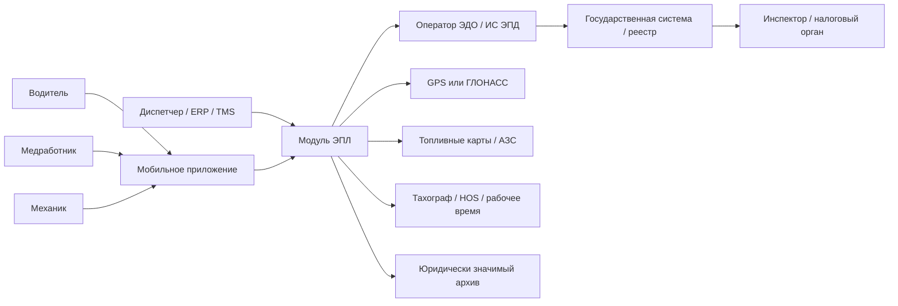
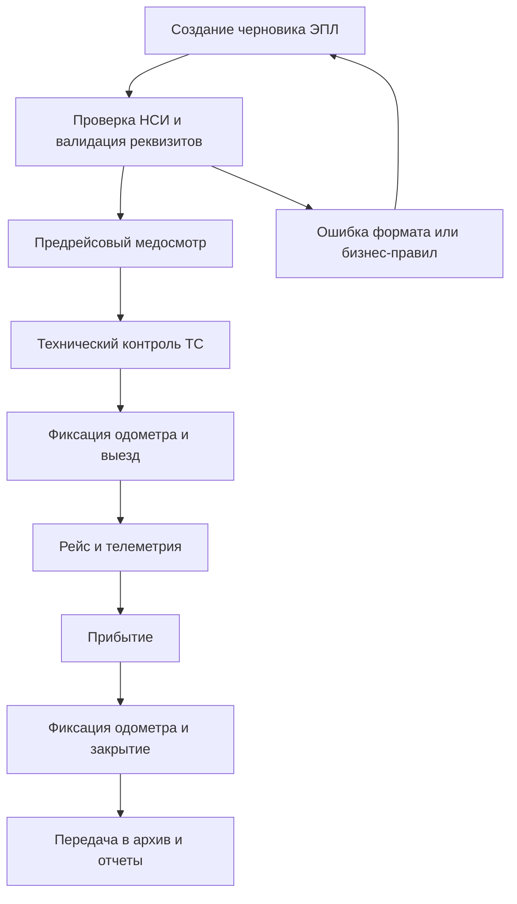

# Анализ электронных путевых листов и технических заданий в разных странах

## Исполнительное резюме

Электронный путевой лист в строгом российском смысле существует не во всех юрисдикциях. На практике страны используют три близких, но не тождественных класса документов: внутренний путевой лист или trip sheet для выпуска ТС на линию; электронную товарно-транспортную накладную или e-way bill для контроля перевозки груза; а также международную электронную накладную e-CMR и инфраструктуру eFTI для обмена регуляторной информацией. Для корректного межстранового сравнения я включил все три класса, отдельно отмечая, где аналог является точным, а где только функционально близким. Такая развязка соответствует тому, как сами регуляторы описывают CMR, eFTI и российский ЭПЛ. citeturn17search0turn29view1turn42view0

По состоянию на 11 июля 2026 года наиболее зрелые и формализованные модели выглядят так. Казахстан ввел обязательную регистрацию путевых листов и ТТН в ЕСУТД для грузового автотранспорта свыше 3,5 т с 1 июня 2026 года. Индия использует обязательный e-Way Bill для перемещения товаров свыше установленного порога стоимости. Бразилия давно эксплуатирует обязательный MDF-e как национальный цифровой транспортно-фискальный документ. Турция перевела e-İrsaliye в режим обязательности для категорий налогоплательщиков, подпадающих под правила GİB. В Украине государственная система e-ТТН вышла из режима чистого эксперимента в режим постоянной правовой эксплуатации, но публично не закреплена как всеобщая обязательность для всех внутренних перевозок. Беларусь сохраняет добровольный характер электронных накладных. В России электронный путевой лист нормативно оформлен и технологически поддержан через ГИС ЭПД, однако в официальных разъяснениях по обязательному транспортному ЭДО на 1 сентября 2026 года ЭПЛ не назван в общем перечне обязательных грузовых документов, поэтому для России корректнее говорить о добровольном или секторно-обязательном статусе, а не о безусловной всеобщей обязательности. citeturn27search2turn15view0turn14search3turn28search6turn25view2turn21view6turn26view0turn43search18

Лучшие публично доступные «готовые ТЗ» в этой теме — это не классические корпоративные ТЗ, а набор нормативно-технических артефактов: XML/XSD-форматы, схемы статусов документа, регламенты интеграции, API-спецификации, сценарии тестирования, онбординг операторов и отдельные публичные техзадания экосистемных проектов. Самые полезные для подготовки собственного ТЗ документы найдены в России, Украине, Беларуси, Индии, Турции, Бразилии и в проектах ЕАЭС. Именно они дают повторяющийся «каркас» требований: роли участников, обязательные реквизиты, порядок подписания, временные точки формирования, форматный контроль, защищенный API-обмен, хранение, архив, QR/визуализацию для инспектора и правила работы при технических сбоях. citeturn31view1turn21view5turn25view2turn39view6turn16search1turn41view3turn13view3turn39view0

С практической точки зрения при разработке собственной системы ЭПЛ сильнее всего выигрывают решения, которые изначально закладывают: подпись квалифицированной ЭП и поддержку МЧД, ролевой маршрут подписания, мобильный сценарий для водителя и линейного персонала, офлайн-предъявление через QR или локальный кэш, API-first интеграцию с ERP/TMS/WMS и операторами ЭДО, подключение GPS/ГЛОНАСС и одометра, отдельный контур топлива, интеграцию медосмотра и техконтроля, а также раздельные политики хранения юридически значимого архива и оперативной телематики. Это прямо вытекает из российских, украинских, индийских, турецких и бразильских спецификаций. citeturn31view1turn42view0turn39view6turn38search2turn41view3turn13view3

## Контекст и методология

Сравнение этой темы требует аккуратного обращения с термином «путевой лист». В России и Казахстане это документ выпуска ТС на линию и учета рейса. В Беларуси и Украине ближе электронная ТТН. В ЕС — e-CMR и eFTI. В Индии, Турции, Саудовской Аравии и Бразилии — цифровые грузовые и налогово-транспортные документы, сопровождающие движение товара. Поэтому ниже я разделяю режимы на три группы: точный аналог ЭПЛ, близкий аналог грузового waybill и международный цифровой consignment note. citeturn42view0turn21view4turn21view5turn25view2turn17search0turn29view1

В исследование включались только источники первого уровня или близкие к ним: министерства транспорта, налоговые органы, официальные правовые порталы, международные организации, государственные информационные системы и официальные сайты разработчиков решений. Если для страны или платформы публичные данные по цене, мобильному приложению, офлайн-режиму или интеграциям не найдены, в таблицах это отмечено как «не указано». citeturn26view0turn21view3turn21view5turn25view2turn15view0turn12search3turn13view3

Ниже приведена укрупненная картина правовых режимов по странам, где электронный путевой лист или его устойчивый функциональный аналог уже используется.

Диаграмма выше является синтезом повторяющейся архитектуры из российских регламентов ГИС ЭПД, украинской системы e-ТТН, индийского API e-Way Bill и бразильского MDF-e: локальная учетная система или мобильный клиент формирует документ, оператор передает его в государственный контур, а инспектор или налоговый орган получают доступ к статусу и реквизитам; параллельно подключаются телематика, подписи и архив. citeturn31view1turn39view6turn16search1turn13view3

## Правовой статус по странам

### Карта режимов

| Страна | Документ или ближайший аналог | Правовой статус | Ключевая норма и комментарий |
|---|---|---|---|
| Россия | Электронный путевой лист через ГИС ЭПД | **Добровольный или секторно-обязательный** | ФНС утвердила формат ЭПЛ до 01.03.2029, Минтранс утвердил порядок оформления; при этом в официальном разъяснении ФНС по обязательному транспортному ЭДО с 01.09.2026 перечислены прежде всего грузовые перевозочные документы без явного включения ЭПЛ. citeturn42view0turn43search0turn26view0 |
| Казахстан | Электронный путевой лист и ТТН в ЕСУТД | **Обязательный** | Минтранс РК сообщает, что с 1 июня 2026 года вводится обязательная регистрация путевых листов и ТТН в ЕСУТД для грузоперевозок свыше 3,5 т. До этой даты обязательность была приостановлена. citeturn27search2turn21view3 |
| Беларусь | ЭТТН и ЭТН | **Добровольный** | Инструкция Минфина прямо говорит, что электронные накладные создаются на добровольной основе; позднейший ТНПА детализирует структуру, формат, ЭЦП и работу через EDI-провайдера. citeturn21view6turn21view5 |
| Украина | e-ТТН | **Регулируемый государством, после эксперимента; всеобщая обязательность публично не указана** | Постановление № 629 оформило экспериментальный проект, приказ № 1491 закрепил постоянный порядок функционирования системы, а портал e-ТТН в 2026 году уже публикует авторизованные платформы и нормативную базу. citeturn25view1turn25view2turn37search1 |
| Индия | GST e-Way Bill | **Обязательный** | До начала движения товаров свыше 50 000 рупий требуется электронная подача сведений и генерация e-Way Bill; для меньших сумм возможна добровольная генерация. citeturn15view0turn15view1 |
| Турция | e-İrsaliye | **Обязательный для налогоплательщиков в установленном периметре, для прочих добровольный** | GİB указывает, что по 509 VUK Genel Tebliği введена обязанность перехода на e-İrsaliye для подпадающих категорий; разъяснения и технические требования опубликованы в официальном application guide. citeturn28search6turn41view3 |
| Саудовская Аравия | Electronic Naqal Document / Bayan waybill | **Обязательный для регулируемых коммерческих перевозок** | Регламент TGA требует выпускать транспортный документ на каждую перевозку груза; официальный портал Logisti предоставляет электронный сервис выдачи waybill, а TGA отдельно подчеркивает требование e-waybill для иностранных грузовиков. citeturn11search1turn12search2turn12search3 |
| Бразилия | MDF-e | **Обязательный** | CONFAZ установил обязанность оформления MDF-e в предусмотренных случаях, а национальный портал MDF-e описывает его как полностью электронный документ с юридической силой за счет цифровой подписи и авторизации налоговым органом. citeturn14search3turn13view0turn13view3 |
| Нидерланды | e-CMR | **Добровольный, юридически признанный** | Нидерланды являются участником e-CMR Protocol с ратификацией 07.01.2009; в ЕС eFTI создает общий режим принятия электронной регуляторной информации. citeturn19view0turn29view1 |
| Франция | e-CMR | **Добровольный, юридически признанный** | Франция присоединилась к e-CMR 05.10.2016; eFTI требует принятия регуляторной информации в электронной форме при соблюдении условий регламента. citeturn19view2turn29view0 |
| Германия | e-CMR | **Добровольный, юридически признанный** | Германия присоединилась к e-CMR 05.01.2022. citeturn19view3 |
| Испания | e-CMR | **Добровольный, юридически признанный** | Испания — участник e-CMR с 11.05.2011. citeturn19view1 |
| Таджикистан | e-CMR | **Добровольный, юридически признанный** | Таджикистан присоединился к e-CMR 09.07.2019; государственная национальная платформа в найденных источниках не указана. citeturn19view1 |
| Узбекистан | e-CMR | **Добровольный, юридически признанный** | Узбекистан присоединился к e-CMR 16.10.2020; отдельная национальная государственная платформа в найденных источниках не указана. citeturn19view1 |

### Наблюдения по международному режиму

Для Европы критично различать e-CMR и eFTI. e-CMR — это правовая валидность электронной международной автодорожной накладной по дополнительному протоколу к CMR. eFTI — это общеевропейский режим, который обязывает компетентные органы принимать регуляторную информацию, предоставленную через сертифицированные платформы, в машиночитаемом и при необходимости человекочитаемом виде. То есть eFTI усиливает инфраструктурную совместимость, но сам по себе не превращает все страны ЕС в режим обязательной исключительно электронной накладной для бизнеса. citeturn18view0turn29view1turn29view0

По состоянию на 10 июля 2026 года у e-CMR Protocol было 41 государство-участник. Среди них, помимо названных выше, — Албания, Армения, Австрия, Азербайджан, Болгария, Чехия, Дания, Эстония, Финляндия, Греция, Венгрия, Италия, Кыргызстан, Латвия, Литва, Люксембург, Черногория, Северная Македония, Норвегия, Оман, Польша, Португалия, Молдова, Румыния, Словакия, Словения, Швеция, Швейцария, Туркменистан, Украина и Великобритания. Это означает широкую международную правовую базу для трансграничного цифрового документа, но не означает автоматическую унификацию национальных внутренних trip-sheet систем. citeturn18view0turn19view0turn19view1turn19view2

## Нормативные акты, стандарты и образцы документов

### Ключевые первоисточники и что именно они регулируют

| Юрисдикция | Документ | Формат | Что задает |
|---|---|---|---|
| Россия | Приказ Минтранса РФ № 390 от 28.09.2022 citeturn43search0 | PDF | Состав сведений и порядок оформления или формирования путевого листа, включая электронную форму. |
| Россия | Приказ ФНС РФ № ЕД-7-26/116@ от 17.02.2023 citeturn42view0 | HTML + ZIP | Формат электронного путевого листа; срок действия формата до 01.03.2029. |
| Россия | Регламент информационного взаимодействия с ГИС ЭПД, версия 1.8.1 citeturn31view1 | PDF | API, каналы связи, ошибки, подписи, параметры интеграции с ГИС ЭПД. |
| Россия | Технический регламент подключения операторов ИС ЭПД к ГИС ЭПД citeturn39view1 | PDF | Базовые требования к оператору, понятия ЭПЛ/ЭТрН, контур подключения. |
| Беларусь | Постановление Минфина/МНС/Минсвязи/НАН № 12/76/42/20 от 19.12.2019 citeturn21view5 | PDF | Структура и формат ЭТТН и ЭТН, EDI-провайдер, ЭЦП, GLN/GTIN, международный обмен. |
| Беларусь | Постановление Минфина № 22/4 от 17.04.2014 citeturn21view6 | PDF | Правила создания, передачи, получения и хранения электронных накладных; добровольность. |
| Беларусь | Постановление Минфина № 58 от 30.06.2016 citeturn20search14 | PDF | Типовые формы ТТН-1 и ТН-2 — базовый образец реквизитов бумажной и цифровой накладной. |
| Казахстан | Правила перевозок и сообщения Минтранса РК о ЕСУТД citeturn21view4turn21view3 | HTML | Обязательность регистрации бумажных путевых листов и ТТН в ЕСУТД для отдельных перевозок. |
| Украина | Постановление КМУ № 629 от 30.05.2024 citeturn25view1 | HTML | Порядок реализации эксперимента e-ТТН, API/личный кабинет, интеграции с WIM и госреестрами. |
| Украина | Приказ Минразвития № 1491 от 27.12.2024 citeturn25view2 | HTML | Постоянный порядок функционирования системы e-ТТН, защита и хранение информации, роли платформ. |
| Индия | Rule 138 / e-Way Bill Rules (CBIC) citeturn15view0turn15view1 | HTML | Обязательность генерации e-Way Bill, порог стоимости, валидность, RFID, документы в дороге. |
| Турция | e-İrsaliye Uygulama Kılavuzu (GİB) citeturn41view3turn41view1 | PDF | Обязательные поля, сроки оформления, правила бумажного исключения, хранение и предъявление. |
| Бразилия | Manual de Orientações do Contribuinte MDF-e v3.00 citeturn13view3 | PDF | Схема XML, веб-сервисы, ICP-Brasil, модель событий, авторизация, DAMDFE. |
| ЕС / ООН | e-CMR Protocol и Regulation (EU) 2020/1056 citeturn18view0turn29view0 | HTML / treaty text | Международная правовая валидность e-CMR и обязательство властей принимать eFTI-данные. |

### Что можно считать официальными образцами

В этой предметной области «образец» часто представлен не как красиво сверстанный бланк, а как структурированный формат документа. Для России таким образцом фактически выступает ZIP-приложение ФНС с XML-схемой ЭПЛ и требованиями к файлам обмена. Для Беларуси официальным образцом служат типовые формы ТТН-1/ТН-2 и их электронные форматы в ТНПА. Для Индии образцом являются FORM GST EWB-01 и EWB-02, описанные в rules. Для Турции — UBL-TR-структура и перечень обязательных полей e-İrsaliye. Для Бразилии — XML-модель MDF-e и печатный документ-спутник DAMDFE. Для Украины — общая спецификация e-ТТН, XSD-схема и инструкции к корректирующим актам, опубликованные на государственном портале проекта. citeturn42view0turn21view5turn20search14turn15view0turn41view0turn13view3turn37search3

## Готовые ТЗ, спецификации и шаблоны

### Что удалось найти в публичном доступе

Полноценные корпоративные ТЗ именно «на разработку системы электронного путевого листа» в открытом доступе встречаются редко. Зато в большом количестве доступны более полезные для реальной разработки документы: регламенты обмена, форматы XML/XSD, сценарии тестирования, онбординг операторов и отдельные экосистемные техзадания. Для практической подготовки собственного ТЗ это обычно даже ценнее, чем классическое закупочное ТЗ, потому что именно эти документы содержат проверяемые требования к API, безопасности, статусной модели, ролевым подписям и архиву. citeturn31view1turn39view6turn39view0turn16search1turn41view3turn13view3

Условные обозначения в сравнительной таблице: **✓** — требование явно задано; **△** — упомянуто косвенно или частично; **—** — не указано в документе; **не указано** — сведений о стоимости или модуле нет.

### Сравнительный анализ найденных ТЗ, шаблонов и спецификаций

| Документ | Формат | Функционал | Безопасность и подпись | GPS/ГЛОНАСС | Топливо | Рабочее время водителя | Хранение данных | API | Мобильный/офлайн | Стоимость внедрения |
|---|---|---|---|---|---|---|---|---|---|---|
| РФ. Приказ Минтранса № 390 citeturn43search0 | PDF | ✓ Реквизиты, роли, порядок оформления ЭПЛ | △ Требования к подписи раскрываются совместно с форматом ФНС | — | △ Оdometer, пробег как часть ЭПЛ связаны с эксплуатацией, но нормы топлива не задаются | — | — | — | △ QR и дорожное предъявление раскрыты в смежных разъяснениях Минтранса citeturn43search1 | не указано |
| РФ. Приказ ФНС № ЕД-7-26/116@ citeturn42view0turn43search3 | HTML + ZIP/XML | ✓ Формат обмена ЭПЛ | ✓ Структура формализованного ЭД и ЭП | — | — | — | — | ✓ Форматизированный обмен по ТКС | — | не указано |
| РФ. Регламент взаимодействия с ГИС ЭПД v1.8.1 citeturn31view1 | PDF | ✓ Потоки данных, статусы, ошибки, QR | ✓ УКЭП/УНЭП, VPN, ГОСТ, VipNET | — | — | — | △ Контроль полноты и своевременности передачи | ✓ Подробные методы API | △ Подходит для веб/мобильных клиентов, но сами клиенты не описывает | не указано |
| РФ. Техрегламент подключения операторов к ГИС ЭПД citeturn39view1 | PDF | ✓ Контур подключения, роли операторов | ✓ Организационные и технические требования | — | — | — | — | ✓ Подключение операторов | — | не указано |
| Беларусь. ТНПА № 12/76/42/20 citeturn21view5 | PDF | ✓ Структура ЭТТН/ЭТН, EDI-процесс, международные реквизиты | ✓ ЭЦП, атрибутные сертификаты, EDI-провайдер | — | — | — | ✓ Передача, получение, хранение через EDI | △ Формат/обмен через EDI, но без открытого REST API | — | не указано |
| Беларусь. Инструкция № 22/4 citeturn21view6 | PDF | ✓ Правила создания/передачи/получения | △ Электронный документ и реквизиты | — | — | — | ✓ Хранение ЭД | — | — | не указано |
| Украина. Порядок функц. системы e-ТТН № 1491 citeturn25view2 | HTML | ✓ Роли, платформы ЭДО, база данных, кабинет инспектора, авторизация платформ | ✓ Аутентификация, защита и хранение информации | △ Интеграция с WIM и госресурсами задается смежным актом citeturn25view1 | — | — | ✓ Специальный раздел о защите и хранении | △ API допускается через личный кабинет пользователя и платформы ЭДО | △ Веб-интерфейс и API; мобильность определяется оператором | не указано |
| Украина. Гайдлайн для операторов e-ТТН citeturn39view5 | PDF | ✓ Онбординг оператора, подключение к системе | △ Организационные требования | — | — | — | — | △ Подключение оператора и интеграции | — | не указано |
| Украина. Программа и сценарии тестирования e-ТТН citeturn39view6 | PDF | ✓ Полный жизненный цикл: PLANNED, PICKUP, ARRIVAL, THIRD_PARTY, акты | ✓ Подписанные XML-документы и контроль статусов | — | — | — | △ Версионность и метаданные | ✓ POST/GET сценарии `/api/2/ettn` и `/task` | △ Подходит для мобильных клиентов через API, офлайн не указан | не указано |
| Индия. Rule 138 / E-Way Bill Rules citeturn15view0turn15view1 | HTML | ✓ Генерация, отмена, consolidated EWB, validity, RFID | △ Портальная аутентификация, не ЭП класса КЭП | △ RFID-привязка ТС | — | — | ✓ Общий портал и журнал транзакций | △ Портал + SMS + bulk | △ SMS и bulk/offline инструменты официально предусмотрены citeturn16search12 | не указано |
| Индия. EWB API Developer’s Portal / EWB_API.pdf citeturn16search1turn16search5turn16search12 | PDF / HTML | ✓ Генерация, обновление, отмена, bulk | ✓ Онбординг, токены, API-доступ | △ Передаются сведения о ТС | — | — | △ На стороне портала/интегратора | ✓ API-first | △ Bulk/offline tool явно предусмотрен | не указано |
| Турция. e-İrsaliye Uygulama Kılavuzu citeturn41view3turn41view1 | PDF | ✓ Обязательные поля, ответ на накладную, цепочка поставки, исключения | ✓ Электронное хранение и электронное предъявление | △ Номер груза, перевозчик, номер ТС и водитель включаются | — | — | ✓ Электронное хранение, бумажная копия не обязательна для архива | △ Работа через GİB и интеграторов | △ Бумажное исключение допускается при технических сбоях | не указано |
| Бразилия. MOC MDF-e v3.00 citeturn13view3 | PDF | ✓ Модель документа, события, завершение, cancel, inclusion of driver | ✓ ICP-Brasil, SSL/TLS, mutual auth | △ Сведения о ТС, водителе, маршруте явно есть | — | — | ✓ Национальный репозиторий и события | ✓ Веб-сервисы, WSDL, XML schema | — | не указано |
| ЕЭК. Техническое задание ЕАЭС на сервисы цифровых транспортных коридоров citeturn39view0turn38search12 | PDF | ✓ Публичное экосистемное ТЗ, включая ЭПЛ, проверку и внесение изменений | △ Требования к подлинности и форматно-логическому контролю | — | — | — | △ Межсистемный обмен в сегментах ЦТК | △ Межгосударственные интеграции | — | не указано |

### Что из этого полезнее всего для собственного проекта

Если требуется именно **прикладное ТЗ на разработку**, самые полезные документы — это российский регламент ГИС ЭПД, украинские сценарии тестирования e-ТТН, индийский EWB API, бразильский MOC MDF-e и турецкий e-İrsaliye guide. Они не просто описывают право, а показывают, как именно должна работать система: статусы, тайминги, события, исключения, методы API, структура ответа, правила подписания и реакции на ошибки. Для международного или интеграционного слоя дополнительно ценен документ ЕЭК по цифровым транспортным коридорам, потому что он уже мыслит сервисом уровня экосистемы, а не одного оператора. citeturn31view1turn39view6turn16search1turn13view3turn41view3turn39view0

Главная практическая лакуна почти во всех публичных документах — слабое внимание к учету топлива и рабочему времени водителя именно внутри транспортного документа. Эти блоки чаще решаются смежными системами: тахографами/ELD, телематикой, ERP или отраслевыми модулями. Поэтому при разработке собственного ЭПЛ их почти всегда надо формализовывать отдельными требованиями, даже если в нормативном документе они упомянуты лишь косвенно. citeturn31view1turn39view6turn46search0turn47search18

## Платформы и решения

### Государственные и отраслевые платформы

| Решение | Тип | Функционал | Лицензия и цена | Масштабируемость | Интеграции | Соответствие нормативам | Примеры внедрений |
|---|---|---|---|---|---|---|---|
| ГИС ЭПД, Россия citeturn31view1turn26view0 | Государственная платформа | Регистрация, обмен, хранение, статусы, QR, несколько типов ЭПД включая ЭПЛ | Для участников через операторов; публичной цены платформы нет | Федеральный уровень; документы от десятков регионов и операторов, миллионы ЭПД citeturn43search21turn43search20 | Операторы ИС ЭПД, ERP, API, роуминг между операторами citeturn26view0turn35search8 | Полное | Мосгортранс полностью перешел на ЭПЛ; Почта России тестировала ЭПЛ. citeturn43search21turn43search4 |
| ЕСУТД, Казахстан citeturn21view4turn27search2 | Государственная платформа | Регистрация, учет, обработка и хранение путевых листов и ТТН; доступ через мобильную версию/QR | Публичная цена не указана | Национальный уровень | Передача формализованной информации госорганам | Полное для режима РК | Промышленная эксплуатация и обязательный режим для >3,5 т с 01.06.2026. citeturn27search2 |
| e-ТТН, Украина citeturn25view2turn37search1 | Государственная система + авторизованные платформы ЭДО | e-ТТН, корректирующие акты, кабинет инспектора, API, авторизация платформ | Государственная система; коммерческие цены операторов зависят от провайдера | Национальный уровень | WIM, госреестры, Трембита, API, ЭДО-платформы citeturn25view1turn39view6 | Полное | На портале опубликованы авторизованные платформы и постоянная нормативная база. citeturn37search1turn37search2 |
| GST e-Way Bill, Индия citeturn15view0turn16search1 | Государственная налогово-логистическая платформа | Генерация, обновление, отмена, consolidated EWB, SMS, RFID, API, bulk/offline | Публичной платы за государственный контур не указано | Национальный уровень для всех GST-регистрантов | API, bulk upload, SMS, RFID | Полное | Все зарегистрированные лица под GST должны регистрироваться на портале e-way bill. citeturn15view4 |
| Logisti / Bayan, Саудовская Аравия citeturn12search1turn12search3 | Государственная логистическая платформа | Электронный waybill, freight statement, сервисы лицензирования | Публичная цена не указана | Национальный уровень | Электронная платформа TGA | Полное в регулируемом секторе | TGA фиксирует миллионы documented truck trips. citeturn10search0 |
| MDF-e National Platform, Бразилия citeturn13view0turn13view3 | Государственный фискально-транспортный контур | Авторизация, web services, события, национальный репозиторий, DAMDFE | Публичная цена платформы не указана | Национальный уровень | XML, WSDL, web services | Полное | Используется по всей федерации, законодательство действует на национальном уровне. citeturn14search1turn14search3 |

### Коммерческие решения

| Решение | Функционал | Лицензия и цена | Масштабируемость | Интеграции | Нормативное соответствие | Примеры внедрений |
|---|---|---|---|---|---|---|
| Контур.Логистика / Диадок API, Россия citeturn45search0turn45search2turn45search10 | ЭПЛ, ЭТрН, заказы-заявки, архив, API, модуль 1С, мобильное приложение | Публичный прайс: от 3 500 ₽ в год за 500 документов; далее пакетная тарификация. citeturn47search9turn47search5 | Enterprise и SMB | API, 1С, мобильный клиент, ГИС ЭПД | Да, автоматически обменивается с ГИС ЭПД по ЭПЛ и ЭТрН | Один из первых ЭПЛ в России; кейс с ускорением выпуска автобусов. citeturn45search4 |
| 1С‑ЭПД / Астрал, Россия citeturn45search1turn45search11turn45search17 | ЭПЛ и ЭТрН в 1С, медосмотр, техконтроль, одометр, QR, API, mobile app, white-label | Публичная абсолютная цена не указана; есть официальный раздел тарифов и правило тарификации по титулу ЭПЛ. citeturn47search8turn45search9 | СМБ и enterprise | API, CRM/TMS, мобильные приложения, 1С | Да, с прямой передачей в ГИС ЭПД | Официально описаны проектные адаптации под логистические компании; именованные кейсы на целевой странице не указаны. citeturn45search11 |
| TransFollow Connect, Европа citeturn46search7turn46search3 | eCMR lifecycle management, обмен transport documents, interop с TMS/WMS/ERP/FMS | Публичная цена не указана | 50+ программных провайдеров и растущая сеть | API | Соответствует eCMR-экосистеме; ориентирован на европейский стандарт | Подключение к множеству TMS/FMS/ERP/WMS-провайдеров. citeturn46search7 |
| Geotab, международно citeturn46search0turn46search14turn47search3 | ELD, HOS, DVIR, GPS, driver ID, compliance, real-time fleet tracking | Публичная цена не указана | Тысячи флотов по миру | Marketplace, compliance apps, fuel/IFTA ecosystem citeturn46search16 | Соответствие FMCSA ELD/HOS/DVIR | Пилот штата Юта в whitepaper Geotab. citeturn47search19 |
| Samsara, международно citeturn47search6turn46search15turn47search18 | ELD/HOS, GPS, fuel and energy monitoring, driver workflows, DVIR through Driver App | Публичная цена не указана, предлагается demo/free trial | Enterprise | REST APIs, webhooks, marketplace/TMS integrations citeturn46search1turn46search19 | Соответствие FMCSA ELD; сильный compliance stack | Кейс Bulkmatic с real-time HOS и API integrations. citeturn46search21 |
| Webfleet, международно citeturn46search6turn48search8turn48search4 | ePOD, route/fleet management, mileage log, tax compliance, API integration | Pricing by request | Enterprise | API/SDK, digital forms, partner ecosystem citeturn46search2 | Поддержка документарного и fleet-compliance контуров; eCMR прямо не позиционируется на целевой найденной странице | Наличие публично названного кейса в найденных источниках не указано |

### Практические выводы по решениям

Если задача — **нормативно значимый российский ЭПЛ**, то наиболее зрелыми с точки зрения публичной продуктовой документации выглядят экосистема ГИС ЭПД плюс коммерческие решения Контур и Астрал/1С‑ЭПД. У них лучше всего просматриваются три ключевые вещи: поддержка формализованных титулов ЭПЛ, интеграция с государственным контуром и готовые API/мобильные сценарии. citeturn31view1turn45search0turn45search1turn45search9

Если задача — **международная мультирегуляторная платформа**, то полезнее смотреть на две разные архитектуры. Для юридически значимого документа в Европе — eCMR/eFTI-ориентированный стек вроде TransFollow. Для операционного управления флотом и комплаенса по часам работы, осмотрам, GPS и топливу — Geotab/Samsara/Webfleet. Это не конкуренты «один к одному»: первая группа закрывает transport document interoperability, вторая — fleet operations and compliance. На практике крупным перевозчикам часто нужен гибрид этих контуров. citeturn46search7turn29view1turn46search0turn47search18turn46search6

## Шаблон ТЗ для разработки системы

### Рекомендуемая структура ТЗ

Ниже — практический шаблон ТЗ, собранный на основе повторяющихся требований из российских, украинских, белорусских, индийских, турецких и бразильских документов. Это не нормативный текст, а инженерная заготовка, позволяющая быстро перейти к проектированию. citeturn31view1turn21view5turn39view6turn16search1turn41view3turn13view3

| Раздел ТЗ | Что включить |
|---|---|
| Предмет проекта | Создание информационной системы электронной формы путевого листа и связанных перевозочных документов для внутреннего и при необходимости международного использования. |
| Цели | Юридически значимый безбумажный выпуск ТС на линию; сокращение времени оформления; интеграция с государственными системами; повышение прозрачности рейса; аудит действий. |
| Нормативная база | Указать применимые законы, приказы, форматы ФНС/Минтранса, требования локального регулятора, eCMR/eFTI при трансграничном использовании. |
| Термины и роли | Водитель, диспетчер, медработник, механик, владелец ТС, перевозчик, грузоотправитель, грузополучатель, инспектор, оператор ЭДО, администратор, интеграционный сервис. |
| Бизнес-процессы | Создание ЭПЛ, предварительное заполнение, медосмотр, техконтроль, выезд, рейс, прибытие, закрытие рейса, корректировки, аннулирование, архив, выгрузка при проверке. |
| Функциональные требования | Шаблоны документов; многотитульная модель; маршруты подписания; статусы; QR; поиск и фильтры; журнал событий; печатная форма; пакетный импорт; уведомления; массовая обработка. |
| Интеграции | API-first; ERP/TMS/WMS/1С; оператор ЭДО; государственная система; GPS/ГЛОНАСС; тахограф/ELD; медосмотр; техконтроль; топливные карты; BI; MDM/НСИ. |
| Требования к данным | Версионирование; обязательные реквизиты; справочники ТС/водителей/маршрутов; форматный и логический контроль; правила валидации. |
| Информационная безопасность | КЭП/ЭЦП/локальные аналоги; МЧД; TLS/VPN; разграничение ролей; audit trail; журнал неуспешных попыток; резервирование; криптозащита; управление ключами. |
| Хранение и архив | Юридически значимый архив; сроки хранения по локальному праву; разделение hot/cold storage; экспорт по делу; неизменяемость оригинала; hash-контроль. |
| Мобильный контур | Android/iOS/web mobile; работа водителя, медика, механика; подпись; камера/сканирование QR; push; локальный кэш. |
| Офлайн-режим | Локальное сохранение черновика; кэш реквизитов; офлайн-предъявление QR/читаемой формы; очередь синхронизации; конфликт-резолвер. |
| Нефункциональные требования | SLA, RPO/RTO, производительность, время ответа API, горизонтальное масштабирование, observability, поддержка обновления форматов без остановки системы. |
| Тестирование | Нагрузочное, интеграционное, регрессионное, безопасность, отказоустойчивость, сценарии статусов, negative cases, UAT, пилотный маршрут. |
| Поставка и внедрение | Этапы, миграция НСИ, обучение, опытно-промышленная эксплуатация, приемо-сдаточные критерии, пакет эксплуатационной документации. |

### Пример минимальных функциональных требований

Система должна поддерживать как минимум следующие сущности и события: карточку путевого листа с обязательными реквизитами; титулы предрейсового медицинского осмотра и технического контроля; фиксацию показаний одометра на выезде и возврате; привязку водителя, ТС, прицепа, маршрута, заказчика и груза; статусную модель документа; историю корректировок; юридически значимую подпись на каждом шаге; экспорт в XML/JSON/PDF; QR для инспектора; API для интеграции; и автоматическую архивацию финальной версии документа. Такой набор напрямую отражает российскую модель титулов ЭПЛ, украинскую модель статусов e-ТТН и бразильскую событийную модель MDF-e. citeturn45search7turn39view6turn13view3

С точки зрения проектной архитектуры оптимален **API-first + event-driven** подход: мастер-данные и UI остаются в ERP/TMS заказчика, а юридически значимый жизненный цикл документа обслуживается специализированным модулем ЭПЛ/ЭПД. Это уменьшает объем ручного ввода и делает проще подключение мобильного клиента, госоператора и внешней телематики. Такая архитектура лучше всего соответствует российскому, украинскому и индийскому контуру. citeturn31view1turn39view6turn16search1

### Примерные требования по безопасности и аудиту

В ТЗ имеет смысл сразу зафиксировать, что все юридически значимые действия подписываются квалифицированной электронной подписью либо национально допустимым сертифицированным аналогом; каждый титул документа сохраняет хэш, timestamp, signer ID, certificate ID, machine-readable power-of-attorney reference и предыдущую версию; транспорт между системами шифруется, а внешние API защищаются mTLS или эквивалентным механизмом. Для операторской интеграции желателен отдельный защищенный канал и журнал ошибок/повторных отправок. Эти требования подтверждаются российским регламентом ГИС ЭПД, белорусским EDI/ЭЦП-подходом и бразильским ICP-Brasil + SSL/TLS. citeturn31view1turn21view5turn13view3

### Что обязательно добавить сверх нормативного минимума

Нормативный минимум почти всегда недостаточен для операционной эффективности. В собственном ТЗ я бы рекомендовал отдельно прописать:

| Блок | Почему это важно |
|---|---|
| Интеграция с GPS/ГЛОНАСС | Для подтверждения маршрута, времени прибытия, пробега, геозон, диспетчерского контроля. Российские и международные коммерческие решения прямо строятся вокруг этого контура. citeturn47search3turn47search18turn46search14 |
| Топливо | Для факта заправок, расхода по рейсу, контроля отклонений и сверки с картами/АЗС. В большинстве регуляторных документов блок топлива слабый, значит его надо формализовать в ТЗ отдельно. citeturn47search18turn48search4 |
| Учет рабочего времени/HOS | Для международного бизнеса и fleet compliance это обязательный контур; без него ЭПЛ будет «слеп» к реальному времени труда и отдыха. citeturn46search0turn47search6 |
| Офлайн-сценарий | Проверка на дороге и удаленные районы требуют автономного предъявления QR/читаемой формы и отложенной синхронизации. citeturn43search1turn16search12turn41view3 |
| Rule engine для страновых профилей | Позволяет одной платформе обслуживать разные юрисдикции: РФ ЭПЛ, Украина e-ТТН, Индия e-Way Bill, ЕС eCMR. citeturn42view0turn25view2turn15view0turn18view0 |

## Выводы

Рынок электронных путевых листов и их аналогов развивается не как единая глобальная модель, а как набор национальных режимов, поверх которых наслаиваются международные стандарты взаимодействия. Для России и Казахстана критичен именно внутренний цифровой путевой лист/госреестр. Для Индии, Турции, Саудовской Аравии и Бразилии — прежде всего обязательный электронный грузовой или фискально-транспортный документ. Для Европы — международная правовая приемлемость e-CMR и инфраструктурное принятие eFTI. citeturn27search2turn15view0turn41view3turn12search3turn13view3turn29view1

Если задача стоит как **разработка собственной системы**, оптимальная стратегия такова: взять за эталон российский регламент ГИС ЭПД по безопасности и интеграции, украинские сценарии тестирования по жизненному циклу статусов, индийский и бразильский контур по API и событийной модели, а европейский e-CMR/eFTI — как слой интероперабельности для трансграничного расширения. Такой подход даст архитектуру, которая не «привязана насмерть» к одному рынку и при этом выдерживает регуляторный аудит. citeturn31view1turn39view6turn16search1turn13view3turn29view0

Наиболее зрелые публичные решения для быстрого старта в русскоязычном контуре — это ГИС ЭПД как государственный слой и коммерческие продукты Контур.Логистика и 1С‑ЭПД/Астрал как прикладной слой. Но если проект задуман как международный, с самого начала нужно разделить «юридически значимый транспортный документ» и «операционную fleet-систему»: это разные продукты, разные интеграции и часто разные поставщики. citeturn26view0turn45search0turn45search1turn46search7turn46search0turn47search18