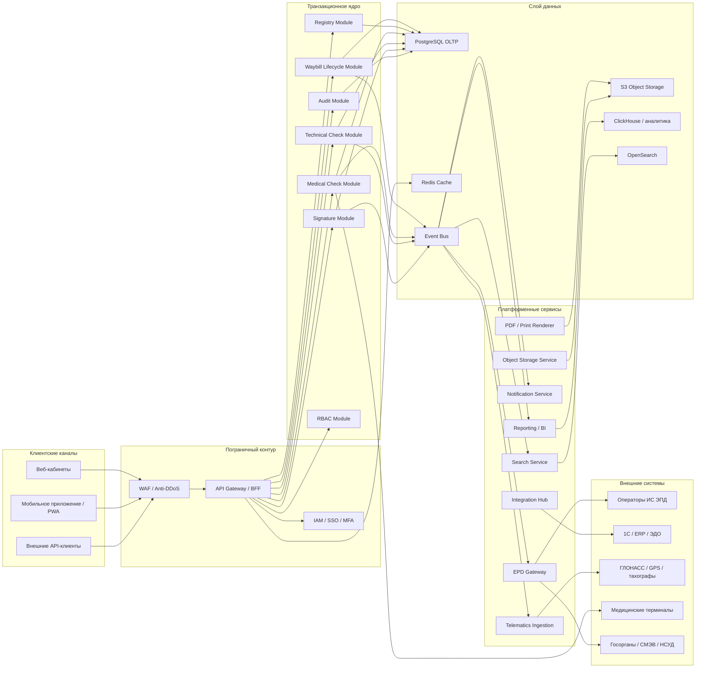
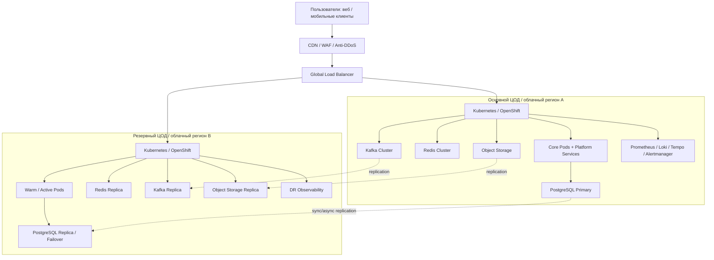
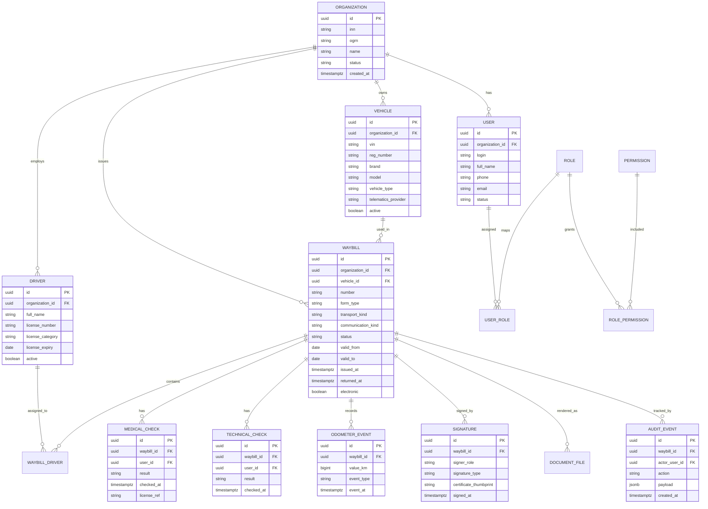
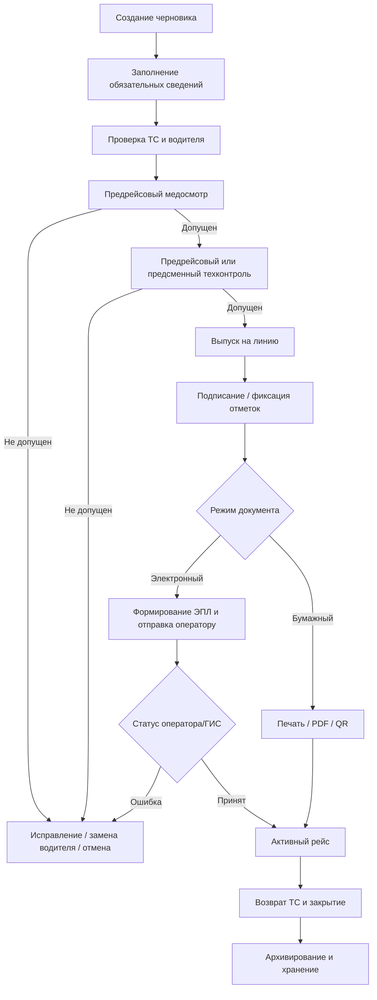
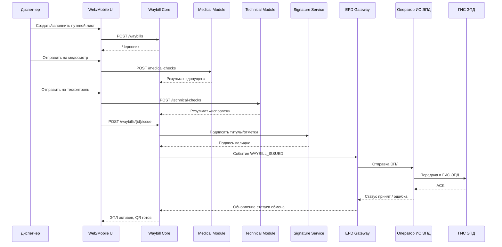
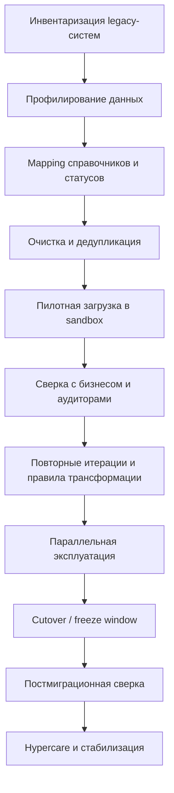
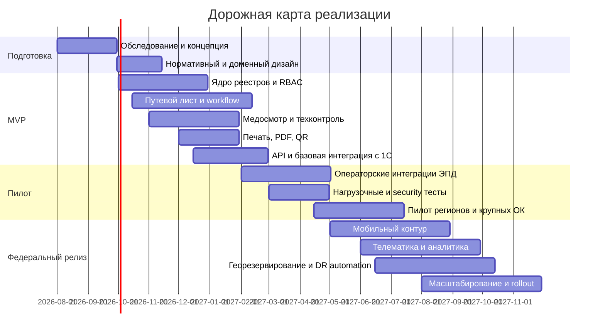

# Техническое задание и инженерный пакет для государственной платформы Путевой лист

## Executive summary

Настоящий документ — проект полного инженерного ТЗ и сопровождающего архитектурного пакета для создания государственной национальной платформы «Путевой лист» федерального масштаба, рассчитанной на миллионы пользователей в сутки, с поддержкой как бумажного, так и электронного путевого листа, юридически значимого электронного документооборота, мобильной работы водителей и интеграции с государственными и корпоративными системами. В российском правовом поле путевой лист оформляется собственником или владельцем транспортного средства; он может вестись на бумажном носителе либо как электронный путевой лист. Состав обязательных сведений и порядок оформления устанавливаются транспортным регулятором, а действующий состав сведений утвержден приказом Минтранса России № 390. Электронный формат путевого листа утвержден приказом ФНС России № ЕД-7-26/116@ и действует до 01.03.2029. citeturn2view3turn12search1turn14view1turn14view2turn14view3turn2view2

Ключевое архитектурное решение, рекомендуемое для этой платформы, — **гибридная архитектура «модульное ядро + выделенные платформенные сервисы + событийная интеграция»**. Причина выбора: жизненный цикл путевого листа является сильно транзакционным и регуляторно чувствительным, что требует строгой согласованности данных, сквозного аудита, предсказуемой доменной модели и контролируемой эволюции. При этом контур интеграций, телематики, аналитики, документооборота, уведомлений и мобильной синхронизации естественно масштабируется как автономные сервисы. Полный ранний переход в «чистые микросервисы» для такого госпроекта ухудшит сроки, стоимость и вероятность успешного запуска; чистый монолит ограничит интеграционную расширяемость и сложнее пройдет федеральное горизонтальное масштабирование. Рекомендуемая модель дает короткий путь к MVP и безопасную траекторию к федеральной эксплуатации.

С точки зрения регуляторики платформа должна изначально строиться как **российская государственная или операторская платформа с хранением и обработкой данных в РФ**, с учетом требований к защите информации, персональных данных, электронной подписи, архивному хранению, медосмотрам и контролю технического состояния ТС. Для электронных перевозочных документов участники перевозок направляют сведения в ГИС ЭПД **через аккредитованных операторов ИС ЭПД**; следовательно, новая платформа должна либо интегрироваться с действующими операторами, либо сама проходить путь включения в реестр операторов ИС ЭПД и подключения к ГИС ЭПД по регламентам Минтранса. citeturn10view3turn10view2turn29search0turn29search4turn29search8

В части обязательности электронного контура важно не смешивать общий ЭПД-контур и именно электронный путевой лист. По официальным материалам Минтранса электронный путевой лист может оформляться с 01.03.2023, а ГИС ЭПД работает на всей территории РФ. При этом официальная страница ФНС об обязательном транспортном ЭДО указывает, что с 01.09.2026 в обязательный электронный формат переводится часть перевозочных документов и экспедиторских документов; в опубликованном на этой странице перечне путевой лист отдельно не назван. Следовательно, для платформы нужно поддерживать **оба режима**: бумажный и электронный, а также конфигурируемые правила обязательности по видам перевозок и по будущим изменениям законодательства. citeturn2view4turn10view4turn2view0turn2view2turn26search9

С точки зрения продукта рекомендуемый федеральный минимум включает: реестр организаций, ТС и водителей; создание, выпуск, подписание, исполнение и закрытие путевого листа; предрейсовые и послерейсовые медицинские осмотры; предрейсовый или предсменный технический контроль; печатную форму и PDF; QR-предъявление для контроля на дороге; аудит; ролевую модель; операторские интеграции с ГИС ЭПД; базовые отчеты; мобильный кабинет водителя; интеграцию с 1С; импорт данных из legacy-систем. Это — реалистичный MVP для пилота 6–8 регионов и крупных перевозчиков. Полноценный федеральный релиз должен дополнительно включать телематику, маршрутизацию, аналитический контур, расширенные API, региональную модель администрирования, нагрузочный и отказоустойчивый контур, обучение и круглосуточную поддержку.

Рекомендуемые эксплуатационные цели для федерального релиза: доступность критичных API не ниже **99,95%** на этапе MVP и **99,99%** на этапе всероссийского масштаба; RPO не более **5 минут**; RTO не более **30 минут** для критичного контура; время выпуска электронного путевого листа — до **5 секунд** без учета внешних задержек операторов и подписантов; p95 для типового чтения — до **300 мс**, p95 для реестрового поиска — до **1,5 с**; проектная обработка телематических событий — отдельно масштабируемым контуром, не влияющим на транзакционный выпуск документов. Это не нормативные показатели, а инженерные целевые значения для проектирования и приемки.

По оценке реализации, если брать федеральную платформу государственного класса, разумно планировать три сценария. **Минимальный**: MVP и межрегиональный пилот — 180–280 млн руб. **Оптимальный**: федеральная эксплуатация с полным базовым контуром, аналитикой и масштабируемой инфраструктурой — 450–750 млн руб. **Премиальный**: геораспределение, расширенный мобильный набор, BI/ML, высокий уровень операционной зрелости и широкий интеграционный контур — 900 млн–1,6 млрд руб. Это ориентиры порядка величины, а не смета закупки; разброс зависит от модели внедрения, числа регионов, требований к импортонезависимости, аттестации и выбора инфраструктуры.

## Нормативный контур и границы проекта

### Предмет регулирования и проектные допущения

Юрисдикция для настоящего ТЗ — **Российская Федерация**. Требования других государств в запросе не конкретизированы; все международные требования в этом документе помечаются как **«не указано»** и приводятся только как опциональные варианты проектирования.

Путевой лист в действующем правовом контуре РФ оформляется на каждое транспортное средство, осуществляющее движение по дорогам при перевозке пассажиров и багажа либо грузов, и может быть оформлен на бумаге или сформирован как электронный путевой лист. Закон перечисляет обязательные блоки сведений: срок действия, лицо, оформившее документ, транспортное средство, водитель, вид перевозки и вид сообщения; собственник вправе включать дополнительные сведения. citeturn2view3turn14view1

Детальный состав сведений утвержден приказом Минтранса России № 390. Он требует, в частности, сведения о лице, оформившем путевой лист; данные ТС; дату, время и результат предрейсового или предсменного контроля технического состояния ТС; дату и время выпуска ТС на линию и его возвращения; показания одометра; сведения о водителе; дату, время и результат медосмотров; вид перевозки и вид сообщения. Приказ действует с 01.03.2023 до 01.03.2029. citeturn14view0turn14view1turn14view2turn14view3turn12search19

Электронный путевой лист является частью семейства электронных перевозочных документов. Формат электронного путевого листа утвержден ФНС России приказом от 17.02.2023 № ЕД-7-26/116@; действие приказа установлено до 01.03.2029. ГИС ЭПД обеспечивает обмен электронными перевозочными документами и сведениями из них, а участники перевозок направляют сведения в ГИС ЭПД через аккредитованных операторов ИС ЭПД. citeturn2view2turn10view3turn10view2turn26search7

Для медицинских осмотров водителей действует приказ Минздрава России № 266н, который с 01.09.2023 по 01.09.2029 регулирует порядок и периодичность предсменных, предрейсовых, послесменных и послерейсовых медицинских осмотров, а также перечень включаемых в них исследований. Этот приказ заменил прежний приказ № 835н. Официальные разъяснения и публикации также подтверждают возможность проведения медосмотров с использованием медицинских изделий при соблюдении специальных правил, установленных постановлением Правительства РФ № 866. citeturn24search1turn24search6turn20search0turn23search3

Для технического контроля применяется приказ Минтранса России от 15.01.2021 № 9, которым утвержден порядок организации и проведения предрейсового или предсменного контроля технического состояния транспортных средств. Требование о фиксации результата такого контроля встроено и в состав сведений путевого листа по приказу № 390. citeturn15search1turn14view1

По персональным данным платформа должна учитывать по меньшей мере требования закона о персональных данных, в том числе уведомительный режим для операторов ПДн, локализацию баз данных российских граждан, правила трансграничной передачи и обязанность уведомления Роскомнадзора о факте неправомерной или случайной передачи персональных данных. Официальный портал Роскомнадзора указывает, что с 01.09.2022 оператор, как правило, должен уведомлять Роскомнадзор о начале или осуществлении обработки персональных данных, кроме отдельных исключений; forms can be filed on paper, with qualified electronic signature, or via ЕСИА. Роскомнадзор также указывает, что с 01.03.2023 действует новый порядок информирования о трансграничной передаче ПДн. По обзору Роскомнадзора по локализации оператор обязан обеспечить запись, систематизацию, накопление, хранение, уточнение и извлечение персональных данных граждан РФ с использованием баз данных, находящихся на территории РФ. citeturn25view2turn8search1turn8search0turn8search16

Если платформа будет отнесена к значимым объектам критической информационной инфраструктуры, потребуется отдельный контур обследования и категорирования по закону о безопасности КИИ. В официально опубликованном тексте закона прямо названы объекты КИИ в сферах, включая транспорт. Для госплатформы такого класса обследование на предмет КИИ следует считать обязательной проектной вехой, даже если итоговая значимость объекта еще не определена. citeturn21search1turn4search3

Срок хранения путевых листов как управленческих архивных документов в общем случае составляет **5 лет**; это же относится к журналам и базам данных учета путевых листов. Официальный архивный источник указывает соответствующий перечень, а правовые базы подтверждают позицию по статьям 553–554 перечня Росархива. Для документов, подтверждающих вредные и опасные условия труда, возможны более длительные сроки хранения; это следует учесть в политике архивации и удаления. citeturn27search2turn22search1turn22search2

### Реестр обязательных нормативных требований для платформы

| Нормативный источник | Что требует для платформы | Архитектурное следствие |
|---|---|---|
| Устав автомобильного транспорта, ст. 6 | Возможность бумажного и электронного путевого листа; обязательные базовые сведения; дополнительные сведения допустимы | Поддержка dual mode: paper + E-waybill; расширяемая схема документа citeturn2view3 |
| Приказ Минтранса № 390 | Детализирует поля, события, отметки, порядок оформления, выпуск до выхода на линию | Жесткий доменный workflow; обязательные валидации полей и статусов citeturn14view1turn14view2turn14view3 |
| Постановление Правительства № 931 | Устанавливает правила обмена ЭПД и взаимодействия с ГИС ЭПД | Нужен операторский шлюз/интеграция через аккредитованных операторов citeturn26search7turn10view3 |
| Приказ ФНС № ЕД-7-26/116@ | Утверждает формат электронного путевого листа до 01.03.2029 | Модель данных E-waybill должна строго соответствовать утвержденному формату и версиям схем citeturn2view2 |
| Приказ Минздрава № 266н | Регулирует медосмотры водителей и исследования | Нужен полноценный модуль медицинских допусков и журналов citeturn24search1turn24search6 |
| Постановление Правительства № 866 | Разрешает специальный режим осмотров с использованием медизделий | Нужен интерфейс для терминалов/телемедицины и доказуемость измерений citeturn20search0 |
| Приказ Минтранса № 9 | Регулирует техконтроль перед рейсом/сменой | Нужен обязательный модуль технического контроля и отметок о выпуске на линию citeturn15search1turn14view1 |
| Закон о ПДн и практика Роскомнадзора | Уведомления, локализация в РФ, трансграничная передача, инциденты | Российские ЦОД/облака, реестр обработки ПДн, DLP/IR-процедуры citeturn25view2turn8search0turn8search1turn8search16 |
| Закон об электронной подписи | Юридическая значимость электронных документов и подписей | Поддержка КЭП, МЧД, проверка цепочки доверия, хранение штампов времени и доказательств подписи citeturn2view4turn2view1 |
| Перечень Росархива | Сроки хранения путевых листов и журналов учета | Архивный tier, WORM/immutability, policy-based retention citeturn27search2turn22search2 |

### Регуляторные выводы для проектирования

С правовой точки зрения платформа не должна ограничиваться только электронным документооборотом. Закон и приказ № 390 прямо допускают как бумажный, так и электронный формат, а текущая официальная коммуникация государства по обязательному транспортному ЭДО не дает основания считать именно электронный путевой лист тотально обязательным для всех сценариев на дату подготовки документа. Поэтому в ядре системы нужен **единый жизненный цикл документа**, а представления документа — бумажное, PDF, XML ЭПЛ, QR и архивное — должны быть лишь разными проекциями одного доменного объекта. citeturn2view3turn2view4turn2view0

Для государственной платформы также важно различать две роли. Первая — **фронт-офисная государственная платформа**, которая обслуживает перевозчиков, органы власти и граждан. Вторая — **оператор ИС ЭПД**, через которого осуществляется передача в ГИС ЭПД. По действующим правилам участники перевозок взаимодействуют с ГИС ЭПД через аккредитованных операторов ИС ЭПД, а стать оператором можно только через включение в реестр и выполнение требований подключения. Следовательно, организационная модель проекта должна быть зафиксирована уже на этапе концепции: интеграция с внешними операторами либо получение собственного статуса оператора. citeturn10view3turn29search0turn29search4turn29search8

Требования по ЕСИА, СМЭВ, НСУД и другим общегосударственным интеграционным сервисам в части пользовательского контура в запросе **не указаны**; однако официальный портал ЭПД уже предусматривает доступ органов власти через личный кабинет, НСУД и СМЭВ. Поэтому для платформы федерального класса следует проектировать государственный интеграционный слой так, чтобы его можно было подключить к этим контурам без ломки доменной модели. citeturn10view3

## Целевой продукт и требования

### Цели платформы

Целевая платформа должна решать одновременно четыре класса задач. Во-первых, обеспечивать юридически корректное оформление и хранение путевых листов. Во-вторых, автоматизировать выпуск транспорта на линию: медицинский допуск, технический контроль, отметки о выпуске и возврате, одометр, маршрут, рейс, расход ГСМ, цифровые подписи. В-третьих, создавать единый цифровой контур взаимодействия между государством, перевозчиками, заказчиками, инспекторами и учетными системами. В-четвертых, формировать достоверную аналитическую базу для контроля, отчетности и управления транспортной отраслью.

### Основные пользовательские группы

| Группа | Цель в системе | Основные операции |
|---|---|---|
| Федеральный администратор | Управление платформой и справочниками федерального уровня | Конфигурация регламентов, справочников, интеграций, операторов, мониторинга |
| Региональный администратор | Управление подключением региона и региональными правилами | Настройка организаций, шаблонов, региональной отчетности |
| Администратор организации | Управление транспортным контуром своей организации | Пользователи, роли, ТС, водители, интеграции, маршруты |
| Диспетчер / логист | Создание и выпуск путевых листов | Черновики, маршруты, назначение водителя/ТС, выпуск, закрытие |
| Медицинский работник | Фиксация допуска водителя | Осмотр, заключение, отметка, подпись |
| Контролер техсостояния / механик | Допуск ТС к работе | Техконтроль, отметка, подпись |
| Водитель | Исполнение рейса и предъявление документа | Просмотр ЭПЛ, подпись, начало/окончание рейса, QR, офлайн-режим |
| Бухгалтер / экономист | Учет затрат и выгрузка в учетные системы | Реестры, экспорт, сверка, отчеты |
| Контролер / инспектор | Проверка документа и статусов | Проверка QR, проверка подлинности и статусов |
| Интеграционный клиент | Машинное взаимодействие | API для 1С, ERP, телематики, операторов ЭДО |

### Функциональные требования

Ниже приведен минимально достаточный функциональный реестр с приоритетами.

| Блок | Требование | Приоритет | Критерий приемки |
|---|---|---|---|
| Управление субъектами | Ведение реестров организаций, филиалов, ТС, водителей, медработников, механиков | P0 | Возможна загрузка через UI и API; все сущности версионируются |
| Путевой лист | Создание, редактирование, выпуск, отзыв, закрытие путевого листа | P0 | Полный жизненный цикл проходит через статусы без нарушения правил приказа № 390 |
| Медосмотр | Регистрация предрейсового/послерейсового осмотра, вывод «допущен/не допущен» | P0 | Без действующего меддопуска выпуск невозможен в конфигурируемых сценариях |
| Техконтроль | Регистрация предрейсового или предсменного контроля технического состояния | P0 | Без действующего техконтроля выпуск невозможен в конфигурируемых сценариях |
| Подписание | Поддержка КЭП, МЧД, хранение подписей и доказательств подписи | P0 | Подписи валидируются, журналируются и проверяются повторно |
| Бумажный контур | Печатная форма А4 с QR и штрихкодом | P0 | Из документа генерируется печатный шаблон без потери обязательных сведений |
| Электронный контур | Формирование XML/JSON-представления электронного путевого листа по утвержденному формату | P0 | Документ проходит форматно-логический контроль и отправляется оператору |
| Проверка на дороге | QR-предъявление, страница верификации, офлайн-кэш водителя | P0 | Инспектор получает достоверный статус документа и доказательства подписи |
| Реестры и поиск | Фильтры по организации, ТС, водителю, дате, статусу, маршруту, номеру документа | P0 | Поиск отрабатывает на объеме pilot-size и federal-size в пределах SLA |
| API | Стабильные внешние REST API, вебхуки, экспорт в 1С/ERP | P0 | Контрактная совместимость соблюдается, версии API независимы |
| Импорт legacy | Массовая загрузка исторических путевых листов, справочников и остатков | P1 | Есть сценарий тестового прогона, отчеты несоответствий и повторной загрузки |
| Телематика | Импорт GPS/ГЛОНАСС треков, авто-подстановка маршрутов/одометра | P1 | События телематики не влияют на транзакционную стабильность ядра |
| Аналитика | Дашборды по выпускам, рейсам, пробегу, простою, ГСМ, нарушениям | P1 | Репорты доступны по ролям и не замедляют OLTP |
| Мобильный кабинет | Приложение iOS/Android или PWA для водителя и мобильного контролера | P1 | Основные сценарии работают при нестабильной связи |
| Шаблонный конструктор | Настройка печатных форм и дополнительных полей организаций | P1 | Организация может включать дополнительные реквизиты без изменения ядра |
| Умные правила | Настраиваемые бизнес-правила по типам перевозок, регионам и видам ТС | P2 | Регламенты меняются через rule-config без релиза ядра |
| Предиктивная аналитика | Выявление аномалий, подозрительных выпусков, нестыковок телематики | P2 | Работает как advisory, не как обязательный регуляторный барьер |

### Пользовательские сценарии

| Роль | User story | Критерий приемки |
|---|---|---|
| Диспетчер | Как диспетчер я хочу создать путевой лист по шаблону маршрута, чтобы выпустить ТС за 1–2 минуты | Новый документ создается из шаблона, обязательные поля валидируются автоматически |
| Медработник | Как медработник я хочу зафиксировать допуск и подписать его электронной подписью | Отметка сохраняется, подпись проверяема, документ нельзя задним числом изменить без новой версии |
| Механик | Как контролер техсостояния я хочу отметить допуск ТС и выпуск на линию | Нельзя выпустить ТС без заполнения обязательных технических полей |
| Водитель | Как водитель я хочу видеть активный ЭПЛ в телефоне и предъявить QR без сети | Последняя подписанная версия документа доступна офлайн, QR содержит проверяемый идентификатор |
| Бухгалтер | Как бухгалтер я хочу выгрузить закрытые путевые листы в 1С | Выгрузка выполняется пакетно, идемпотентно и с журналом статусов |
| Аудитор | Как аудитор я хочу видеть, кто и когда изменял документ | Полная история версий и событий доступна в неизменяемом журнале |
| Интеграционный клиент | Как внешняя система я хочу создавать путевые листы через API | API поддерживает OAuth2/OIDC, idempotency key и версионирование контрактов |

### Нефункциональные требования

| Категория | Требование | Целевое значение |
|---|---|---|
| Доступность | Критичные API выпуска и проверки | 99,95% на MVP; 99,99% на федеральном релизе |
| Производительность | p95 простого чтения | до 300 мс |
| Производительность | p95 поискового запроса по реестру | до 1,5 с |
| Производительность | Выпуск документа | до 5 с без внешних задержек |
| Масштабируемость | Горизонтальное масштабирование stateless-узлов | без остановки сервиса |
| Отказоустойчивость | Потеря одного AZ/узла | без потери доступности критичных функций |
| Резервирование | RPO | не более 5 минут |
| Восстановление | RTO | не более 30 минут |
| Безопасность | Все административные и чувствительные операции | MFA / 2FA, аудит, RBAC/ABAC |
| Аудит | След событий, подписей, изменений | неизменяемый журнал |
| Тестируемость | Автоматизация регресса | не менее 80% критики smoke+contract |
| Эксплуатация | Наблюдаемость | метрики, логи, трейсы, бизнес-SLI |
| Юзабилити | Время массового выпуска документа оператором | не более 90 секунд при предварительно заполненных справочниках |

### UX/UI требования и перечень экранов

Интерфейсы должны быть ролевыми, простыми и устойчивыми к человеческой ошибке. Для госмасштаба критично минимизировать количество обязательных ручных полей, использовать автозаполнение по справочникам, показывать статусные подсказки, проверять нормативные условия до подписи и обеспечивать видимую трассировку «почему документ не выпустился».

| Экран | Пользователь | Ключевые элементы |
|---|---|---|
| Вход и выбор организации | Все | SSO, вход по роли, переключение контуров и филиалов |
| Главный дашборд | Админ / диспетчер | Активные рейсы, документы в ошибке, ожидающие подписи, SLA интеграций |
| Реестр путевых листов | Диспетчер / бухгалтер / аудитор | Фильтры, быстрые действия, экспорт, история |
| Создание путевого листа | Диспетчер | Выбор ТС, водителя, маршрута, шаблона, типа перевозки и сообщения |
| Карточка путевого листа | Все профильные роли | Таймлайн статусов, обязательные поля, подписи, приложенные артефакты |
| Медицинский осмотр | Медработник | Результаты измерений, решение, подпись, журнал |
| Технический контроль | Механик | Чек-пункты контроля, отметка выпуска, подпись |
| Мобильный экран водителя | Водитель | Сегодняшние документы, QR, статус связи, офлайн-кэш |
| Проверка QR | Инспектор / контролер | Статус, хеш, подписи, время выпуска, действительность |
| Реестр ТС и водителей | Админ организации | Карточки, документы, сроки действия, предупреждения |
| Интеграции | Техадмин / интегратор | Настройка API, вебхуков, сертификатов, операторов, журнал обмена |
| Отчеты и аналитика | Бухгалтер / аналитик / госорган | Дашборды, экспорт, конструктор выборок |
| Роли и права | Админ | Пользователи, группы, права, ограничение по филиалам |
| Аудит и безопасность | SOC / аудитор | События, логины, ошибки подписи, действие по объекту |
| Настройка печатных шаблонов | Админ организации | Логотип, реквизиты, дополнительные поля, подписи, QR |

## Архитектура решения и данные

### Сравнение архитектурных вариантов

| Вариант | Плюсы | Минусы | Оценка для платформы |
|---|---|---|---|
| Классический монолит | Быстрый старт, простая отладка, единые транзакции | Сложная масштабируемость аналитики, интеграций и телематики; риск тяжелого релизного цикла | Пригоден только для ограниченного пилота |
| Чистые микросервисы с первого дня | Лучшая изоляция доменов и независимое масштабирование | Высокая стоимость DevOps/SRE, сложные распределенные транзакции и согласованность, высокий риск срыва сроков | Не рекомендован как стартовая модель |
| **Гибридное решение** | Сильная транзакционная консистентность в ядре, быстрый MVP, вынос нагруженных и интеграционных контуров в отдельные сервисы | Требует дисциплины модульных границ и roadmap по декомпозиции | **Рекомендуемый вариант** |

### Рекомендуемая целевая архитектура

Рекомендуется построить систему как **модульное transactional-ядро**, внутри которого сосредоточены домены: реестры субъектов, ТС, водителей, жизненный цикл путевого листа, меддопуски, техдопуски, подписи, RBAC, аудит, архив и версия документа. Вокруг ядра выносятся платформенные сервисы: интеграционный шлюз, операторский EPD-gateway, notification-service, report/BI-service, search-service, rendering-service, telematics-ingestion, identity-provider, file/scan-service и observability-stack. Такой контур минимизирует количество распределенных транзакций в критическом документном потоке и одновременно позволяет масштабировать телематику, вызовы к внешним операторам, отчеты и поиск отдельно от OLTP-контура.



Архитектурно важно, что **операторский EPD-gateway не должен быть встроен в доменную бизнес-логику**. Он принимает события «документ готов к отправке», сериализует их в нужный формат, ведет корреляцию request/ack/status/error и пишет журналы обмена. Это позволит безболезненно поддерживать несколько операторов ИС ЭПД, а при необходимости — перейти к собственной операторской модели. Официальные материалы Минтранса и ФНС подтверждают и сам принцип взаимодействия через операторов, и наличие роуминга, форматно-логического контроля, QR-кода и возможности подписания через мобильные решения вроде Госключа на стороне операторского контура. citeturn10view3turn10view2turn29search7

### Диаграмма развертывания



### Модель данных

Для OLTP-контура рекомендуем использовать **PostgreSQL** как основную транзакционную СУБД с партиционированием крупных таблиц и read-replica для отчетных и поисковых нагрузок. Для аналитики и больших событийных массивов — отдельный аналитический контур на ClickHouse. Для полнотекстового поиска — OpenSearch. Для бинарных артефактов документов, подписей, сканов, печатных форм и предгенерированных PDF — S3-совместимое объектное хранилище.

#### Сравнение вариантов данных

| Вариант | Когда подходит | Плюсы | Минусы | Рекомендация |
|---|---|---|---|---|
| PostgreSQL как единая БД | Пилот и средняя нагрузка | Надежные транзакции, зрелость, понятный SQL | Аналитика и телематика быстро «забьют» OLTP | Использовать только для MVP |
| PostgreSQL + ClickHouse + S3 + OpenSearch | Федеральная нагрузка с документным и аналитическим разделением | Оптимально по стоимости и масштабированию | Больше платформенной сложности | **Рекомендуется** |
| Полностью распределенная SQL-СУБД | Если нужны экстремальные multi-region write и низкая RPO | Потенциально проще единая модель | Сложнее внедрение, выше риск и стоимость | Рассматривать на премиальном этапе |

#### Ключевые сущности



#### Таблицы и индексы

| Таблица | Назначение | Ключевые индексы |
|---|---|---|
| organizations | Организации и филиалы | unique(inn, kpp), index(parent_org_id) |
| vehicles | Реестр ТС | unique(reg_number), index(org_id, active), index(vin) |
| drivers | Реестр водителей | index(org_id, active), index(license_number), index(full_name gin/trgm) |
| waybills | Основной документ | unique(org_id, number), index(org_id, status, valid_from), index(vehicle_id, valid_from), index(electronic, status) |
| waybill_versions | Версионирование | index(waybill_id, version_no desc) |
| medical_checks | Меддопуски | index(waybill_id), index(driver_id, checked_at desc), index(result) |
| technical_checks | Техдопуски | index(waybill_id), index(vehicle_id, checked_at desc), index(result) |
| odometer_events | Одометр и события выпуска/возврата | index(waybill_id, event_at), index(vehicle_id, event_at desc) |
| signatures | Подписи | index(waybill_id), index(signer_role), index(signed_at) |
| audit_events | Аудит | partition by month, index(actor_user_id), index(entity_type, entity_id) |
| telematics_points | Поток координат и датчиков | partition by date / org / vehicle, index(vehicle_id, ts) в отдельном storage-tier |
| integration_jobs | Обмен с внешними системами | index(direction, status, created_at), index(correlation_id) |

#### Правила партиционирования

Для федеральной нагрузки рекомендуются следующие правила:

| Сущность | Партиционирование | Примечание |
|---|---|---|
| waybills | по месяцу оформления + hash по organization_id | Упрощает архив и масштабирует списки |
| audit_events | по месяцу | Уменьшает размер горячих партиций |
| telematics_points | по дню/неделе и vehicle_id | Снимает write pressure с OLTP |
| document_files | по объектному хранилищу и bucket-prefix | Передача в архив без дорогого DB-tier |

### Диаграмма жизненного цикла документа



### Диаграмма последовательности для электронного выпуска



## Интеграционный контур и API

### Принципы интеграции

Рекомендуется использовать **REST как основной внешний контракт** для транзакционных сценариев и **событийный обмен** через message bus для асинхронных реакций. GraphQL целесообразен только как **внутренний BFF-слой** для сложных интерфейсов аналитики и агрегированных экранов; нормативный и межсистемный контур должен оставаться предсказуемым, версионируемым и контрактно стабильным на REST. Для задач, связанных с утвержденными форматами ЭПД, нужно строго отделить внутреннюю доменную модель от внешних государственных форматов, сохранив отдельный слой маппинга.

### Реестр интеграций

| Интеграция | Назначение | Интерфейс | Статус в ТЗ |
|---|---|---|---|
| Операторы ИС ЭПД | Передача ЭПЛ в ГИС ЭПД, статусы, ошибки, роуминг | REST/SOAP/XML по требованиям оператора; асинхронные статусы | Обязательно |
| ГИС ЭПД | Государственный контур сведений ЭПД | Через аккредитованных операторов; прямое подключение только в статусе оператора ИС ЭПД | Обязательно по электронному режиму citeturn10view3turn29search4 |
| 1С / ERP | Бухгалтерия, зарплата, ГСМ, документы | REST API, file exchange, webhooks | Обязательно |
| ГЛОНАСС / GPS / тахографы | Треки, пробег, маршрут, стоянки, контроль отклонений | REST/MQTT/vendor API | Рекомендуется |
| Медицинские терминалы | Автоматизированный или дистанционный предрейсовый осмотр | Device API / HL7-lite / vendor connectors | Обязательно при применении терминалов citeturn20search0turn24search1 |
| Техконтроль / СТО | Диагностика, результаты осмотра, выпуск | REST API / CSV / ручной UI | Рекомендуется |
| ЕСИА / SSO | Аутентификация пользователей госплатформы | OIDC/SAML adapter | Рекомендуется, если платформа — госфронт |
| СМЭВ / НСУД | Доступ органов власти, межведомственный обмен | По правилам госинтеграции | Опционально / по модели заказчика citeturn10view3 |
| ЕГАИС | Контур перевозок/документов по алкогольной продукции | УТМ/вендор-коннектор; только для профильных сценариев | **Не указано**; рекомендуется как отраслевой опциональный модуль citeturn17search6turn17search10turn17search17 |
| Платежные системы | Платные сервисы, штрафы, подписки, госпошлины | Эквайринг / СБП / биллинг API | **Не указано**; только отдельным контуром |
| ФНС / налоговый контур | Налоговые и контрольные сценарии | Через ГИС ЭПД для ЭПД; через 1С/учетный обмен для прочих процессов | Частично обязательно citeturn2view4 |

Для 1С существует уже зрелый вендорский контур 1С-ЭПД, который заявляет поддержку всех утвержденных форматов электронных перевозочных документов, включая электронный путевой лист. Это делает интеграцию с 1С первоочередной не только для бухгалтерии, но и для миграционного сценария рынка. citeturn18search0turn18search9turn18search13

По операторскому контуру новая платформа должна предусматривать **мультиоператорную модель**. Официальные материалы ФНС и Минтранса показывают, что на начало 2026 года действовал реестр аккредитованных операторов ИС ЭПД и что бизнес-пользователь работает через их сервисы, а не подключается к ГИС ЭПД напрямую. Значит, технически нужен слой адаптеров по операторам, нормализующий статусы и ошибки. citeturn2view0turn10view2turn10view3

### Рекомендуемая API-спецификация

#### Основные REST endpoints

| Метод и путь | Назначение | Идемпотентность |
|---|---|---|
| `POST /v1/organizations` | Создать организацию | Да, по natural key / request-id |
| `POST /v1/vehicles` | Создать ТС | Да |
| `POST /v1/drivers` | Создать водителя | Да |
| `POST /v1/waybills` | Создать черновик путевого листа | Да |
| `GET /v1/waybills/{id}` | Получить карточку документа | Нет |
| `PATCH /v1/waybills/{id}` | Обновить черновик | Нет |
| `POST /v1/waybills/{id}/medical-checks` | Добавить результат медосмотра | Да |
| `POST /v1/waybills/{id}/technical-checks` | Добавить результат техконтроля | Да |
| `POST /v1/waybills/{id}/issue` | Выпустить документ | Да |
| `POST /v1/waybills/{id}/signatures` | Подписать документ/отметку | Да |
| `POST /v1/waybills/{id}/dispatch-epd` | Отправить ЭПЛ оператору | Да |
| `POST /v1/waybills/{id}/close` | Закрыть путевой лист | Да |
| `GET /v1/waybills` | Реестр документов с фильтрами | Нет |
| `GET /v1/audit-events` | Поиск по аудиту | Нет |
| `POST /v1/imports/legacy` | Импорт данных legacy-системы | Да |
| `POST /v1/webhooks/subscriptions` | Регистрация вебхуков | Да |

#### Пример создания путевого листа

```http
POST /v1/waybills
Authorization: Bearer <token>
Idempotency-Key: 3e44f176-5fda-4ec1-a1f4-2f95d9506d65
Content-Type: application/json
```

```json
{
  "organizationId": "8d4415b9-5d3f-4cc7-8f31-8f6f6a0d1010",
  "branchId": "7d2292fe-f375-4fce-b45d-ce1fdbfb9152",
  "electronic": true,
  "templateCode": "CITY_CARGO_STD",
  "vehicleId": "17d56be8-bd78-4c4d-8f03-0b1ea7ae92d0",
  "drivers": [
    {
      "driverId": "50874fd0-92ee-4bbe-95cd-e03273723019",
      "role": "PRIMARY"
    }
  ],
  "transportationKind": "COMMERCIAL_CARGO",
  "communicationKind": "URBAN",
  "validFrom": "2026-07-08",
  "validTo": "2026-07-08",
  "route": {
    "templateId": "CITY-MSK-04",
    "startPoint": "Склад Север",
    "endPoint": "РЦ Восток",
    "plannedStops": 6
  },
  "customFields": {
    "cargoType": "FMCG",
    "customerOrderNo": "ORD-2026-000118"
  }
}
```

```json
{
  "id": "6ac1584a-d787-4006-9943-a3d4c97e65od",
  "number": "PL-2026-07-08-001245",
  "status": "DRAFT",
  "requiredChecks": {
    "medical": true,
    "technical": true
  },
  "missingFields": [],
  "links": {
    "self": "/v1/waybills/6ac1584a-d787-4006-9943-a3d4c97e65od",
    "issue": "/v1/waybills/6ac1584a-d787-4006-9943-a3d4c97e65od/issue"
  }
}
```

#### Пример медосмотра

```http
POST /v1/waybills/{id}/medical-checks
Authorization: Bearer <token>
Content-Type: application/json
```

```json
{
  "checkType": "PREREIS",
  "checkedAt": "2026-07-08T07:42:11+03:00",
  "performedBy": {
    "userId": "caad9de5-e84c-4125-bd35-b1ce847cb3c1",
    "medicalOrganizationId": "6b1fe1e5-c7bb-44f9-9b90-0a292ac11592",
    "licenseRef": "Л041-01137-77/00348219"
  },
  "measurements": {
    "bloodPressure": "125/80",
    "pulse": 71,
    "temperature": 36.5,
    "alcoholTestPromille": 0.0
  },
  "result": "FIT_TO_WORK"
}
```

```json
{
  "medicalCheckId": "fbe81da7-aec0-480b-9996-c392df9f0fd7",
  "waybillId": "6ac1584a-d787-4006-9943-a3d4c97e65od",
  "result": "FIT_TO_WORK",
  "displayMark": "прошел предрейсовый медицинский осмотр, к исполнению трудовых обязанностей допущен",
  "signatureRequired": true
}
```

#### Пример выпуска документа

```http
POST /v1/waybills/{id}/issue
Authorization: Bearer <token>
Content-Type: application/json
```

```json
{
  "issuedAt": "2026-07-08T08:01:00+03:00",
  "odometerStartKm": 301552,
  "releaseUserId": "65386ef4-7212-4d41-bf2a-858ce9a82d88"
}
```

```json
{
  "waybillId": "6ac1584a-d787-4006-9943-a3d4c97e65od",
  "status": "ISSUED",
  "printUrl": "/v1/waybills/6ac1584a-d787-4006-9943-a3d4c97e65od/files/print",
  "pdfUrl": "/v1/waybills/6ac1584a-d787-4006-9943-a3d4c97e65od/files/pdf",
  "qrPayload": "pl://verify/6ac1584a-d787-4006-9943-a3d4c97e65od?v=3&sig=9e2d...",
  "epdStatus": "PENDING_DISPATCH"
}
```

#### Пример GraphQL для аналитического BFF

```graphql
query DashboardSummary($orgId: ID!, $from: Date!, $to: Date!) {
  dashboardSummary(orgId: $orgId, from: $from, to: $to) {
    totalWaybills
    activeTrips
    rejectedMedicalChecks
    rejectedTechnicalChecks
    avgIssueTimeSeconds
    fuelConsumption {
      planned
      actual
      delta
    }
    topVehiclesByMileage {
      vehicleId
      regNumber
      mileageKm
    }
  }
}
```

### Событийная модель

| Событие | Источник | Подписчики |
|---|---|---|
| `WAYBILL_CREATED` | Core | Search, Audit, Analytics |
| `MEDICAL_CHECK_PASSED` | Medical Module | Core, Audit, Notification |
| `TECHNICAL_CHECK_PASSED` | Technical Module | Core, Audit |
| `WAYBILL_ISSUED` | Core | EPD Gateway, Notification, Analytics |
| `EPD_OPERATOR_ACKED` | EPD Gateway | Core, UI-notify, Audit |
| `WAYBILL_CLOSED` | Core | 1С Export, Analytics, Archive |
| `LEGACY_IMPORT_FAILED` | Import Service | Admin Notify, Support Queue |
| `SECURITY_INCIDENT_DETECTED` | SIEM/Observability | SOC, Incident Mgmt |

### Шаблоны документов и артефакты

Поскольку унифицированная обязательная форма путевого листа законом не установлена в виде единственного бланка, но обязательный **состав сведений** строго закреплен, в платформе нужно поддержать три уровня шаблонов: федеральный базовый шаблон; отраслевой шаблон по виду перевозки; организационный шаблон с дополнительными полями. Это полностью соответствует правовой модели, где обязательные поля заданы законом и приказом Минтранса, а дополнительные сведения допускаются собственником ТС. citeturn2view3turn14view1

Набор артефактов должен включать:

| Артефакт | Назначение |
|---|---|
| HTML/WEB-view | Операционная карточка в личных кабинетах |
| Печатная форма A4 | Бумажное предъявление и архив |
| PDF/A | Долговременное хранение и обмен |
| XML ЭПЛ | Нормативный электронный формат для операторов ИС ЭПД |
| QR payload | Быстрая проверка на дороге |
| Signature proof bundle | Цепочка сертификата, штамп времени, хеши, МЧД-связка |
| Archive package | Версия документа + подписанные титулы + журнал статусов |

## Безопасность, качество и эксплуатация

### Модель безопасности

Безопасность платформы должна проектироваться не как отдельный модуль, а как сквозное свойство системы. В официальных материалах Минтранса по ГИС ЭПД прямо указано, что взаимодействие осуществляется с помощью сертифицированных средств межсетевого экранирования и криптографической защиты информации, а защита сведений и обработка персональных данных обеспечиваются в соответствии с законами об информации и о персональных данных. Для платформы федерального класса это означает обязательность полного security-by-design подхода. citeturn2view4

Рекомендуемая модель аутентификации — OIDC/OAuth2 для всех интерактивных и API-сценариев, с поддержкой федерации идентичностей, MFA/2FA для администраторов и чувствительных операций, а также аппаратных или квалифицированных подписей там, где требуется юридическая значимость. Для сотрудников, подписывающих документы не как руководители/ИП, нужен контур МЧД. Официальная страница ФНС по переходу на ЭПД прямо указывает на необходимость КЭП и использования МЧД сотрудниками. citeturn2view1

### RBAC и права

| Роль | Ключевые права |
|---|---|
| Federal Platform Admin | Управление всей платформой, федеральными справочниками, операторами, глобальными политиками |
| Regional Admin | Управление региональными организациями, отчетами, локальными регламентами |
| Org Admin | Пользователи, филиалы, роли, ТС, водители, шаблоны, интеграции |
| Dispatcher | Создание, редактирование, выпуск, закрытие путевых листов |
| Medical Worker | Просмотр назначенных документов, внесение медосмотров, подпись |
| Technical Controller | Внесение техконтроля, выпуск на линию, подпись |
| Driver | Просмотр своих документов, подписание, статус рейса, QR, завершение рейса |
| Accountant | Доступ к закрытым документам, отчетам, экспорту и сверкам |
| Auditor | Только чтение, история версий, аудит, доказательства подписи |
| API Client | Ограниченный машинный доступ по организации и скоупам |

Рекомендуется комбинировать **RBAC + объектные ограничения**: по организации, филиалу, роли в документе, региону и типу перевозки. Для ряда сценариев нужен и элемент ABAC, например ограничение доступа по статусу документа или по уровню допуска организации.

### Защитные механизмы

| Механизм | Требование |
|---|---|
| Шифрование в транзите | TLS 1.2+; целевое значение — TLS 1.3 |
| Шифрование на хранении | TDE / volume encryption / S3 SSE-KMS |
| Подписи | КЭП, учет сертификатов, проверка цепочек доверия, хранение доказательств подписи |
| Секреты | Централизованный vault, ротация, запрет hardcoded secrets |
| Аудит | Неизменяемые логи авторизации, подписей, маршрутов, изменений и админ-действий |
| DLP/IR | Выявление и расследование инцидентов ПДн, регламент 24/72 часа для уведомлений |
| Сегментация | Разделение контуров frontend/backend/data/admin/integration |
| DevSecOps | SAST, DAST, SCA, container scanning, IaC scanning |
| Антифрод | Выявление аномалий по времени выпуска, подписи, географии и телематике |

### Эксплуатация и наблюдаемость

| Контур | Что нужно собирать |
|---|---|
| Логи | Структурированные JSON-логи, correlation-id, actor-id, org-id, document-id |
| Метрики | RPS, latency p50/p95/p99, error rate, queue lag, DB locks, cache hit ratio |
| Трейсы | Сквозной путь «UI → API → DB → Gateway → Operator» |
| Бизнес-метрики | Количество выпусков, отказы медосмотров, отказы техконтроля, среднее время выпуска, ошибки оператора |
| Алерты | SLA breach, рост ошибок подписи, недоступность оператора, деградация БД, replication lag |
| SIEM | Подозрительная активность, массовые ошибки аутентификации, аномальный экспорт |

Резервное копирование должно включать: PITR для OLTP-БД, репликацию объектного хранилища, контроль консистентности backup-цепочки, регулярные restore-drill, отдельную политику для ключей и сертификатов, а также специальный архивный tier для завершенных документов. Для signed-documents рекомендуется режим неизменяемого хранения или WORM-подобная реализация на срок, соответствующий нормативным требованиям и внутренним правилам заказчика.

### План тестирования

| Тип теста | Обязательность | Объект проверки |
|---|---|---|
| Unit tests | Обязательно | Доменная логика, калькуляции, валидаторы |
| Integration tests | Обязательно | БД, хранилище, очередь, подписи |
| Contract tests | Обязательно | Внешние API, операторские адаптеры, 1С |
| E2E tests | Обязательно | Сквозные пользовательские сценарии |
| Security tests | Обязательно | IAM, privilege escalation, OWASP Top 10, secrets, crypto-flow |
| Load tests | Обязательно | Реестры, выпуск, массовый импорт, QR-проверки |
| Soak tests | Обязательно | Длительная стабильность, утечки памяти, queue lag |
| Chaos / DR tests | Обязательно | Потеря узла, Redis/Kafka failover, DB failover |
| Migration rehearsal | Обязательно | Импорт legacy, сверка данных, cutover |
| Mobile offline tests | Обязательно | Работа без сети, конфликты синхронизации |
| Accessibility tests | Рекомендуется | Контраст, клавиатурная навигация, screen reader |

#### Целевые нагрузочные профили

Рекомендуется закладывать в стенд нагрузки несколько профилей:

| Профиль | Параметр |
|---|---|
| Утренний пик выпуска | массовое создание и выпуск документов в коротком окне |
| Дневной рабочий режим | steady traffic по реестрам, просмотрам, интеграциям |
| Вечернее закрытие | массовое закрытие рейсов и синхронизация с 1С |
| Контрольный режим | большое количество QR-проверок и запросов на верификацию |
| Интеграционный пик | burst по операторским статусам и вебхукам |
| Миграционный пик | массовый импорт документов и справочников |

### CI/CD

Пайплайн должен включать ветвление release/hotfix, обязательный code review, автоматическую сборку, тестовый прогон, проверку уязвимостей, прогон миграций на ephemeral environment, contract-test gate, feature flags, canary rollout и автоматический rollback по SLI. Для госплатформы изменение форматов документов и интеграционных контрактов нужно проводить только через совместимый versioning policy.

## Миграция и внедрение

### Стратегия миграции

Миграция с legacy-платформы — критически рискованный этап, и ее нельзя сводить к простому «переливу таблиц». Требуется отдельная программа миграции данных, процессов и пользователей.

#### Этапы миграции



### Правила миграции

| Объект | Стратегия |
|---|---|
| Организации, пользователи, ТС, водители | Полная миграция до запуска |
| Открытые путевые листы | Обязательная миграция в активное ядро |
| Закрытые путевые листы за нормативный срок хранения | Перенос в архивный и поисковый контур |
| Подписи и юридические доказательства | Переносятся как неизменяемые артефакты при наличии; иначе отмечаются как legacy provenance |
| Телематика | По умолчанию перенос только агрегатов; сырой трек — опционально |
| Отчеты | Перестраиваются на новой модели BI, а не переносятся как hardcoded-формы |

### План реализации и roadmap



### Приоритизация функций

| Приоритет | Что входит |
|---|---|
| P0 | Реестры субъектов, путевой лист, медосмотр, техконтроль, подписи, печать/PDF/QR, аудит, RBAC, API, 1С-базовая интеграция |
| P1 | Мобильный контур, телематика, расширенные отчеты, операторы ИС ЭПД в нескольких вариантах, импорт legacy, региональная админ-модель |
| P2 | ML-анализ, интеллектуальные правила, отраслевые модули ЕГАИС/спецгрузы/международный режим, advanced routing |

### Обучение и поддержка

Для платформы федерального масштаба обучение — не факультативный блок, а часть функционального запуска.

| Контур обучения | Содержание |
|---|---|
| Федеральный и региональный админ-контур | Архитектура прав, настройка организаций, мониторинг, инциденты |
| Организации-перевозчики | Выпуск документов, роли, интеграции, отчеты |
| Медработники и контролеры ТС | Сценарии отметок, подпись, работа с терминалами |
| Водители | Мобильный кабинет, QR, офлайн-режим |
| Служба поддержки | Каталог инцидентов, runbooks, SLA, эскалации |

Рекомендуемая модель поддержки: L1 — 24/7 пользовательская служба; L2 — прикладная экспертиза по бизнес-процессам и интеграциям; L3 — команда разработки/SRE; выделенный оператор миграции и выделенный оператор интеграций на период пилота и rollout.

### Ключевые риски и меры снижения

| Риск | Влияние | Митигирующая мера |
|---|---|---|
| Изменение законодательства по ЭПД/ЭПЛ | Высокое | Конфигурируемая rule-engine и versioned mapping слоев |
| Зависимость от операторов ИС ЭПД | Высокое | Мультиоператорная модель, retry-policy, outbox, аналитика по SLA операторов |
| Плохое качество legacy-данных | Высокое | Data profiling, dedup, dry-run imports, отчеты расхождений |
| Высокая утренняя пиковая нагрузка | Высокое | Отдельный release-path, prefetch, cache, autoscaling, очереди |
| Ошибки подписи / сертификатов / МЧД | Высокое | Сервис подписи как отдельный домен, тестовый контур PKI, ранняя сертификационная проработка |
| Нестабильная мобильная связь у водителей | Среднее | Offline-first cache, QR без сети, изоляция критичных сценариев |
| Инциденты ПДн | Высокое | Privacy-by-design, DLP/IR process, mTLS, least privilege |
| Расползание проекта по функционалу | Высокое | Жесткая приоритизация P0/P1/P2, отдельный change control board |

## Оценка ресурсов, бюджета и инфраструктуры

### Команда проекта

| Роль | MVP | Федеральный релиз |
|---|---:|---:|
| Руководитель программы | 1 | 1 |
| Product / domain lead | 1–2 | 2–3 |
| Системные аналитики | 3–4 | 5–7 |
| Архитекторы | 2 | 3 |
| Backend engineers | 6–8 | 12–18 |
| Frontend engineers | 3–4 | 5–7 |
| Mobile engineers | 2–3 | 4–6 |
| QA / test automation | 4–5 | 8–10 |
| DevOps / SRE | 2–3 | 5–7 |
| Security engineers / AppSec | 1–2 | 3–4 |
| DBA / data engineers | 2 | 4–5 |
| BI / analytics | 1–2 | 3–5 |
| Support / rollout / training | 3–5 | 8–12 |

### Бюджетные сценарии

| Сценарий | Горизонт | Что включает | Оценка |
|---|---|---|---:|
| Минимальный | 10–12 месяцев | MVP, ограниченный пилот, базовый web+PWA, один оператор, одна линия 1С, минимальный DR | **180–280 млн руб.** |
| Оптимальный | 15–18 месяцев | Федеральное transactional-ядро, мультиоператорный EPD, mobile, телематика, BI, двухзонная устойчивость, обучение и поддержка | **450–750 млн руб.** |
| Премиальный | 18–24 месяца | Георезервирование, развитый mobile/native, data lake/ML, высокий уровень автоматизации SRE/SOC, расширенный отраслевой контур | **900 млн–1,6 млрд руб.** |

Эти оценки включают разработку, аналитику, тестирование, часть rollout-активностей, запуск support-контура и первоначальную инфраструктуру, но не учитывают индивидуальные региональные адаптации, глубокую отраслевую кастомизацию и возможную формальную аттестацию отдельных защищенных контуров, если она будет вынесена в самостоятельный контракт.

### Сравнение вариантов хостинга

| Вариант | Плюсы | Минусы | Когда подходит |
|---|---|---|---|
| On-prem в государственных ЦОД | Максимальный контроль, предсказуемость комплаенса, удобство для закрытых контуров | Высокий CAPEX, дольше запуск, меньше эластичность | Если платформа входит в жестко регулируемый госконтур |
| Российское облако | Быстрое масштабирование, быстрый запуск пилотов, ниже time-to-market | Нужно отдельно подтверждать регуляторную пригодность и режимы размещения данных | Для MVP, пилотов, аналитических и фронтовых контуров |
| Гибрид | Баланс комплаенса и эластичности, хороший путь для роста | Более сложная эксплуатация и сеть | **Рекомендуемый вариант** |

### Рекомендация по инфраструктуре

Для госплатформы федерального класса оптимален **гибридный вариант**: критичное OLTP-ядро, подписи, аудит и чувствительные данные — в аттестуемом основном контуре на территории РФ; фронтовой web/mobile edge, часть аналитики, вспомогательные очереди и пиковой autoscaling-контур — в российском облаке или резервном ЦОД. Поскольку персональные данные должны быть локализованы в РФ, размещение и резервирование должны проектироваться исключительно в российских юрисдикциях инфраструктуры. citeturn8search0turn25view2

### Рекомендация по мобильным приложениям

| Вариант | Плюсы | Минусы | Рекомендация |
|---|---|---|---|
| Только адаптивный web | Дешевле и быстрее | Слабый offline и доступ к функциям устройства | Не рекомендован как единственный вариант |
| PWA + web | Хорош для пилота, дешевле native | Ограничения background sync / OS integration | Подходит для MVP |
| Cross-platform mobile + web | Баланс скорости и функциональности | Нужно тщательное тестирование стабильности | **Рекомендуется для оптимального сценария** |
| Native iOS + Native Android + web | Лучшая UX/полный контроль | Дороже и дольше | Для премиального сценария |

С учетом требований к работе водителя вне сети и возможности предъявлять QR «даже там, где нет покрытия сетей связи», мобильный контур должен строиться по принципу **offline-first**. Это прямо согласуется с официальной позицией Минтранса по использованию электронного путевого листа на дороге. citeturn10view4

## Нормативные источники и приоритетные ссылки

Ниже приведен список приоритетных источников, на которые должно опираться формальное ТЗ, правовая экспертиза, архитектурная защита и спецификации интеграций.

### Базовые нормативные и официальные источники

| Источник | Значение для проекта |
|---|---|
| Устав автомобильного транспорта, ст. 6 citeturn2view3 | Базовая норма о путевом листе, его обязательности, видах и составе сведений |
| Приказ Минтранса России № 390 citeturn12search1turn14view1turn14view2turn14view3 | Детальный обязательный состав сведений и порядок оформления / формирования |
| Постановление Правительства РФ № 931 citeturn26search2turn26search7 | Правила обмена ЭПД и взаимодействия с ГИС ЭПД |
| Портал ЭПД Минтранса citeturn10view3turn26search9 | Официальная модель контуров, роли операторов, доступ органов власти, перечень ЭПД |
| Реестр и требования к операторам ИС ЭПД citeturn29search0turn29search3turn29search4turn29search8 | Основание для решения: интегрироваться с оператором или получать операторский статус |
| Приказ ФНС России № ЕД-7-26/116@ citeturn2view2 | Утвержденный формат электронного путевого листа |
| Официальная страница ФНС по операторам ИС ЭПД citeturn10view2 | Текущая операторская экосистема |
| Официальная страница ФНС по обязательному транспортному ЭДО citeturn2view0 | Актуальный обязательный контур на 2026 год |
| Приказ Минздрава России № 266н citeturn24search1turn24search6 | Текущие правила медосмотров водителей |
| Постановление Правительства РФ № 866 citeturn20search0 | Особенности медосмотров с использованием медицинских изделий |
| Приказ Минтранса России № 9 от 15.01.2021 citeturn15search1 | Порядок предрейсового/предсменного техконтроля |
| Портал персональных данных Роскомнадзора citeturn25view2turn8search1turn8search16 | Уведомления оператора ПДн, трансграничная передача, уведомление об инцидентах |
| Обзор Роскомнадзора по локализации баз данных citeturn8search0 | Требование локализации персональных данных граждан РФ |
| Закон о безопасности КИИ и официальная публикация его текста citeturn4search3turn21search1 | Основание для обследования платформы как объекта КИИ в транспортной сфере |
| Приказ Росархива № 236 и архивный перечень citeturn27search2turn22search1turn22search2 | Сроки хранения путевых листов и журналов учета |

### Официальные и первичные отраслевые источники по интеграциям

| Источник | Значение |
|---|---|
| 1С-ЭПД, официальные материалы 1С citeturn18search0turn18search9turn18search13 | Опорный контур интеграции с крупнейшей учетной экосистемой |
| АО «ГЛОНАСС» citeturn18search4 | Официальный навигационный и телематический контур для проектирования интеграций |
| Росалкогольтабакконтроль / ЕГАИС citeturn17search6turn17search10turn17search17 | Основание для отраслевого опционального модуля перевозок алкоголя |

### Финальный архитектурный вывод

Для практической реализации настоящего ТЗ рекомендуется утвердить следующие управленческие решения до начала детального проектирования:

| Решение | Статус |
|---|---|
| Будет ли платформа интегрироваться с действующими операторами ИС ЭПД или сама станет оператором | Требует решения заказчика |
| Является ли платформа государственной информационной системой федерального уровня | Требует решения заказчика |
| Нужна ли обязательная интеграция с ЕСИА/СМЭВ/НСУД для пользовательских кабинетов и межведомственного обмена | **Не указано**; рекомендуется определить на концепте |
| Нужны ли отраслевые модули ЕГАИС, спецгрузы, международные перевозки, платежи | **Не указано**; вынести в отдельные опции |
| Требуется ли native mobile или достаточно PWA + cross-platform app | Требует решения по бюджету и rollout-модели |

При отсутствии этих решений базовый рекомендуемый курс для проекта остается таким: **гибридная архитектура, dual-mode paper+electronic, интеграция через операторов ИС ЭПД, российская локализация данных, строгий аудит, модульная доменная модель и поэтапный rollout через MVP → пилот → федеральный масштаб**. Это наилучшим образом соответствует действующему правовому контуру и снижает риски для проекта государственного масштаба.