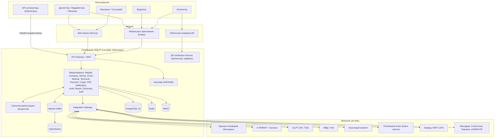
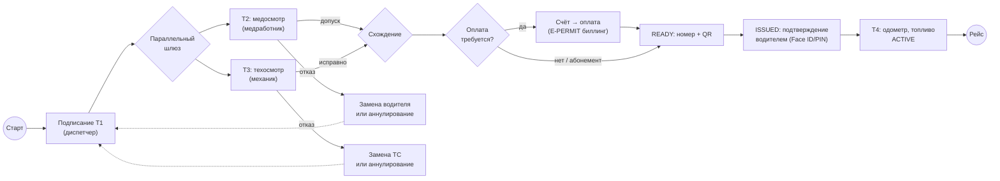

# 10. Архитектура и технологии

Настоящий раздел устанавливает требования к архитектуре, технологическому стеку, модели развёртывания, масштабированию и наблюдаемости платформы «Электронные перевозочные документы Республики Таджикистан» (далее — Платформа). Требования обозначаются идентификаторами АР-10.x.y и являются обязательными, если прямо не указано иное.

## 10.1. Архитектурные принципы

Платформа должна проектироваться и реализовываться в соответствии со следующими архитектурными принципами. Каждое проектное решение, отступающее от принципов настоящего пункта, подлежит письменному согласованию с Заказчиком (Министерством транспорта Республики Таджикистан).

**АР-10.1.1. API-first.** Все функции Платформы должны быть доступны через документированные программные интерфейсы (REST/JSON, для межсервисного взаимодействия допускается gRPC) до реализации пользовательских интерфейсов. Веб-портал, мобильные приложения и API аккредитованных интеграторов (агрегаторов такси ЧУРА, НЕРУ и др.) должны использовать один и тот же публичный API без привилегированных «внутренних» каналов. Спецификации API должны вестись в формате OpenAPI 3.1 и публиковаться на портале разработчика.

**АР-10.1.2. Микросервисная архитектура с выделенными границами предметных областей.** Платформа должна состоять из микросервисов, границы которых совпадают с границами предметных областей (организации, транспортные средства, водители, путевые листы, медицинские и технические осмотры, платежи и т. д.). Каждый микросервис должен владеть собственной схемой данных; прямой доступ одного сервиса к таблицам другого запрещается.

**АР-10.1.3. Событийная архитектура.** Изменения состояния бизнес-объектов должны публиковаться как события в Apache Kafka. Слабосвязанные функции (уведомления, аудит, аналитика, интеграционные выгрузки, антифрод) должны строиться как потребители событий, а не как синхронные вызовы из ядра. Синхронные вызовы допускаются только там, где результат необходим для завершения пользовательской операции (проверки перед выдачей, подписание, оплата).

**АР-10.1.4. Принцип однократности (модель X-Road).** Мастер-данные внешних ведомств и Единой платформы Минтранса (реестры ЮЛ/ИП, лицензий, ТС, водительских удостоверений, сертификатов) не должны копироваться в Платформу как первичный источник. Платформа должна запрашивать данные у ведомства-источника в момент операции. При выдаче путевого листа Платформа должна фиксировать **юридически значимый снимок (snapshot)** использованных мастер-данных в составе документа: подписанные титулы должны ссылаться на снимок на момент выдачи, а не на «живую» запись реестра. Последующие изменения в реестрах-источниках не должны изменять содержание выданного документа.

**АР-10.1.5. Изоляция интеграций.** Все взаимодействия с внешними системами (перечень — spec/data/integrations.yaml, 20 направлений) должны проходить исключительно через Integration Gateway. Недоступность любой внешней системы не должна блокировать ядро Платформы: должны применяться кэширование последних валидных ответов (с фиксацией срока годности кэша по каждой интеграции), очереди отложенных повторов, тайм-ауты, предохранители (circuit breaker) и деградационные сценарии, определённые для каждой интеграции (инициатор, протокол, формат, режим, SLA, поведение при недоступности).

**АР-10.1.6. Офлайн-устойчивость.** С учётом уровня проникновения фиксированного интернета в Республике Таджикистан (мобильный доступ преобладает, включая сети 2G/3G) Платформа должна:
- обеспечивать проверку QR-кода путевого листа инспектором **полностью офлайн** (подписанная полезная нагрузка JWS/COSE ES256, локальная проверка подписи по модели ISO 18013-5, без обращения к серверу и без авторизации);
- обеспечивать офлайн-кэш выданного путевого листа в мобильном приложении водителя;
- предусматривать SMS-резерв доставки номера путевого листа водителю;
- допускать отложенную синхронизацию действий мобильных приложений при восстановлении связи (идемпотентные операции с клиентскими ключами идемпотентности).

**АР-10.1.7. Неизменяемость юридически значимых данных.** Подписанные титулы (Т1–Т6) должны быть неизменяемыми; исправления — только корректирующими титулами со ссылкой на исправляемый. Все переходы статусной модели (spec/data/waybill-statuses.yaml) должны фиксироваться в append-only журнале аудита.

**АР-10.1.8. Технологический суверенитет.** Платформа должна размещаться исключительно в государственном ЦОД Республики Таджикистан. Использование зарубежных публичных облаков для хранения или обработки данных запрещается. Все компоненты стека должны быть свободным программным обеспечением или программным обеспечением с открытым исходным кодом, допускающим самостоятельную эксплуатацию (self-hosted) без обязательных обращений к внешним сервисам вендора.

**АР-10.1.9. Совместимость моделей данных.** Модель данных перевозочных документов должна проектироваться как профиль UN/CEFACT MMT-RDM, обеспечивая совместимость с eCMR, eTIR и регламентом ЕС eFTI. Для обмена «система-система» в международном контуре должен поддерживаться профиль AS4/eDelivery.

**АР-10.1.10. Обратная совместимость с legacy.** Платформа должна предоставлять совместимый контракт для действующих потребителей API rohkhat.tj (в первую очередь `waybill_neru` для агрегаторов и справочные выгрузки с пагинацией), реализованный как фасад над новым API, с объявленным графиком вывода из эксплуатации.

## 10.2. Общая схема Платформы (контекст C4)

**АР-10.2.1.** Платформа должна реализовывать следующую контекстную модель (уровень C4 Context).

**Пользователи Платформы:** диспетчеры (танзимгар), медицинские работники (духтур), механики, водители, руководители и бухгалтеры перевозчиков, инспекторы дорожного контроля, администраторы и аналитики Минтранса, операторы Госслужбы по надзору, аккредитованные API-интеграторы (агрегаторы).

**Каналы доступа:** веб-портал (Next.js) для кабинетов организаций и ведомств; мобильные приложения (Flutter, Android/iOS) водителя, медработника/механика и инспектора; публичная страница проверки QR; API аккредитованных интеграторов; SMS-канал (резерв).

**Внешние системы:** Единая платформа Минтранса (мастер-данные), E-PERMIT (дозволы и централизованный биллинг), национальный УЦ РТ (ЭП, метки времени), МВД/ГАИ (ТС, ВУ), Налоговый комитет (РМА, статус ЮЛ/ИП, кадровая принадлежность), реестр лицензий Госслужбы (transcontrol.tj), реестр медработников Минздрава, платёжный шлюз («Корти милли», банки, кошельки), камеры НЕРУ (пассивная сверка госномеров), GPS-мониторинг, eCMR/eTIR, Таможенная служба, Агентство по статистике, SMS/Email/Push-шлюзы.

**АР-10.2.2.** Публичный контур (QR Verification Service, страница проверки) должен быть физически и логически отделён от ядра: отдельные поды, отдельные точки входа, отсутствие сетевого доступа из публичного контура к основной БД (только реплицированная проекция и JWKS).

**АР-10.2.3.** Весь внешний трафик должен входить через API Gateway с WAF; прямая публикация микросервисов вне Gateway запрещается (исключение — QR Verification Service за собственным публичным входом с WAF).

## 10.3. Состав микросервисов

**АР-10.3.1.** Платформа должна включать следующие микросервисы. Состав уточнён относительно базового перечня бизнес-логики Заказчика: добавлен Dictionary Service (общие справочники и автодополнения, вынесенные из legacy `/api/brand|city|route|...`), сотрудники организаций (врач, механик, диспетчер — legacy `/api/employees`) отнесены к Company Service как персонал организации; Camunda выделена как платформенный компонент оркестрации, а не бизнес-сервис.

| № | Сервис | Назначение | БД / хранилище | Ключевые взаимодействия |
|---|--------|-----------|----------------|--------------------------|
| 1 | Auth Service | Адаптер Keycloak: регистрация, привязка ролей RBAC/ABAC, выпуск и учёт scoped-токенов интеграторов, legacy-совместимые сессии 12 ч | PostgreSQL (схема auth), Redis (сессии, отзыв токенов) | Keycloak, API Gateway, все сервисы |
| 2 | Company Service | Организации (упсерт по РМА), филиалы, стоянки, персонал (врач/механик/диспетчер), лицензии и документы организации | PostgreSQL; MinIO (сканы документов) | Налоговый комитет (РМА, статус ЮЛ/ИП), реестр лицензий, Единая платформа |
| 3 | Vehicle Service | ТС (ключ — госномер), прицепы, контрольные карточки (варақаи назоратӣ), техпаспорта, гостехосмотр, одометр, закрепления водителей (timesheet) | PostgreSQL | ГАИ (учёт, розыск, VIN), Единая платформа, Technical Check |
| 4 | Driver Service | Водители (упсерт по РМА), ВУ и категории, класс, медсправки, договоры, доверенности, фото/подпись | PostgreSQL (шифрование ПДн на уровне колонок); MinIO | ГАИ (ВУ: действительность, лишение), Налоговый комитет (кадровая принадлежность), Medical Check |
| 5 | TripSheet (Waybill) Service | Ядро: путевые листы всех форм (Т(1-АД), 1-А, 3-С, 2-Б, 5Б-БМ, 4М-БМ) и накладные (борхат, связка с eCMR); титулы Т1–Т6, статусная модель (20 статусов), снимки мастер-данных, work_days, топливные остатки, инварианты («один активный ПЛ на ТС/водителя») | PostgreSQL (партиционирование по месяцам), transactional outbox → Kafka | Camunda, Crypto, Medical/Technical Check, Payment, QR (проекция), Template/PDF, Integration Gateway |
| 6 | Medical Check Service | Титулы Т2/Т6: предрейсовые и послерейсовые медосмотры, показатели (АД, пульс, температура, алкотест), допуск/отказ, поверенные приборы | Отдельный экземпляр PostgreSQL (медицинские данные — особая категория, см. п. 13.1) | Waybill, Driver, реестр медработников Минздрава, Crypto |
| 7 | Technical Check Service | Титул Т3: контроль техсостояния, дефекты, акты, фотофиксация, разрешение выпуска | PostgreSQL; MinIO (фото, акты) | Waybill, Vehicle, Crypto |
| 8 | Payment / Billing Service | Тарифы за выдачу документов, счета, абонементы, сверка платежей, возвраты | PostgreSQL | Биллинг E-PERMIT, платёжный шлюз («Корти милли», банки, кошельки), Waybill, Camunda |
| 9 | Notification Service | SMS / Email / Push, шаблоны на тадж./рус., SMS-резерв номера ПЛ, повторная доставка | PostgreSQL (журнал доставки), Kafka (входящие события) | SMS-шлюзы операторов РТ, Email, Push (с деградацией на SMS) |
| 10 | QR Verification Service | Публичная проверка QR: онлайн-статус документа и раздача JWKS; выборочное раскрытие данных инспектору | Без собственной мастер-БД: read-only проекция статусов (реплика/Redis), кэш JWKS | Crypto (публичные ключи), Waybill (CQRS-проекция через Kafka) |
| 11 | Audit Service | Append-only журнал всех действий и переходов статусов с ЭП/метками времени, цепочка хешей | PostgreSQL (append-only, партиционирование), MinIO WORM (архив) | Kafka (все события), Crypto (метки времени), Report |
| 12 | Report / Analytics Service | Отчётность (включая замену бумажной Замимаи 7), витрины, антифрод-аналитика (повторные QR, фиктивные рейсы, отсутствие генерации), поиск | OpenSearch (поиск, аналитика), PostgreSQL (витрины) | Kafka, Агентство по статистике, камеры НЕРУ, GPS-мониторинг |
| 13 | Integration Gateway | Единая точка всех 20 внешних интеграций: адаптеры, кэш валидных ответов, очереди повторов, circuit breaker, трансформация форматов (профиль MMT-RDM, AS4/eDelivery) | Redis (кэш), PostgreSQL (очереди, журналы обмена) | Все внешние системы; все внутренние сервисы |
| 14 | Crypto / Signature Service | Формирование и проверка КЭП CAdES/XAdES, метки времени RFC 3161, ключи QR (ES256), ротация, публикация JWKS, взаимодействие с УЦ РТ | PostgreSQL (метаданные), изолированное хранилище ключей (перспектива HSM, PKCS#11) | УЦ РТ, TSA, Waybill, Medical/Technical Check, Audit, QR Verification |
| 15 | Template / PDF Service | Печатные формы путевых листов и накладных (тадж./рус.), PDF-визуализация с QR, архивные копии | MinIO (PDF), PostgreSQL (шаблоны, версии) | Waybill, Crypto (QR-нагрузка), Notification |
| 16 | Dictionary Service | Общие справочники: регионы, типы ТС, топливо, марки, города, страны, маршруты, клиенты, направления, грузы; автодополнение (legacy-совместимое) | PostgreSQL, Redis (кэш чтения) | Все сервисы, веб/мобильные каналы |

**АР-10.3.2. Обоснование выделения Crypto/Signature Service.** Криптографические операции должны быть изолированы в отдельном сервисе по следующим причинам, каждая из которых является самостоятельным требованием:
- **изоляция ключей**: закрытые ключи Платформы (подпись QR-нагрузок, служебные подписи) должны быть доступны только Crypto Service; ни один другой сервис не должен иметь доступа к ключевому материалу ни в памяти, ни в хранилище;
- **единая аудируемая точка**: каждая операция подписания/проверки проходит через один сервис и фиксируется в аудите, что упрощает расследование инцидентов и сертификацию;
- **перспектива HSM**: при вводе аппаратного модуля безопасности (HSM) замена программного хранилища ключей на PKCS#11-интерфейс HSM выполняется только в Crypto Service, без изменения остальных сервисов;
- **соответствие Закону РТ № 1965**: требования к сертификации средств защищённой ЭП локализуются в одном компоненте;
- **независимая ротация и версионирование ключей** (kid в заголовках JWS) без релизов бизнес-сервисов.

**АР-10.3.3. Обоснование выделения QR Verification Service.** Сервис проверки QR должен быть выделен и спроектирован как публичный, stateless и высокодоступный:
- профиль нагрузки принципиально иной, чем у ядра: массовые анонимные проверки (до 100 тыс./сутки с резкими пиками при рейдах) против транзакционной записи; сервис должен масштабироваться независимо;
- сервис доступен без аутентификации из сети Интернет и потому образует отдельную поверхность атаки (DDoS): его отказ или перегрузка не должны влиять на выдачу документов;
- сервису не требуются закрытые ключи и мастер-данные: только публичные ключи (JWKS) и read-only проекция статусов, наполняемая событиями Kafka (CQRS), — что позволяет запускать его одновременно на основном и резервном контурах (active-active);
- офлайн-проверка подписи QR вообще не требует обращения к сервису; онлайн-обращение лишь дополняет её актуальным статусом (отзыв, блокировка, актуальность ежедневного медосмотра).

## 10.4. Технологический стек

**АР-10.4.1.** Платформа должна быть реализована на утверждённом технологическом стеке согласно таблице. Замена компонентов допускается только по согласованию с Заказчиком при сохранении класса решения (open-source, self-hosted).

| Слой | Технология | Обоснование выбора для государственной платформы |
|------|-----------|--------------------------------------------------|
| Язык и каркас backend | Java 21 (LTS) + Spring Boot 3 | Долгосрочная поддержка (LTS до 2031 г.), зрелая экосистема безопасности (Spring Security, OAuth2), наибольшая доступность инженеров на рынке региона, промышленные практики для транзакционных госсистем (ГИС ЭПД РФ, ЕСУТД РК используют JVM-стек) |
| Основная СУБД | PostgreSQL 16 | Открытая лицензия, строгая транзакционность (ACID), партиционирование и логическая репликация для георезервирования, JSONB для снимков мастер-данных, отсутствие лицензионных платежей и вендор-лока |
| Кэш и сессии | Redis | Стандарт де-факто для кэша, состояния сессий (legacy 12 ч), rate limiting и дедупликации; кластеризация Sentinel/Cluster |
| Шина событий | Apache Kafka | Гарантированная доставка с репликацией (RF=3), воспроизведение истории событий для аудита и повторного наполнения проекций, горизонтальное масштабирование консюмеров; реестр схем — Apicurio Registry (open-source) |
| Объектное хранилище | MinIO | S3-совместимое on-premises хранилище для PDF, сканов, фото; erasure coding, версионирование, WORM (object lock) для архивов аудита; исключает зарубежные облачные хранилища |
| Поиск и аналитика | OpenSearch | Полнотекстовый поиск (тадж./рус.), аналитика и антифрод-витрины; лицензия Apache 2.0 (предпочтительнее Elasticsearch с ограничительной лицензией) |
| IAM / SSO | Keycloak | Открытый стандарт OAuth2/OIDC/SAML, RBAC+ABAC, 2FA, федерация с ведомственными каталогами, self-hosted; используется в госсекторе десятков стран |
| Оркестрация процессов | Camunda | Исполняемые BPMN-модели процесса выдачи (прозрачны для Заказчика и аудиторов), таймеры, компенсации, инцидент-менеджмент, история процессов |
| API Gateway | Spring Cloud Gateway (либо Kong OSS) | Маршрутизация, лимитирование, аутентификация на периметре, канареечные релизы; единый стек с backend |
| Frontend | Next.js + React + TypeScript | SSR для быстрой первой загрузки на слабых каналах связи (2G/3G), типобезопасность, i18n (тадж./рус./англ.), доступность (WCAG) |
| Мобильные приложения | Flutter (Android/iOS) | Единая кодовая база для 4 приложений (водитель, медработник/механик, инспектор, руководитель), офлайн-хранилище, биометрия (Face ID/PIN), работа на бюджетных Android-устройствах |
| Контейнеризация и оркестрация | Docker + Kubernetes | Стандарт эксплуатации микросервисов: самовосстановление, HPA, декларативные релизы; разворачивается в госЦОД РТ без внешних зависимостей |
| CI/CD | GitLab CE (self-hosted) | Полный цикл (репозитории, пайплайны, реестр контейнеров) внутри госЦОД; открытая лицензия |
| Мониторинг | Prometheus + Grafana + Loki + OpenTelemetry | Открытый стек метрик/логов/трасс без внешних SaaS; алертинг Alertmanager |
| ЭЦП и QR | Национальный УЦ РТ (Закон № 1965), CAdES/XAdES + RFC 3161, JWS/COSE ES256 + JWKS | Юридическая сила по законодательству РТ; офлайн-верификация по модели ISO 18013-5; компактность ES256 для QR |

**АР-10.4.2.** Все компоненты должны эксплуатироваться в версиях с активной поддержкой производителя/сообщества; план обновления версий — не реже одного раза в год.

## 10.5. Оркестрация бизнес-процессов (Camunda)

**АР-10.5.1.** Процесс выдачи путевого листа должен быть реализован как исполняемая BPMN-модель в Camunda и соответствовать статусной модели (spec/data/waybill-statuses.yaml):

1. подписание Т1 диспетчером (DRAFT → CREATED);
2. **параллельный шлюз**: заявка медработнику (Т2, AWAITING_MED) и механику (Т3, AWAITING_TECH) одновременно;
3. схождение ветвей: при обоих положительных подтверждениях — переход к оплате (AWAITING_PAYMENT), если услуга платная и не покрыта абонементом, иначе сразу READY;
4. подтверждение оплаты (PAID) → присвоение номера и генерация QR (READY);
5. подтверждение получения водителем — Face ID/PIN (ISSUED) → фиксация одометра/топлива (Т4, ACTIVE).

**АР-10.5.2. Таймеры.** Модель процесса должна содержать таймерные события как минимум для: не пройденного в установленный срок мед/техосмотра (эскалация диспетчеру и руководителю); неоплаты счёта в срок (напоминание, затем аннулирование заявки); неполучения документа водителем до конца срока действия (READY → EXPIRED); неактивации/незакрытия ПЛ в срок с грейс-периодом (→ EXPIRED с флагом нарушения); ежедневного контроля актуальности медосмотра для многодневных пассажирских ПЛ.

**АР-10.5.3. Компенсации.** Для каждой транзакции процесса, охватывающей несколько сервисов, должны быть определены компенсирующие действия (сага): возврат/зачёт платежа при аннулировании после оплаты; отзыв QR и уведомление водителя при аннулировании после выдачи; автосоздание нового ПЛ со ссылкой `replaces` при замене ТС в рейсе; закрытие предыдущего активного ПЛ при создании нового через API агрегатора (legacy-инвариант).

**АР-10.5.4.** Экземпляры процессов и их история должны храниться в Camunda не менее 12 месяцев в оперативном доступе; юридически значимая история — в Audit Service бессрочно в пределах ретенции (5+ лет).

**АР-10.5.5.** Инциденты процессов (сбой внешнего вызова, истечение повторов) должны попадать в операторскую очередь Camunda с алертингом (п. 10.9); разбор инцидентов не должен требовать вмешательства разработчиков в БД.

## 10.6. Событийная модель (Apache Kafka)

**АР-10.6.1.** Платформа должна публиковать доменные события как минимум в следующие топики (соглашение об именовании `<домен>.<событие>`, ключ партиционирования — идентификатор агрегата):

| Топик | Событие | Ключ | Основные потребители |
|-------|---------|------|----------------------|
| `waybill.created` | Создан черновик/заявка ПЛ | waybill_id | Audit, Camunda, Report |
| `waybill.signed.t1` … `waybill.signed.t6` | Подписан соответствующий титул | waybill_id | Audit, Camunda, Notification, QR-проекция |
| `waybill.status.changed` | Любой переход статусной модели | waybill_id | QR-проекция, Report, Notification, Integration Gateway |
| `waybill.issued` | ПЛ выдан водителю (номер, QR) | waybill_id | Notification (SMS-резерв), PDF, Audit |
| `waybill.cancelled` / `waybill.expired` / `waybill.blocked` | Аннулирование / просрочка / блокировка инспектором | waybill_id | QR-проекция (отзыв), Notification, Audit, Report |
| `medical.check.completed` | Результат медосмотра (допуск/отказ, без медицинских показателей) | waybill_id | Camunda, Waybill, Audit |
| `technical.check.completed` | Результат техосмотра | waybill_id | Camunda, Waybill, Audit |
| `payment.completed` / `payment.failed` | Результат оплаты | invoice_id | Camunda, Waybill, Audit |
| `company.updated`, `vehicle.updated`, `driver.updated` | Изменение локальных данных субъектов | rma / рег. номер | Report, Integration Gateway, кэши |
| `integration.inbound` / `integration.failed` | Событие внешней системы / отказ интеграции | код интеграции | Waybill, Report, алертинг |
| `audit.event` | Унифицированная запись аудита | entity_id | Audit Service |

Медицинские показатели (АД, пульс, алкотест) в события не включаются — передаётся только факт и результат допуска (см. п. 13.1, 13.7).

**АР-10.6.2. Transactional outbox.** Каждый сервис-издатель должен записывать событие в таблицу outbox в той же локальной транзакции БД, что и изменение состояния; публикация в Kafka выполняется отдельным издателем (Debezium CDC или polling publisher). Прямая публикация в Kafka из бизнес-транзакции запрещается: не допускается ситуация «состояние изменено, событие потеряно» и наоборот.

**АР-10.6.3. Идемпотентность консюмеров.** Доставка — at-least-once; каждый потребитель обязан быть идемпотентным: дедупликация по `event_id` (UUID) в локальной таблице обработанных событий либо естественная идемпотентность операции. Повторная обработка события не должна изменять результат.

**АР-10.6.4.** Порядок событий гарантируется в пределах партиции: все события одного путевого листа должны иметь ключ `waybill_id`. Консюмеры не должны полагаться на глобальный порядок между агрегатами.

**АР-10.6.5.** Для каждого топика должны быть определены: схема (Apicurio Registry, совместимость BACKWARD), ретенция (для событий ПЛ — не менее 30 суток; `audit.event` — до подтверждения записи в Audit Service), DLQ (dead letter queue) с алертингом и регламентом разбора.

**АР-10.6.6.** Фактор репликации топиков — не менее 3, `min.insync.replicas` — не менее 2; продюсеры юридически значимых событий — `acks=all`, идемпотентный продюсер включён.

## 10.7. Масштабирование и отказоустойчивость

**АР-10.7.1. Расчёт целевой нагрузки.** Проектирование должно исходить из следующей модели (парк — около 700 тыс. ТС по данным ГАИ с учётом роста; полная обязательность электронных перевозочных документов — к 2030 г.):

| Показатель | Оценка | Пояснение |
|-----------|--------|-----------|
| Выдача путевых листов | 100–170 тыс. ПЛ/сутки | Ежедневные ПЛ автобусов/троллейбусов; многодневные формы (1-А до 4 дней, 3-С до 7 дней/месяц для такси, 2-Б до 15 дней) снижают суточную выдачу относительно активного парка |
| Операций записи на один ПЛ в день выдачи | ~8 | Создание, Т1–Т3, оплата, присвоение номера/QR, выдача, Т4 + переходы статусов |
| Средняя интенсивность записи | ~15–20 rps | 170 тыс. × 8 / 86 400 с |
| Пиковая интенсивность записи | 60–100 rps | Утренний пик 6:00–9:00 — 3–5× средней (массовый выпуск на линию) |
| **Проектная величина записи** | **100 rps** | С округлением вверх от пиковой |
| **Проектная величина чтения** | **500 rps** | Соотношение чтение/запись ≥ 5:1 (кабинеты, справочники, статусы) |
| Запас прочности | ×5 | Подтверждается нагрузочными испытаниями: 500 rps записи / 2 500 rps чтения без деградации сверх SLO |
| QR-проверки | до 100 тыс./сутки | Отдельный публичный контур; проектная величина — не менее 200 rps с учётом пиков при рейдах |

**АР-10.7.2.** Все бизнес-микросервисы должны быть stateless и масштабироваться горизонтально (Kubernetes HPA по CPU/RPS/лагу консюмера). Состояние — только в PostgreSQL, Redis, Kafka, MinIO.

**АР-10.7.3.** PostgreSQL должен эксплуатироваться кластером высокой доступности (Patroni: лидер + не менее двух реплик, синхронная реплика для нулевой потери подтверждённых транзакций при отказе лидера; автоматический failover ≤ 60 с). Читающие запросы отчётности и проекций должны выполняться на репликах. Таблицы путевых листов и аудита — партиционирование по месяцам.

**АР-10.7.4.** Kafka — не менее 3 брокеров; Redis — Sentinel/Cluster; MinIO — распределённый режим с erasure coding; Keycloak и Camunda — не менее 2 реплик. Отказ любого одного узла любого компонента не должен приводить к недоступности Платформы или потере данных.

**АР-10.7.5. Зеркальный резервный контур (модель E-Way Bill 2.0, Индия).** Платформа должна иметь резервный контур на второй площадке государственного ЦОД РТ:
- полная копия стека (Kubernetes, микросервисы, PostgreSQL, Kafka, MinIO, Keycloak);
- непрерывная синхронизация: потоковая репликация PostgreSQL (георезервирование), MirrorMaker 2 для Kafka, репликация бакетов MinIO;
- **RPO ≤ 5 минут, RTO ≤ 1 час**; переключение — управляемое (регламент) с перенаправлением трафика на уровне DNS/GSLB;
- QR Verification Service — в режиме **active-active** на обоих контурах постоянно (stateless, публичные ключи и проекция), проверка документов не прерывается при отказе основного контура;
- после переключения резервный контур обязан поддерживать полный объём операций (не деградированный режим);
- учения переключения — не реже двух раз в год (см. также ИБ-13.8).

**АР-10.7.6. Деградационные режимы.** При недоступности отдельных зависимостей Платформа должна сохранять частичную работоспособность: недоступность внешних реестров — выдача по кэшу последних валидных ответов с флагом «проверено по кэшу от <дата>» и отложенной повторной проверкой; недоступность платёжного контура — очередь оплат и выдача по абонементам; недоступность OpenSearch — без влияния на выдачу (только поиск/отчёты); недоступность Notification — повторная доставка из Kafka.

**АР-10.7.7.** Целевые уровни обслуживания: доступность ядра выдачи — не ниже 99,9 % в месяц; QR Verification Service — не ниже 99,95 %; латентность API p95 — ≤ 500 мс для операций чтения, ≤ 1 500 мс для операций подписания (без учёта времени внешнего УЦ).

## 10.8. Развёртывание

**АР-10.8.1. Окружения.** Должны поддерживаться изолированные окружения: **dev** (разработка), **stage** (предпромышленное, конфигурация идентична prod, интеграции — песочницы ведомств), **prod** (промышленное, основной контур госЦОД), **DR** (резервный контур, п. 10.7.5). Использование промышленных данных в dev/stage допускается только в обезличенном виде (см. ИБ-13.9).

**АР-10.8.2.** Все окружения — в государственном ЦОД РТ на Kubernetes. Изоляция — отдельными кластерами (prod/DR) и пространствами имён с NetworkPolicy (dev/stage). Зарубежные облачные окружения запрещены, включая среды сборки.

**АР-10.8.3. CI/CD.** GitLab CE (self-hosted в госЦОД): сборка, модульные и интеграционные тесты, статический анализ и проверка зависимостей (SAST/SCA, см. ИБ-13.5), сборка образов в локальный реестр, подпись образов (cosign), сканирование образов (Trivy), авторазвёртывание в dev/stage, развёртывание в prod — по ручному подтверждению уполномоченного лица с фиксацией в аудите. Развёртывание — GitOps (Argo CD) из декларативных манифестов.

**АР-10.8.4. IaC.** Вся инфраструктура (кластеры, сети, СУБД, брокеры, мониторинг) должна описываться кодом (Terraform/OpenTofu, Ansible, Helm) в репозиториях GitLab; ручные изменения промышленной инфраструктуры вне IaC запрещаются. Конфигурация DR-контура порождается из тех же модулей, что и prod.

**АР-10.8.5.** Релизы должны выполняться без остановки обслуживания (rolling update, обратная совместимость API и схем БД в пределах одного релизного шага; миграции БД — expand/contract). Должна обеспечиваться возможность отката релиза в течение 15 минут.

## 10.9. Мониторинг и наблюдаемость

**АР-10.9.1. Метрики.** Prometheus должен собирать метрики всех микросервисов (RED: rate/errors/duration), СУБД, Kafka (лаг консюмеров), Redis, MinIO, Kubernetes и хостов. Grafana — визуализация; доступ — по ролям через Keycloak.

**АР-10.9.2. Логи.** Все сервисы должны писать структурированные логи (JSON) в stdout; агрегирование — Loki. Обязательные поля: время, сервис, уровень, `trace_id`, идентификатор пользователя (без ПДн в теле лога). Срок хранения оперативных логов — не менее 90 суток; события безопасности дублируются в Audit Service (5+ лет).

**АР-10.9.3. Трассировка.** Сквозная распределённая трассировка OpenTelemetry (W3C Trace Context) через API Gateway, микросервисы, Kafka (заголовки) и вызовы Integration Gateway; хранение — Grafana Tempo/Jaeger. Каждый инцидент должен быть восстановим как трасса: от запроса пользователя до внешнего вызова.

**АР-10.9.4. Алертинг.** Alertmanager должен доставлять оповещения дежурной смене по SMS и в Telegram (резервирование каналов) с маршрутизацией по критичности: P1 (недоступность ядра/QR, отказ репликации DR, лаг RPO > 5 мин) — немедленно, круглосуточно; P2 — в рабочее время; P3 — сводки. Для каждого алерта — runbook (регламент реагирования).

**АР-10.9.5. Uptime-контроль.** Внешние синтетические проверки (Blackbox exporter + независимая точка наблюдения вне ЦОД): доступность портала, API, QR-проверки, мобильных API; сценарные проверки «создание тестового ПЛ в stage» по расписанию.

**АР-10.9.6. SLO-дашборды.** Для каждого SLO (п. 10.7.7) должны вестись дашборды с бюджетом ошибок (error budget); исчерпание бюджета — основание для приостановки функциональных релизов до стабилизации. Ежемесячный отчёт об SLA должен формироваться автоматически и предоставляться Заказчику.

**АР-10.9.7.** Мониторинг должен развёртываться на обоих контурах (основной и DR) независимо; отказ мониторинга основного контура не должен ослеплять наблюдение за резервным.
