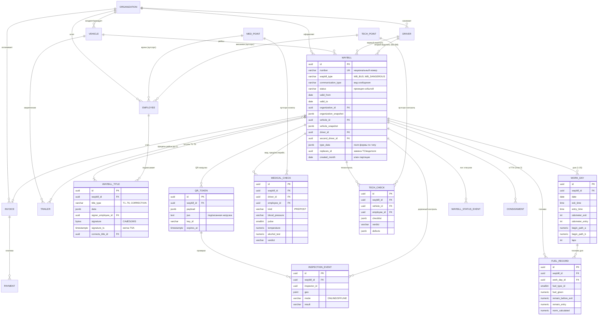

# 11. Модель данных

Настоящий раздел определяет логическую модель данных платформы «Электронные перевозочные документы Республики Таджикистан» (далее — Платформа): принципы построения, состав основных сущностей, схему связей, состав полей путевых листов всех типов с маппингом на действующую систему rohkhat.tj, систему идентификаторов, требования историчности и аудита, а также порядок миграции данных из legacy-системы.

Целевая СУБД — PostgreSQL 16. Каждый микросервис владеет собственной схемой данных (принцип database-per-service); обмен между сервисами — через события Kafka и снимки данных, прямой доступ к чужим таблицам запрещён. Модель данных проектируется как национальный профиль эталонной модели UN/CEFACT MMT-RDM (см. раздел 3.5), что обеспечивает совместимость с eCMR, eTIR и регламентом ЕС eFTI.

## 11.1. Принципы построения модели данных

| № | Требование | Содержание |
|---|---|---|
| МД-11.1.1 | Снимки мастер-данных | При выдаче путевого листа (подписании титула Т1) в документ записывается **снимок** (snapshot) всех используемых мастер-данных и значений справочников: реквизиты организации, водителя, ТС, маршрута, тарифов, коэффициентов. Последующее изменение справочника или реестра **не изменяет** ранее выданный документ. Снимок хранится в JSONB-полях документа вместе со ссылками (UUID) на актуальные версии записей-источников. |
| МД-11.1.2 | Неизменяемость подписанных титулов | Титул путевого листа (Т1–Т6) после наложения электронной подписи неизменяем: запрещены UPDATE/DELETE на уровне приложения и СУБД (триггеры-запреты, права ролей БД). Исправления оформляются только корректирующими титулами со ссылкой на исправляемый (`corrects_title_id`). |
| МД-11.1.3 | Версионирование справочников (SCD-2) | Все справочники (раздел «Справочники» dictionaries.yaml) и локальные копии мастер-данных ведутся по схеме SCD Type 2: каждая версия записи имеет `valid_from`, `valid_to`, `is_current`; изменение создаёт новую версию. Бизнес-ключ записи неизменен, суррогатный ключ — на версию. История версий хранится бессрочно. |
| МД-11.1.4 | Партиционирование | Таблица `waybill` и её дочерние таблицы (`waybill_title`, `work_day`, `fuel_record`, `waybill_status_event`) партиционируются декларативно **по месяцам** по дате создания документа (`created_month`). Партиции старше срока оперативного хранения переводятся в архивный tablespace / отсоединяются в архивную БД без изменения содержимого. |
| МД-11.1.5 | JSONB для вариативных полей | Общая для всех типов «шапка» путевого листа хранится реляционно (типизированные столбцы, индексы, ограничения). Поля, специфичные для типа ПЛ (форма Т(1-АД), 1-А, 3-С, 2-Б, 5Б-БМ, 4М-БМ и новые типы), хранятся в поле `type_data JSONB`, валидируемом JSON-схемой соответствующего типа (реестр схем версионируется). Аналогично данные титулов Т1–Т6 хранятся в `waybill_title.data JSONB` по схеме титула. |
| МД-11.1.6 | Совместимость с UN/CEFACT MMT-RDM | Сущности и атрибуты модели снабжаются маппингом на классы MMT-RDM (таблица 11.1.1). Экспортные представления (eCMR, eTIR, э-ТТН, eFTI) формируются из этого маппинга без изменения внутренней модели. |
| МД-11.1.7 | Ретенция и архив | Срок оперативного хранения перевозочных документов — **не менее 5 лет** с даты закрытия. По истечении срока документы переводятся в статус ARCHIVED и перемещаются в архивное хранилище (архивная БД + объектное S3-хранилище для файлов) в режиме «только чтение». Удаление — только по акту, в соответствии с нормативными сроками хранения РТ. Журнал аудита хранится не менее 10 лет. |
| МД-11.1.8 | Первичные ключи | Первичные ключи всех сущностей — UUID (версия 7, монотонная по времени — дружественная к B-tree-индексам). Бизнес-ключи (РМА, госномер, номер ПЛ) — уникальные индексы, но не первичные ключи (раздел 11.5). |
| МД-11.1.9 | Многоязычность | Наименования справочных записей хранятся в трёх языковых колонках/ключах: `name_tj` (основной), `name_ru`, `name_en` (международный контур). Отсутствие перевода не блокирует работу — выполняется fallback tj → ru → en. |
| МД-11.1.10 | Событийная модель статусов | Статус путевого листа не «затирается»: каждый переход фиксируется событием в `waybill_status_event` (event sourcing, раздел 11.6.2); текущий статус — материализованная проекция последнего события. |
| МД-11.1.11 | Append-only аудит | Все изменения данных и действия пользователей записываются в журнал `audit_log`, доступный только на добавление; целостность журнала защищена цепочкой хэшей (раздел 11.6.3). |
| МД-11.1.12 | Файлы | Файлы (сканы документов, фото дефектов, подписи, печати) хранятся в объектном хранилище (S3-совместимом); в БД — метаданные (`file_ref`: uuid, bucket, ключ, SHA-256, MIME, размер, владелец). Хэш файла включается в подписываемый состав титула. |

### 11.1.1. Маппинг на UN/CEFACT MMT-RDM

| Сущность Платформы | Класс MMT-RDM | Примечание |
|---|---|---|
| Organization | `TradeParty` / `LogisticsTransportParty` | перевозчик, заказчик, грузоотправитель/получатель |
| Driver | `TransportPerson` (роль DriverParty) | реквизиты ВУ — `IdentityDocument` |
| Vehicle | `LogisticsTransportMeans` | госномер — `id`, тип — `typeCode` |
| Trailer | `LogisticsTransportEquipment` | до 2 на рейс |
| Waybill | `LogisticsTransportMovement` + национальное расширение | путевой лист как документ о движении |
| WorkDay | `TransportEvent` (последовательность) | ежедневные блоки |
| Consignment / э-ТТН | `Consignment`, `ConsignmentItem` | этап 2; прямой профиль eCMR |
| Route (маршрут, страны погрузки/разгрузки/транзита) | `TransportRoute`, `LogisticsLocation` | |
| InspectionEvent | `TransportEvent` (тип — контроль) | гео — `GeographicalCoordinate` |
| MedicalCheck / TechCheck | национальное расширение профиля | в MMT-RDM аналог отсутствует; экспортируются как `AdditionalDocument` |

## 11.2. Основные сущности

Требование МД-11.2.1: Платформа должна реализовать перечисленные ниже сущности с указанными ключевыми атрибутами и связями. Полный физический состав таблиц уточняется на этапе технического проектирования, состав полей путевых листов — обязателен в объёме раздела 11.4.

| Сущность | Назначение | Ключевые атрибуты | Связи |
|---|---|---|---|
| **Organization** (организация, корхона) | Перевозчик (ЮЛ/ИП); локальная SCD-2-копия мастер-данных единой платформы Минтранса | `id`, `rma` (бизнес-ключ, 9–10 цифр), `kpp`, `name`, `type_company` (1=общего пользования/истифодаи умум, 2=ведомственный/соҳавӣ), `region_id`, `city_id`, `number` (рамзи корхона), лицензия (`license_from/to`), выписка (иқтибос), свидетельство ААИ (НДС), банк, адрес, телефон, руководитель, e-mail, файлы-вложения, `stat_codes JSONB` (КУҶТ, КУТОНХ, КШМ, КУРСХ, КУФИ — госстатотчётность) | 1:N → Driver, Vehicle, Employee, Waybill, Invoice |
| **Driver** (водитель, ронанда) | Водитель организации или ИП-самозанятый; SCD-2-копия мастер-данных | `id`, `rma` (бизнес-ключ), `number` (табельный, 4 цифры), `full_name`, ВУ (`license`, `category`, срок), `degree` (класс 1/2/3 → % надбавки), паспорт, медсправка (`med_cert_number`, `med_cert_valid_date`), талон 20-часовых занятий, договор, доверенность (ваколатнома), адрес, телефон, фото, подпись, `organization_id` | N:1 → Organization; 1:N → Waybill (первый/второй водитель), MedicalCheck |
| **Vehicle** (ТС) | Транспортное средство; SCD-2-копия мастер-данных | `id`, `registration_number` (госномер — бизнес-ключ), `transport_type_id`, `brand_id`, `number` (номер стоянки, 4 цифры: 1-я — колонна, 3–4-я — бригада), `capacity` (ғунҷоиш), `carrying`, `vincode`, `year_manufacture`, `odometer` (текущий одометр; для автобуса недоступен диспетчеру), `ownership_type` (собственность/аренда/лизинг), техпаспорт, техосмотр (`tech_inspection_number`, срок), контрольная карточка (варақаи назоратӣ: номер, срок), кондиционер, закреплённые водители (`timesheet`), `organization_id` | N:1 → Organization; 1:N → Waybill, TechCheck; 1:0..2 → Trailer |
| **Trailer** (прицеп, ядак) | Прицеп/полуприцеп (до 2 на ТС/рейс) | `id`, `registration_number`, `brand`, `carrying`, `weight`, `vehicle_id` (постоянное закрепление) либо привязка на рейс через `waybill_trailer` | N:1 → Vehicle; N:M → Waybill |
| **Employee** (сотрудник) | Врач, механик, диспетчер организации либо аутсорс-пункта | `id`, `rma` (бизнес-ключ), `number` (табельный), `name`, `type` (1=Духтур/врач, 2=Механик, 3=Танзимгар/диспетчер), подпись (имзо), печать (муҳр — врач/механик), сертификат ЭП, `organization_id` **или** `med_point_id`/`tech_point_id`, признак аккредитации | N:1 → Organization / MedPoint / TechPoint; 1:N → WaybillTitle, MedicalCheck, TechCheck |
| **MedPoint** (медпункт-аутсорсер) | Аккредитованная медицинская организация, оказывающая услуги пред-/послерейсовых осмотров ИП и компаниям | `id`, наименование, `rma`, адрес, гео, аккредитация (номер, срок, статус), реестр приборов (`med_devices`: алкотестеры, тонометры, термометры — номер, срок поверки), график работы | 1:N → Employee (врачи), MedicalCheck; N:M → Organization (договоры) |
| **TechPoint** (СТО/техпункт-аутсорсер) | Аккредитованный пункт технического контроля | `id`, наименование, `rma`, адрес, гео, аккредитация, оборудование, график | 1:N → Employee (механики), TechCheck; N:M → Organization |
| **Waybill** (путевой лист) | Электронный путевой лист — общая шапка всех типов | `id`, `number` (национальный номер, раздел 11.5.4), `waybill_type` (waybill-types.yaml), `communication_type` (вид сообщения), `validity_mode` (разовый/суточный/многодневный/сменный), `status` (проекция), `valid_from`, `valid_to`, `organization_id` + `organization_snapshot JSONB`, `vehicle_id` + `vehicle_snapshot JSONB`, `driver_id`, `second_driver_id` + снимки, `route_id` + снимок, `parking_id`, одометр выезда/возврата, время выезда/возврата, `type_data JSONB` (поля формы — раздел 11.4), `replaces_id`/`replaced_by_id` (замена ТС/водителя), `source` (WEB/MOBILE/API/BULK), `legacy_id` (миграция), `created_month` (ключ партиционирования) | N:1 → Organization, Vehicle, Driver; 1:N → WaybillTitle, WorkDay, FuelRecord, MedicalCheck, TechCheck, QrToken, InspectionEvent, WaybillStatusEvent; 1:0..1 → Invoice; 1:N → Consignment (этап 2) |
| **WaybillTitle** (титул Т1–Т6) | Подписываемая часть документа | `id`, `waybill_id`, `title_type` (T1…T6, CORRECTION), `data JSONB` (состав по схеме титула), `signer_employee_id`, `signature` (CAdES/XAdES/JWS-контейнер), `signature_ts` (метка времени TSA), `corrects_title_id`, `seq_no` | N:1 → Waybill, Employee |
| **WorkDay** (рабочий день) | Ежедневный блок многодневного ПЛ (1-А до 4, 3-С до 7, 2-Б до 15 дней) | `id`, `waybill_id`, `date`, `exit_time`, `entry_time`, одометр выезда/возврата, `begin_path_a/b` (гашти ибтидоӣ), `laps` (гардиш), `client_id`, `client_time`, `conditioner_time`, `work_time` (спецоборудование, 2-Б) | N:1 → Waybill; 1:N → FuelRecord |
| **FuelRecord** (топливо) | Запись о топливе (до 2 видов на ПЛ пассажирский; 1 запись/день грузовой) | `id`, `waybill_id`, `work_day_id` (nullable), `fuel_type_id` (1=бензин, 2=дизель, 3=газ сжиж., 4=газ природный, 5=электро), `fuel_given` (дода шуд), `be_given` (дода шавад), `remain_before_exit` (остаток на выезд — автоматически из предыдущего ПЛ того же ТС и вида топлива), `remain_entry` (остаток на возврат), `additional` (харҷи иловагӣ, 0–5), `coef_winter`, `coef_city`, `coef_highland`, `coef_usage`, `norm_calculated` (норма = базовая норма марки × коэффициенты), `fact_consumed` | N:1 → Waybill, WorkDay |
| **MedicalCheck** (медосмотр) | Пред-/послерейсовый медицинский осмотр (основа Т2/Т6) | `id`, `waybill_id`, `driver_id`, `employee_id` (врач), `med_point_id` (nullable), `kind` (PRE/POST), `blood_pressure` (АД сист./диаст.), `pulse`, `temperature`, `alcohol_test` (прибор, результат мг/л), `device_ids` (приборы с поверкой), `verdict` (допущен/не допущен), `reject_reason_id`, `checked_at`, подпись | N:1 → Waybill, Driver, Employee, MedPoint |
| **TechCheck** (техосмотр) | Предрейсовый контроль техсостояния (основа Т3) | `id`, `waybill_id`, `vehicle_id`, `employee_id` (механик), `tech_point_id` (nullable), `checklist JSONB` (пункты: тормоза, рулевое, свет, шины…), `verdict` (исправно/неисправно), `defects JSONB`, `act_file_id`, `photo_file_ids[]`, `odometer`, `checked_at`, подпись | N:1 → Waybill, Vehicle, Employee, TechPoint |
| **Invoice / Payment** (счёт / платёж) | Оплата услуги выдачи документа (через биллинг E-PERMIT) | Invoice: `id`, `organization_id`, `waybill_id`, сумма, тариф, статус, `external_billing_id`; Payment: `id`, `invoice_id`, способ («Корти милли», банк, кошелёк, абонемент), сумма, `external_tx_id`, `paid_at`, идемпотентный ключ | Invoice 1:N → Payment; N:1 → Organization, Waybill |
| **QrToken** (QR-код) | Криптографически подписанная нагрузка для проверки ПЛ (онлайн и офлайн) | `id`, `waybill_id`, `payload JSONB` (минимальный состав: номер, тип, срок, госномер, ФИО водителя, статусные признаки), `jws` (подписанная нагрузка JWS/COSE), `key_id` (ключ Платформы, JWKS), `issued_at`, `expires_at`, `revoked_at` | N:1 → Waybill; 1:N → InspectionEvent |
| **InspectionEvent** (дорожная проверка) | Факт проверки документа инспектором | `id`, `waybill_id`, `qr_token_id`, `inspector_id`, `geo` (широта/долгота), `checked_at`, `mode` (ONLINE/OFFLINE), `result` (действителен/нарушение), `violation_type_id`, `comment`, `blocked` (признак блокировки документа) | N:1 → Waybill, QrToken |
| **AuditLog** (журнал аудита) | Append-only журнал всех действий | `id`, `occurred_at`, `actor_id`, `actor_role`, `entity_type`, `entity_id`, `action`, `request_id`, `payload_diff JSONB`, `ip`, `prev_hash`, `hash` (цепочка) | ссылки на любые сущности |
| **WaybillStatusEvent** (событие статуса) | Лог переходов жизненного цикла ПЛ (event sourcing) | `id`, `waybill_id`, `from_status`, `to_status`, `actor_id`, `actor_role`, `occurred_at`, `reason_id`, `title_id` (если переход вызван подписанием титула) | N:1 → Waybill |
| **Consignment / э-ТТН** (этап 2) | Электронная товарно-транспортная накладная — профиль MMT-RDM `Consignment` (замена борхати замимаи 1/2, связь с eCMR) | `id`, `waybill_id`, грузоотправитель/грузополучатель (`TradeParty`-снимки), пункты погрузки/разгрузки, позиции груза (`ConsignmentItem[]`: наименование, класс, ед. изм., количество, вес, цена), титулы отгрузки/приёмки, `ecmr_id` (ссылка на eCMR), `etir_ref` | N:1 → Waybill, Organization×2 |
| **Справочники** (dictionaries.yaml) | Регионы, города, страны, иностранные города, пункты пропуска, типы ТС, марки (тамғаҳо), виды топлива, маршруты (хатсайрҳо), виды маршрутов, направления (самтҳо), графики (реҷа), типы/статусы ПЛ, причины аннулирования/недопуска/отклонения, виды сообщения/услуг/перевозки, виды нарушений, клиенты (мизоҷҳо), грузы (борҳо), прейскурант (нархнома), коэффициенты (зимний, городской, высокогорный, эксплуатационный), классы водителей, нормы расхода топлива, приборы медосмотра, нормы медпоказателей, страны виз, типы дозволов, классы ADR | единая структура: `id` (версии), `code` (бизнес-ключ), `name_tj/ru/en`, атрибуты записи, `valid_from`, `valid_to`, `is_current`, `master` (UP/LOCAL/EXT) | ссылки из всех сущностей — на `code` + версия на момент снимка |

Требование МД-11.2.2: справочники экономического блока (нархнома, коэффициенты, нормы расхода топлива, классы водителей) обязательны к реализации — на них строится нормирование расхода топлива и расчёт стоимости/зарплаты, унаследованные от программы «НА ва ХЛ» (см. конспект «Дастурамал», раздел 3).

Требование МД-11.2.3: марка ТС (справочник brands/тамғаҳо) содержит атрибуты: модель, вместимость (ғунҷоиш), грузоподъёмность (иқтидори борбардорӣ), стоимость услуги, отопление салона (л/час) и базовую норму расхода топлива (л/100 км) — источник расчёта `norm_calculated` в FuelRecord.

## 11.3. ER-диаграмма основных связей

Примечание: диаграмма отражает логические связи; сущности AuditLog, Organization/Driver/Vehicle/Employee и справочники показаны без атрибутов либо опущены для читаемости.

## 11.4. Поля путевого листа

### 11.4.1. Базовый набор (общая шапка всех типов)

Требование МД-11.4.1: все типы путевых листов используют единый базовый набор полей. Маппинг legacy-полей rohkhat.tj на поля Платформы:

| Legacy-поле | Тадж./описание | Новое поле | Тип | Примечание |
|---|---|---|---|---|
| `number` | рақами роҳхат | `waybill.number` | varchar(20) | национальный формат (11.5.4); legacy — 7 цифр |
| — | тип формы (по эндпоинту) | `waybill.waybill_type` | varchar(20) | WB_BUS … WB_DANGEROUS (waybill-types.yaml) |
| `organization_rma` | РМА-и корхона | `organization_id` + `organization_snapshot` | uuid + jsonb | снимок реквизитов на момент Т1 |
| `kpp` | КПП (2-Б) | `organization_snapshot.kpp` | jsonb | |
| `company_id` | ID корхона (legacy) | `organization_id` | uuid | через таблицу соответствий миграции |
| `transport_registration_number` | рақами давлатии ВН | `vehicle_id` + `vehicle_snapshot` | uuid + jsonb | снимок: госномер, марка, тип, VIN, контрольная карточка |
| `parking_id` | таваққуфгоҳ | `parking_id` + снимок | uuid | колонна/бригада из номера стоянки |
| `driver_rma` / `timesheet_id` | РМА-и ронанда | `driver_id` + `driver_snapshot` | uuid + jsonb | снимок: ФИО, табель, ВУ, класс, медсправка, 20-часовые занятия |
| `employee_rma` | танзимгар | `dispatcher_employee_id` | uuid | подписант Т1 |
| `created_at` | санаи роҳхат | `issue_date` | date | дата выдачи |
| — | срок действия | `valid_from`, `valid_to` | date | по типу ПЛ (waybill-types.yaml) |
| `exit_date` | вақти баромад | `departure_at` | timestamptz | фиксируется в Т4 |
| `entry_date` | вақти баргашт | `return_at` | timestamptz | фиксируется в Т5 |
| `indication_counter_exit` | нишондоди спидометр (баромад) | `odometer_departure` | integer | авто из ТС/предыдущего ПЛ; 6 цифр; для автобуса диспетчеру недоступен |
| `indication_counter_entry` | нишондоди спидометр (баргашт) | `odometer_return` | integer | вносится один раз (Т5) |
| `special_mark` | қайдҳои махсус | `special_notes` | text | |
| — | вид сообщения (намуди ҳамлу нақл) | `communication_type` | varchar(15) | URBAN/SUBURBAN/INTERCITY/INTERNATIONAL |
| — | серия/номер бланка госстатотчётности | `stat_blank_series`, `stat_blank_number` | varchar | наследие Замимаи 7; для выгрузки в Агентство по статистике |
| — | канал оформления | `source` | varchar(10) | WEB/MOBILE/API/BULK |

### 11.4.2. Дельта: Т(1-АД) автобус (legacy `waybill1ad`, тип WB_BUS)

| Legacy-поле | Тадж./описание | Новое поле (`type_data.*`) | Тип | Примечание |
|---|---|---|---|---|
| `route_id` | хатсайр | `route_id` + `route_snapshot` | uuid + jsonb | обязательно |
| `schedule` | реҷа (график) | `schedule` | varchar(2) | обязательно, ≤2 цифр |
| `begin_path_a` | гашти ибтидои А | `begin_path_a` | numeric(5,1) | обязательно, ≤2 знаков legacy-маски |
| `begin_path_b` | гашти ибтидои Б | `begin_path_b` | numeric(5,1) | опционально |
| `client_id` | мизоҷ | `client_id` | uuid | заказные перевозки; 6 цифр legacy |
| `client_time` | вақти мизоҷ | `client_time` | numeric(4,1) | часы работы у клиента |
| `number_lap` | миқдори гардиш | `laps` | smallint | ≤2 цифр |
| `work_time` | вақти корӣ | `work_time` | numeric(4,1) | |
| `conditioner_time` | вақти кондитсионер | `conditioner_time` | numeric(4,1) | |
| `earning` | маблағ (выручка) | `earning` | numeric(7,2) | ≤5 знаков: 3 сомони + 2 дирама (legacy-маска) |
| `fuels[]` | сузишворӣ | FuelRecord (до 2 видов) | таблица | вносится один раз, не изменяется |

### 11.4.3. Дельта: Т(1-АД) троллейбус (legacy `waybill1ade`/`1adt`, тип WB_TROLLEYBUS)

Состав полей — как WB_BUS (11.4.2), **за исключением**: отсутствуют FuelRecord (электротранспорт), `client_id`, `client_time`, `conditioner_time`. Требование МД-11.4.2: код типа троллейбуса нормализуется — единый `WB_TROLLEYBUS` (устраняется расхождение 1adt/1ade legacy).

### 11.4.4. Дельта: 1-А микроавтобус/автобус (legacy `waybill1a`, тип WB_MINIBUS)

| Legacy-поле | Тадж./описание | Новое поле | Тип | Примечание |
|---|---|---|---|---|
| `route_id`, `schedule` | хатсайр, реҷа | как 11.4.2 | | обязательны |
| `kassa` | хазина (касса) | `type_data.kassa` | numeric(10,2) | |
| `special_mark` | қайдҳои махсус | `special_notes` | text | |
| `work_days[]` | рӯзҳои корӣ | WorkDay (1–4 записи) | таблица | лимит одометра за период: 650 км (в тз.txt — 1600; **уточнить у заказчика**, конфигурируемый параметр типа) |
| `work_days[].fuels[]` | сузишворӣ | FuelRecord (до 2 видов/день) | таблица | |
| — (ответ legacy) | doctor_id, mechanic_id | подписанты Т2/Т3 | uuid | через WaybillTitle |

### 11.4.5. Дельта: 3-С легковой/сабукрав (legacy `waybill3c`, тип WB_CAR / WB_TAXI)

| Legacy-поле | Тадж./описание | Новое поле | Тип | Примечание |
|---|---|---|---|---|
| `type_service` | намуди хизмат | `type_data.service_type` | smallint | 1=такси (фармоишӣ), 2=маршрут (хатсайр), 3=почасовой (соатбайъ); обязательно |
| `route_id`, `schedule` | хатсайр, реҷа | `type_data.route_id`, `schedule` | | активны только при service_type=2 |
| `regions_id[]` | минтақаҳои фаъолият | `type_data.region_ids[]` | uuid[] | территория деятельности (1–7); обязательно; неактивно при service_type=2 |
| `work_days[]` | рӯзҳои корӣ | WorkDay (1–7 записей) | таблица | лимит одометра за период 2800 км; такси г. Душанбе — срок до 1 месяца |
| `work_days[].fuels[]` | сузишворӣ | FuelRecord (до 2 видов/день) | таблица | |

### 11.4.6. Дельта: 2-Б грузовой (legacy `waybill2b`, тип WB_TRUCK)

| Legacy-поле | Тадж./описание | Новое поле | Тип | Примечание |
|---|---|---|---|---|
| `type_of_shipment` | намуди ҳамл | `type_data.shipment_type` | smallint | 1=сдельно (корбайъ), 2=почасово (соатбайъ) |
| `direction_id` | самт | `type_data.direction_id` + снимок коэффициентов | uuid + jsonb | обязательно; коэффициенты городской/экспорт/зимний |
| `client_id` | мизоҷ | `type_data.client_id` | uuid | обязательно |
| `employee_rma` | танзимгар | `dispatcher_employee_id` | uuid | обязательно |
| `trailers[]` | ядак 1/2 | `waybill_trailer` (до 2) | таблица | госномер (обяз.), марка (обяз.), грузоподъёмность, вес |
| `work_days[]` | рӯзҳои корӣ | WorkDay (до 15 записей) | таблица | срок: 15 дней (API) / 7 дней (manual) — **нормализовать**, конфигурируемо |
| `work_days[].work_time` | вақти кори таҷҳизот | `work_day.work_time` | numeric(4,1) | время работы спецоборудования |
| `work_days[].fuels[]` | сузишворӣ | FuelRecord (1 запись/день) | таблица | |
| — | борхатҳо | связь → Consignment (э-ТТН) | uuid[] | замена номеров борхати замимаи 1/2 при закрытии (этап 2; на этапе 1 — текстовые номера в `type_data.consignment_refs[]`) |

Правило legacy, сохраняемое на переходный период: при PUT `exit_date` не изменяется; отсутствие `work_days` в запросе изменения трактуется как удаление всех дней (в новом API v1 — запрещено, дни изменяются адресно; см. раздел 12).

### 11.4.7. Дельта: 5Б-БМ грузовой международный (legacy `waybill5bbm`, тип WB_TRUCK_INTL)

| Legacy-поле | Тадж./описание | Новое поле | Тип | Примечание |
|---|---|---|---|---|
| `first_driver_id` | ронандаи якум | `driver_id` | uuid | обязательно |
| `second_driver_id` | ронандаи дуюм | `second_driver_id` | uuid | сменная схема |
| `route_id` | хатсайр | `type_data.route_id` | uuid | обязательно |
| `exit_date` | вақти баромад | `departure_at` | timestamptz | обязательно |
| `arrival_time` | вақти расидан | `type_data.arrival_time` | timestamptz | |
| `visa_expire_date` | муҳлати раводид | `type_data.visa.expire_date` | date | обязательно; на каждого водителя |
| `visa_country_id` | давлати раводид | `type_data.visa.country_id` | uuid | обязательно |
| `load_country_id` / `load_city_id` | давлат/шаҳри боркунӣ | `type_data.load.country_id`, `city_id` | uuid | обязательно |
| `unload_country_id` / `unload_city_id` | давлат/шаҳри борфарорӣ | `type_data.unload.country_id`, `city_id` | uuid | обязательно |
| `transit_countries_id[]` | давлатҳои транзитӣ | `type_data.transit_country_ids[]` | uuid[] | обязательно |
| `cargo_id` | номгӯи бор | `type_data.cargo_id` + снимок | uuid | обязательно |
| `cargo_capacity` | ҳаҷми бор | `type_data.cargo_capacity` | numeric(10,2) | |
| `cargo_distance` | масофа бо бор | `type_data.cargo_distance` | integer | км с грузом |
| `bba_number` | рақами китобчаи ББА | `type_data.bba_number` | varchar(20) | книжка ББА/TIR; обязательно |
| `fuels[]` | сузишворӣ | FuelRecord (1 запись) | таблица | |
| — | дозвол | `type_data.epermit_id`, `epermit_snapshot` | varchar + jsonb | обязательная привязка к E-PERMIT (проверка 17) |
| — | eCMR/eTIR | `type_data.ecmr_id`, `type_data.etir_ref` | varchar | привязки международного контура |

Срок действия — 1 рейс (гардиш). Представление документа — двуязычное (тадж./англ. или рус./англ.).

### 11.4.8. Дельта: 4М-БМ пассажирский международный (тип WB_PAX_INTL — в legacy без API, описывается впервые)

Состав — как 11.4.7, за исключением блока груза; дополнительно: `type_data.trip_task` (рейсовое задание), `type_data.passenger_list_ref` (список пассажиров/файл), обязательные пред- и послерейсовые медосмотры (Т2 и Т6), обязательная привязка к дозволу E-PERMIT.

### 11.4.9. Новые типы: WB_SPECIAL, WB_DANGEROUS

- WB_SPECIAL (спецтехника): `type_data.special_work_type`, `type_data.engine_hours` (моточасы), `work_time` (время работы оборудования); срок до 7 дней.
- WB_DANGEROUS (опасные грузы): `type_data.adr_class` (класс ADR), `type_data.vehicle_adr_cert`, `type_data.driver_adr_cert` (свидетельства о допуске), `type_data.approved_route_ref` (согласованный маршрут); срок 1 рейс; обязательный послерейсовый медосмотр.

### 11.4.10. Поля WorkDay (ежедневный блок)

| Legacy-поле | Тадж./описание | Новое поле | Тип |
|---|---|---|---|
| `date` | сана | `date` | date (обязательно; в пределах `valid_from..valid_to`) |
| `exit_time` / `entry_time` | вақти баромад/баргашт | `exit_time`, `entry_time` | time (HH:mm) |
| `indication_counter_exit/entry` | спидометр | `odometer_exit`, `odometer_entry` | integer (entry ≥ exit) |
| `begin_path_a/b` | гашти ибтидои А/Б | `begin_path_a`, `begin_path_b` | numeric(5,1) (a — обязательно) |
| `laps` | гардишҳо | `laps` | smallint |
| `client_id`, `client_time` | мизоҷ | `client_id`, `client_time` | uuid, numeric |
| `conditioner_time` | кондитсионер | `conditioner_time` | numeric(4,1) |
| `work_time` | таҷҳизоти махсус (2-Б) | `work_time` | numeric(4,1) |

### 11.4.11. Поля FuelRecord

| Legacy-поле | Тадж./описание | Новое поле | Тип |
|---|---|---|---|
| `fuel_id` | навъи сузишворӣ | `fuel_type_id` | smallint (справочник fuel_types) |
| `fuel_given` | дода шуд | `fuel_given` | numeric(6,1) (≤3 цифр legacy-маски) |
| `be_given` | дода шавад | `be_given` | numeric(6,1) |
| `remain_fuel_before_exit` | бақия ҳангоми баромад | `remain_before_exit` | numeric(6,1) (авто = `remain_entry` предыдущего ПЛ того же ТС/вида топлива) |
| `remain_fuel_entry` | бақия ҳангоми баргашт | `remain_entry` | numeric(6,1) |
| `additional` | харҷи иловагӣ | `additional` | smallint (0–5) |
| `coef_below_0` | коэффитсиенти зимистона | `coef_winter` | numeric(4,3) (+ `coef_city`, `coef_highland`, `coef_usage` — снимки из справочников на дату) |
| — | норма | `norm_calculated` | numeric(8,2) (= базовая норма марки × коэффициенты × пробег/100) |
| — | факт | `fact_consumed` | numeric(8,2) |

## 11.5. Идентификаторы

| № | Требование | Содержание |
|---|---|---|
| МД-11.5.1 | UUID | Первичные ключи всех таблиц — UUID v7. Внешние ссылки — только UUID. UUID не отображаются пользователю как основной идентификатор документа. |
| МД-11.5.2 | РМА | Бизнес-ключ организаций, водителей и сотрудников — РМА (рамзи мушаххаси андозсупоранда): строго 9–10 цифр, только цифры, проверка через Налоговый комитет. Upsert мастер-данных выполняется по РМА. Идентификация по ИНН/tin (старый черновик tz_waybills) не применяется. |
| МД-11.5.3 | Госномер | Бизнес-ключ ТС — государственный регистрационный номер (формат РТ, буквы и цифры, хранение в верхнем регистре без пробелов, отдельное поле нормализованного значения для поиска). Upsert по госномеру. Прицепы идентифицируются собственным госномером. |
| МД-11.5.4 | Национальный номер ПЛ | Единый национальный номер путевого листа (предложение, подлежит утверждению Минтрансом): **RR-YY-TT-NNNNNNN-K**, где RR — код региона выдачи (01–07 по справочнику регионов, 00 — центральный/API-контур), YY — две последние цифры года выдачи, TT — код типа ПЛ (01–10 по справочнику waybill_types), NNNNNNN — 7-значный порядковый номер в пределах комбинации RR+YY+TT (совместим с 7-значной legacy-маской), K — контрольный разряд по алгоритму Луна (mod 10) от 13 цифр номера. Машинная форма — 14 цифр без разделителей; печатная форма — с разделителями (пример: `01-26-04-0123456-8`). Номер присваивается при переходе в статус READY, уникален бессрочно, повторное использование запрещено. |
| МД-11.5.5 | Прочие бизнес-ключи | Табельный номер водителя — 4 цифры (в пределах организации); номер стоянки — 4 цифры (1-я — колонна, 3–4-я — бригада); коды справочников — строковые `code` (стабильные, независимые от суррогатных ключей). |
| МД-11.5.6 | Legacy-идентификаторы | Все мигрированные записи сохраняют `legacy_id` (и legacy-номер ПЛ) для обратной трассировки и работы legacy-совместимого API агрегаторов. |

## 11.6. Историчность и аудит

### 11.6.1. Темпоральность мастер-данных и справочников (SCD-2)

- МД-11.6.1: справочники и локальные копии мастер-данных (Organization, Driver, Vehicle, Employee) ведутся по SCD Type 2 (`valid_from`, `valid_to`, `is_current`). Любое изменение — новая версия; закрытие старой версии выполняется в той же транзакции.
- МД-11.6.2: снимки в документах (МД-11.1.1) содержат ссылку на конкретную версию записи (`entity_id` + `version_id`), что обеспечивает воспроизводимость документа на любую дату.
- МД-11.6.3: изменения мастер-данных, поступающие из единой платформы Минтранса (Kafka-события), применяются как новые SCD-2-версии с сохранением метки источника и времени события источника.

### 11.6.2. Event sourcing статусов путевого листа

- МД-11.6.4: каждый переход жизненного цикла ПЛ (waybill-statuses.yaml) записывается событием в `waybill_status_event` (from, to, actor, роль, время, причина, ссылка на титул). Таблица — append-only, партиционируется вместе с `waybill`.
- МД-11.6.5: поле `waybill.status` — денормализованная проекция последнего события; при расхождении истиной считается журнал событий. Восстановление проекции — детерминированный replay.
- МД-11.6.6: недопустимые переходы (вне матрицы transitions) отклоняются на уровне доменного сервиса; попытка фиксируется в аудите.
- МД-11.6.7: инварианты статусной модели контролируются на уровне БД: единственный ACTIVE-документ на ТС и на водителя (частичные уникальные индексы по `vehicle_id`/`driver_id` WHERE status='ACTIVE', с исключением сменной схемы на том же ТС).

### 11.6.3. Журнал аудита

- МД-11.6.8: `audit_log` — append-only (без UPDATE/DELETE), фиксирует: время, субъект (пользователь/сервис/интегратор), роль, сущность, действие, дифф данных, request-id, IP. Записи связаны цепочкой хэшей (`hash = SHA-256(prev_hash || payload)`); ежесуточный якорь цепочки подписывается ключом Платформы и передаётся на хранение в независимый контур.
- МД-11.6.9: сохраняется legacy-практика логирования API-запросов: тип запроса (1–6 — путевые листы по формам, 7 — организация, 8 — сотрудник, 9 — водитель, 10 — транспорт), тип операции (1 — добавление, 2 — изменение, 3 — подтверждение), время, результат.
- МД-11.6.10: срок хранения аудита — не менее 10 лет; доступ — по роли SYSTEM_ADMIN/MINTRANS_ANALYST с фиксацией факта доступа.

## 11.7. Миграция данных из legacy-системы (MySQL, rohkhat.tj)

### 11.7.1. Таблица соответствий сущностей

| Legacy (MySQL rohkhat.tj) | Сущность Платформы | Правила переноса |
|---|---|---|
| `companies` (организации) | Organization | upsert по РМА; поля 4.1 конспекта; файлы-вложения → S3 + file_ref |
| `drivers` (ронандаҳо) | Driver | upsert по РМА; ВУ, класс, медсправка, 20-часовые занятия, договор, доверенность |
| `transports` (ВН) | Vehicle (+Trailer из полей ядак 1/2) | upsert по госномеру; прицепы `number_ydak/brand_ydak/carrying_ydak/weight_ydak` (+`_2`) выделяются в Trailer |
| `employees` (кормандон) | Employee | upsert по РМА; тип 1/2/3; подпись/печать → file_ref |
| `waybill1ad`, `waybill1ade`, `waybill1a`, `waybill3c`, `waybill2b`, `waybill5bbm` | Waybill (+ `type_data`) | тип по таблице маппинга форм (раздел 11.4); статусы legacy («Ожидает», «Активный», закрыт) → статусная модель; `legacy_id` сохраняется |
| `work_days` | WorkDay | привязка к мигрированному Waybill |
| `fuels` (записи топлива ПЛ) | FuelRecord | восстановление цепочек остатков remain_entry → remain_before_exit по ТС/виду топлива |
| подтверждения врача/механика (confirm) | WaybillTitle (T2/T3, ретроспективные, без ЭП — признак `migrated_unsigned`) + MedicalCheck/TechCheck (усечённые) | юридический статус мигрированных документов — «архивный, без КЭП» |
| `parkings` (таваққуфгоҳ) | справочник parkings | |
| `brands` (тамғаҳо) | справочник brands | + атрибуты из массива №6 МД: модель, вместимость, грузоподъёмность, стоимость услуги, отопление салона |
| `routes` (хатсайрҳо) | справочник routes | номер, название, вид маршрута, тип ТС, регион, город/район |
| `directions` (самтҳо) | справочник directions | + коэффициенты городской/экспорт/зимний |
| `cities`, `external_cities`, страны | справочники cities, foreign_cities, countries | страны — сверка с ISO 3166 |
| `clients` (мизоҷҳо) | справочник clients | |
| `cargos` (борҳо) | справочник cargo | наименование, вид, ед. изм., цена, класс |
| нархнома, коэффициенты (зимний/городской/высокогорный/эксплуатационный), дараҷаҳои ронанда | справочники tariffs, coef_*, driver_degrees | как начальные SCD-2-версии с `valid_from` = дата миграции |
| `fuel` (сузишворӣ) | справочник fuel_types | нормализация кодов 1–4 (+5=электро) |
| журнал запросов API | AuditLog (исторический раздел) | перенос в архивную партицию |
| пользователи/логины организаций | Keycloak (реестр учётных записей) | пароли не переносятся — первичная регистрация/сброс через новую процедуру |

### 11.7.2. Правила очистки и нормализации

| № | Правило |
|---|---|
| МД-11.7.1 | **РМА**: удаление нецифровых символов; проверка длины 9–10; записи с невалидным РМА — в карантинную таблицу на ручную обработку; **дедупликация по РМА** (организации, водители, сотрудники): выбирается запись с последней датой изменения, прочие сливаются с сохранением ссылок; конфликтные атрибуты — в отчёт оператору. |
| МД-11.7.2 | **transport_type_id**: нормализация к единому справочнику типов ТС (в legacy-примерах значения непоследовательны — конспект, раздел 11 «Противоречия»); правило: тип определяется по форме исходной таблицы ПЛ и полю типа записи ТС; расхождения — в отчёт. |
| МД-11.7.3 | **Госномера**: верхний регистр, удаление пробелов/дефисов в нормализованном поле, валидация формата РТ; дубликаты ТС по нормализованному госномеру сливаются. |
| МД-11.7.4 | **Троллейбусы**: коды 1adt/1ade объединяются в WB_TROLLEYBUS. |
| МД-11.7.5 | **Даты/время**: приведение к ISO 8601, часовой пояс Asia/Dushanbe (UTC+05); legacy-формат `dd.mm.yyyy` конвертируется; заведомо невозможные даты (год ТС вне 1900–следующий) — в карантин. |
| МД-11.7.6 | **Телефоны**: нормализация к E.164 (+992…). |
| МД-11.7.7 | **Марки ТС**: дедупликация по нормализованному названию (регистр, лишние пробелы); построение таблицы синонимов. |
| МД-11.7.8 | **Одометры/топливо**: проверка монотонности одометра по ТС; проверка цепочек остатков топлива; разрывы фиксируются флагом `migration_gap` (не блокируют перенос). |
| МД-11.7.9 | **Осиротевшие записи** (ПЛ без организации/ТС/водителя): переносятся с привязкой к специальной технической записи «UNKNOWN (миграция)» и включаются в отчёт. |
| МД-11.7.10 | Все правки миграции журналируются (что изменено, исходное значение, правило); исходный дамп MySQL сохраняется в архиве неизменным. |

### 11.7.3. Верификация после миграции

| № | Проверка |
|---|---|
| МД-11.7.11 | **Количественная сверка**: число записей по каждой сущности (legacy vs новая БД) с учётом дедупликации; расхождения объясняются построчно в отчёте карантина. |
| МД-11.7.12 | **Контрольные суммы**: агрегаты по числовым полям (суммы выручки, литров топлива, пробегов по месяцам и организациям) должны совпадать с legacy в пределах документированных правок. |
| МД-11.7.13 | **Ссылочная целостность**: 100% ПЛ ссылаются на существующие Organization/Vehicle/Driver; 100% WorkDay/FuelRecord — на существующий Waybill. |
| МД-11.7.14 | **Бизнес-валидация**: прогон мигрированных данных через валидатор checks.yaml в режиме «отчёт без блокировки»; статистика нарушений по типам — в акт миграции. |
| МД-11.7.15 | **Выборочная ручная сверка**: не менее 50 документов каждого типа сверяются с печатными формами legacy визуально (включая тадж. реквизиты). |
| МД-11.7.16 | **Параллельный прогон**: на переходный период legacy-совместимое API (раздел 12.3) отвечает из новой БД; расхождения ответов старой и новой систем на идентичные запросы фиксируются и разбираются до вывода legacy из эксплуатации. |
| МД-11.7.17 | Приёмка миграции оформляется актом (объёмы, карантин, правки, результаты проверок МД-11.7.11–11.7.16), утверждаемым Минтрансом РТ и ГУП ЦЦТО. |
