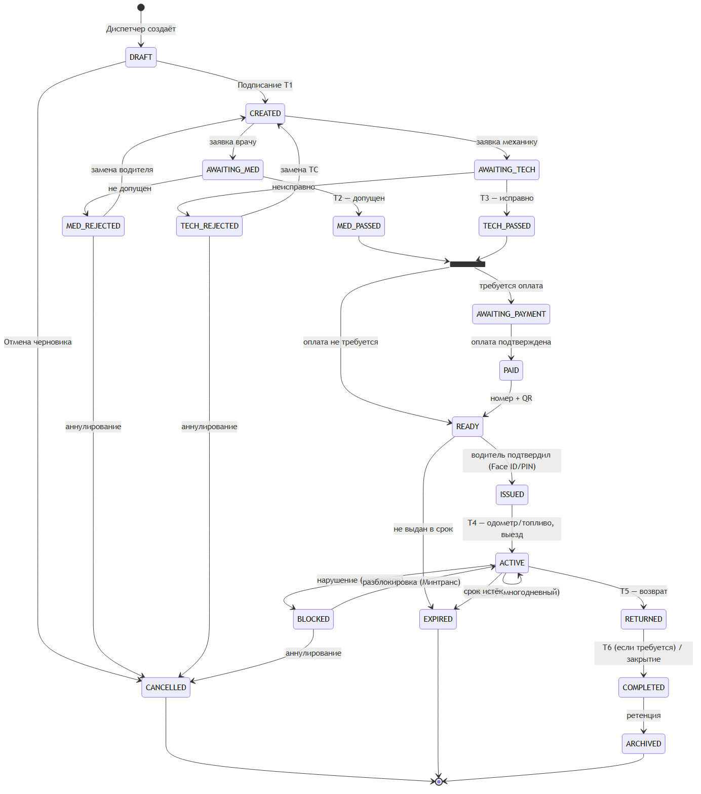
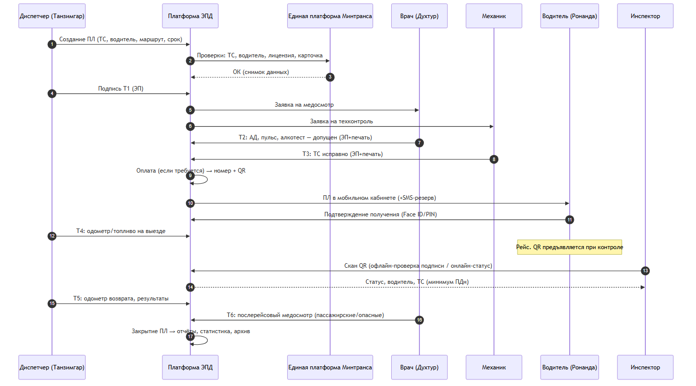
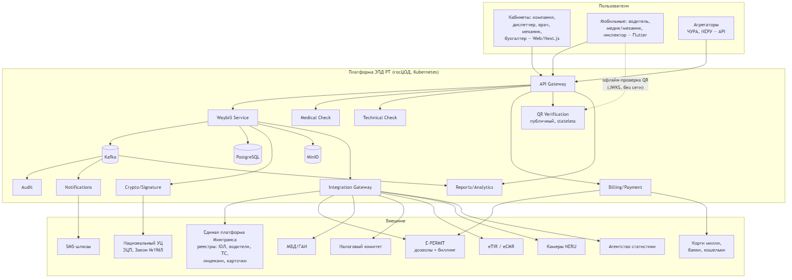
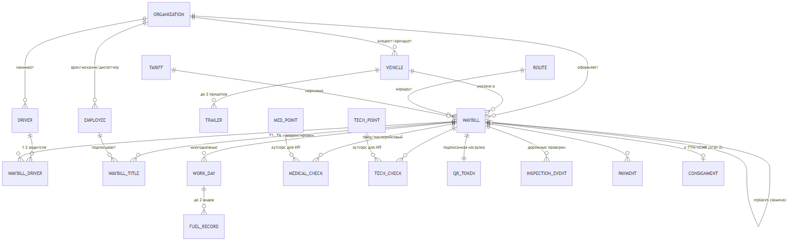

# Приложения

## Приложение А. Диаграммы

### А.1. Статусная модель путевого листа

### А.2. Последовательность оформления и подписания титулов

### А.3. Контекстная архитектурная схема

### А.4. Модель данных (основные сущности)

## Приложение Б. Соответствие форм действующей системы и типов путевых листов Платформы

| Legacy-форма (rohkhat.tj / НА ва ХЛ) | Тип ТС | Новый тип Платформы | Срок действия | Ключевые отличия полей |
|---|---|---|---|---|
| Т (1-АД) — waybill1ad | Автобус | WB_BUS | 1 день | маршрут, график (реҷа), круги, выручка, кондиционер, топливо ≤2 видов |
| Т (1-АД) троллейбус — waybill1ade | Троллейбус | WB_TROLLEYBUS | 1 день | как автобус, без топлива и клиента |
| 1-А — waybill1a | Микроавтобус | WB_MINIBUS | до 4–7 дней | work_days (до 4), касса, топливо по дням |
| 3-С — waybill3c | Легковой (сабукрав) | WB_CAR / WB_TAXI | до 7 дней (такси Душанбе — 1 мес.) | вид услуги (такси/маршрут/почасовой), территория деятельности, work_days до 7 |
| 2-Б — waybill2b | Грузовой | WB_TRUCK | до 15 дней | вид перевозки (сдельно/почасово), направление, прицепы ≤2, work_days до 15, связь с борхат |
| 5Б-БМ — waybill5bbm | Грузовой международный | WB_TRUCK_INTL | 1 рейс (гардиш) | 2 водителя, виза, страны погрузки/разгрузки/транзита, груз, книжка ББА, дозвол E-PERMIT |
| 4М-БМ (без API в legacy) | Пассажирский международный | WB_PAX_INTL | 1 рейс | как 5Б-БМ, но пассажирский; описан полноценно в настоящем ТЗ |
| — | Спецтехника | WB_SPECIAL | до 7 дней | новый тип: вид спецработ, моточасы |
| — | Опасные грузы | WB_DANGEROUS | 1 рейс | новый тип: класс ADR, свидетельства о допуске |
| Борхати замимаи 1 / замимаи 2 | Накладные | э-ТТН (этап 2) | разовая | электронная товарно-транспортная накладная |
| CMR | Международная накладная | eCMR (этап 2) | 1 рейс | по протоколу eCMR (РТ — участник с 2019) |

## Приложение В. Маппинг ключевых полей legacy → Платформа

| Legacy-поле (тадж.) | Перевод | Поле Платформы | Примечание |
|---|---|---|---|
| rma (рамзи мушаххаси андозсупоранда) | ИНН налогоплательщика | party.rma | ключ организаций/людей, 9–10 цифр |
| registration_number | госномер ТС | vehicle.plate_number | ключ ТС |
| number (рақами таваққуфгоҳ) | номер стоянки | vehicle.parking_number | 4 цифры: колонна + бригада |
| indication_counter_exit / _entry | одометр выезд/возврат | title4.odometer_out / title5.odometer_in | авто из предыдущего ПЛ |
| fuel_given / remain_fuel_* | топливо выдано/остатки | fuel_record.* | автоперенос остатков |
| begin_path_a / begin_path_b | начальный пробег А/Б | work_day.deadhead_a/b | от предприятия до маршрута |
| schedule (реҷа) | график | waybill.schedule_ref | справочник графиков |
| number_lap (миқдори гардиш) | количество кругов | work_day.laps | |
| earning (маблағ) | выручка | work_day.revenue | |
| kassa (хазина) | касса | waybill.cash_total | 1-А |
| type_service | вид услуги (3-С) | waybill.service_kind | такси/маршрут/почасовой |
| type_of_shipment | вид перевозки (2-Б) | waybill.shipment_kind | сдельно/почасово |
| direction_id (самт) | направление | waybill.direction_ref | грузовые |
| visa_expire_date / visa_country_id | виза | intl.visa_* | международные |
| load/unload_country/city, transit_countries | география рейса | intl.route_* | международные |
| cargo_id / cargo_capacity / cargo_distance | груз | intl.cargo_* | международные |
| bba_number | книжка ББА (МДП/TIR) | intl.tir_carnet | связка с eTIR |
| expire_checklist_* (варақаи назоратӣ) | контрольная карточка | vehicle.control_card_* | блокирующая проверка |
| number_lessons_20_hours | 20-часовые занятия | driver.safety_course_* | обязательно для всех ТС |
| med_cert_number / _valid_date | медсправка водителя | driver.med_cert_* | блокирующая проверка |
| signature / seal (имзо / муҳр) | ЭП / печать | employee.signature — заменяется квалифицированной ЭП | Закон № 1965 |

## Приложение Г. Legacy-совместимый контракт API агрегаторов

Сохраняемый контракт (`POST /api/waybill_neru`, `GET /api/waybill_neru/{id}`) описан в разделе 12.3. Правила: новый запрос закрывает предыдущий активный ПЛ; выдача только после подписания Т2 и Т3; `entry_date − exit_date ≤ 7 дней`; расчёт одометра `entry = exit + distance`; коды ошибок 404/409/422 — по разделу 12.1.
